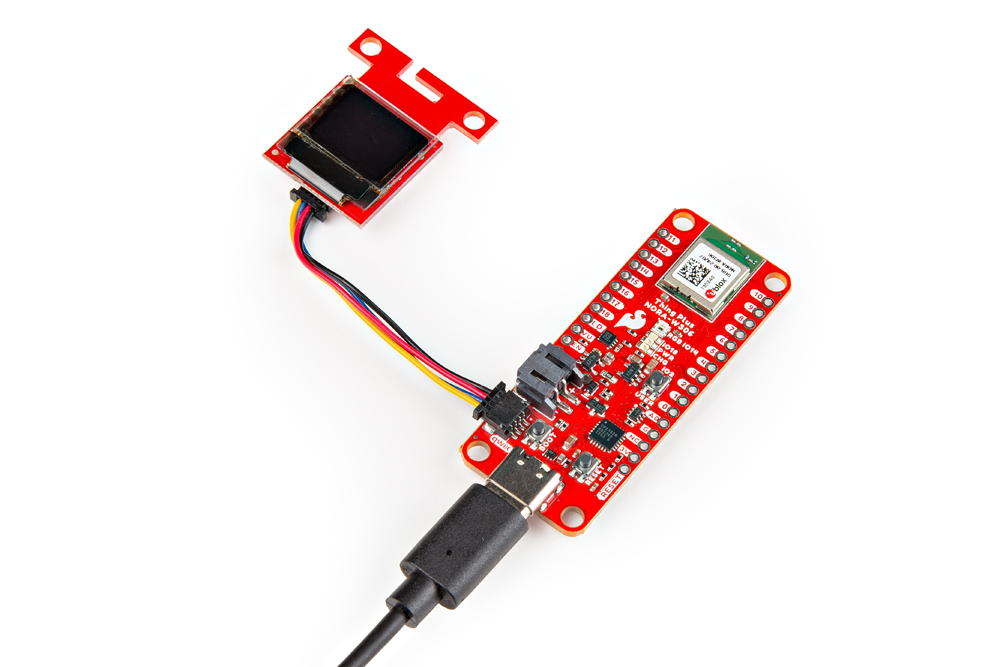
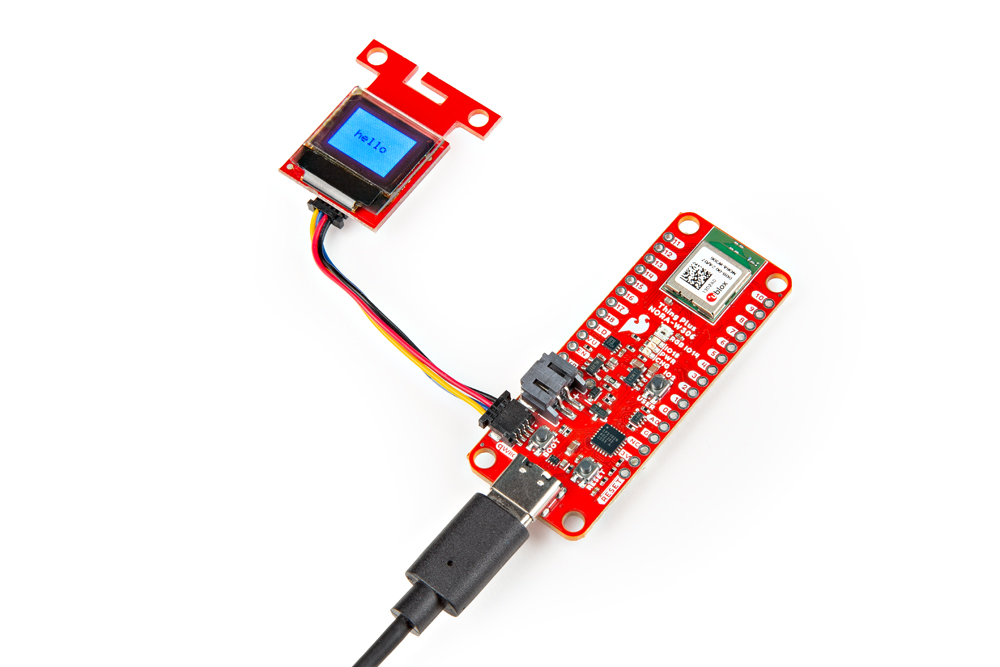

In this example, we will connect a Qwiic-enabled Micro OLED display.


### Hardware Hookup

To connect the Qwiic Micro OLED, simply insert a Qwiic cable between the display and the SparkFun Thing Plus NORA-W306.

<div style="text-align: center;">
  <table>
    <tr style="vertical-align:middle;">
     <td style="text-align: center; vertical-align: middle; border: solid 1px #cccccc;"><a href="../assets/img/WRL-21637_Thing_Plus_NORA-W306_Qwiic_Enabled_Device_OLED.jpg"></a></td>
    </tr>
    <tr style="vertical-align:middle;">
     <td style="text-align: center; vertical-align: middle; border: solid 1px #cccccc;"><i>Qwiic Micro OLED Connected to SparkFun Thing Plus NORA-W306</i></td>
    </tr>
  </table>
</div>

When ready, connect the board to your computer with the USB C cable.


### Installing the Arduino Library

!!! note
    There are two SparkFun Arduino Libraries for the Qwiic micro OLED. We recommend using the SparkFun Qwiic OLED Arduino Library.

If you have not already, make sure to install the following libraries as explained earlier.

* [Qwiic OLED](https://github.com/sparkfun/SparkFun_Qwiic_OLED_Arduino_Library)


### Arduino Code

Let&apos;s upload the sketch to display graphics and characters on the Qwiic Micro OLED. From the menu, select the following: **File** > **Examples** > <font style="color:gray">Examples from Custom Libraries</font> | **SparkFun OLED Graphics Library** > **Example-01_Hello**.

Or you can copy and paste the following code in the Arduino IDE. Select the correct board definition from the menu (in this case, **Tools** > **Boards** > **SparkFun Thing Plus NORA-W306 (RTL8720DF)**). Then select the correct COM port that the board enumerated to (in this case, it was **COM13**). Hit upload button.

``` C++
/*

  Example-01_Hello.ino

  This demo shows the basic setup of the OLED library, generating simple graphics and displaying
  the results on the target device.

   Micro OLED             https://www.sparkfun.com/products/14532
   Transparent OLED       https://www.sparkfun.com/products/15173
   "Narrow" OLED          https://www.sparkfun.com/products/24606
   Qwiic OLED 1.3in       https://www.sparkfun.com/products/23453

  Written by Kirk Benell @ SparkFun Electronics, March 2022

  Repository:
     https://github.com/sparkfun/SparkFun_Qwiic_OLED_Arduino_Library

  Documentation:
     https://sparkfun.github.io/SparkFun_Qwiic_OLED_Arduino_Library/

  SparkFun code, firmware, and software is released under the MIT License(http://opensource.org/licenses/MIT).
*/

#include <SparkFun_Qwiic_OLED.h> //http://librarymanager/All#SparkFun_Qwiic_OLED

// The Library supports four different types of SparkFun boards. The demo uses the following
// defines to determine which device is being used. Uncomment the device being used for this demo.

QwiicMicroOLED myOLED;
//QwiicTransparentOLED myOLED;
//QwiicNarrowOLED myOLED;
//Qwiic1in3OLED myOLED;


void setup()
{
    Serial.begin(115200);
    Serial.println("Running OLED example");

    Wire.begin();

    // Initalize the OLED device and related graphics system
    if (myOLED.begin() == false)
    {
        Serial.println("Device begin failed. Freezing...");
        while (true)
            ;
    }
    Serial.println("Begin success");

    // Do a simple test - fill a rectangle on the screen and then print hello!

    // Fill a rectangle on the screen that has a 4 pixel board
    myOLED.rectangleFill(4, 4, myOLED.getWidth() - 8, myOLED.getHeight() - 8);

    String hello = "hello"; // our message

    // Center our message on the screen. Get the screen size of the "hello" string,
    // calling the getStringWidth() and getStringHeight() methods on the oled

    // starting x position - screen width minus string width  / 2
    int x0 = (myOLED.getWidth() - myOLED.getStringWidth(hello)) / 2;

    // starting y position - screen height minus string height / 2
    int y0 = (myOLED.getHeight() - myOLED.getStringHeight(hello)) / 2;

    // Draw the text - color of black (0)
    myOLED.text(x0, y0, hello, 0);

    // There's nothing on the screen yet - Now send the graphics to the device
    myOLED.display();

    // That's it - HELLO!
}

void loop()
{
    delay(1000); // Do nothing
}
```

Once the code has been uploaded, check the Qwiic Micro OLED screen. You should see the entire screen filled with a rectangle with the "hello" in the middle. Try exploring the other examples in the folder and writing your own code to output on the screen.

<div style="text-align: center;">
  <table>
    <tr style="vertical-align:middle;">
     <td style="text-align: center; vertical-align: middle; border: solid 1px #cccccc;"><a href="../assets/img/WRL-21637_Thing_Plus_NORA-W306_Qwiic_OLED_Hello_World.jpg"></a></td>
    </tr>
    <tr style="vertical-align:middle;">
     <td style="text-align: center; vertical-align: middle; border: solid 1px #cccccc;"><i>Qwiic Micro OLED Connected to SparkFun Thing Plus NORA-W306 and with the Word &quot;hello&quot; Displayed</i></td>
    </tr>
  </table>
</div>
