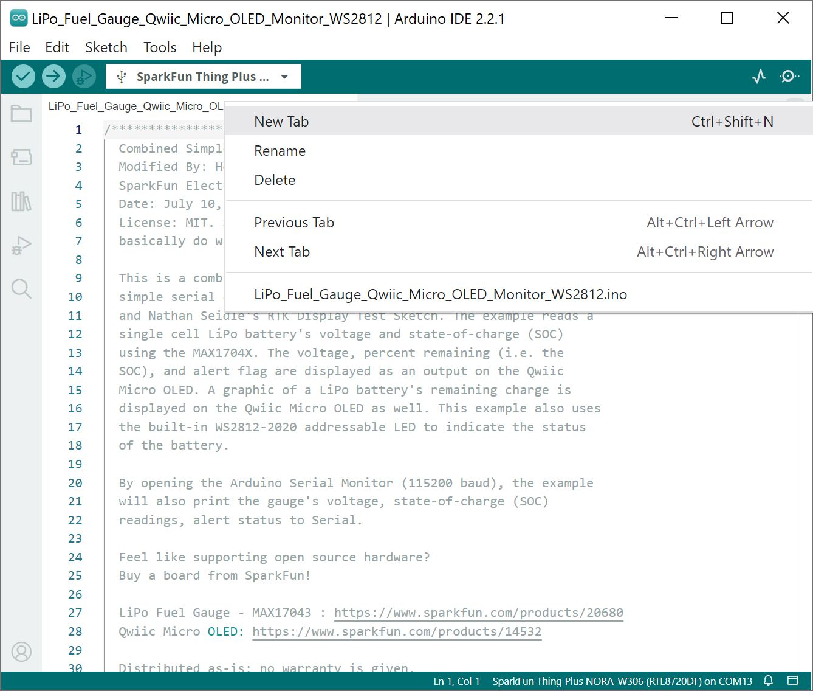
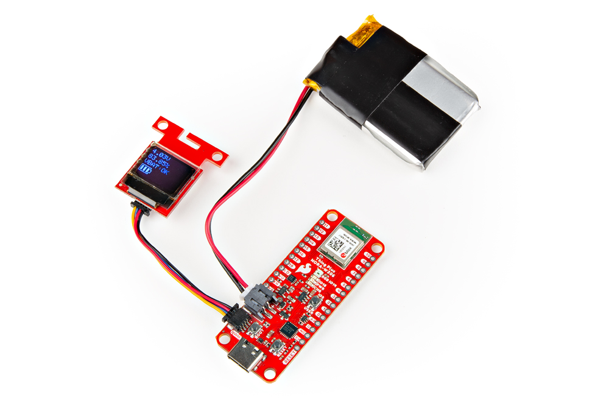

Based on the examples from the LiPo Fuel Gauge and Micro OLED, we will measure a battery's capacity and display the readings on a micro OLED.


### Hardware Hookup

Connect the Qwiic micro OLED and LiPo battery to the board.

<div style="text-align: center;">
  <table>
    <tr style="vertical-align:middle;">
     <td style="text-align: center; vertical-align: middle; border: solid 1px #cccccc;"><a href="../assets/img/NORA-W306_MAX17048_Fuel_Gauge_WS2812_LiPo_Battery_Demo_bb.jpg"></a></td>
    </tr>
    <tr style="vertical-align:middle;">
     <td style="text-align: center; vertical-align: middle; border: solid 1px #cccccc;"><i>Fritzing Diagram Qwiic micro OLED and LiPo Battery</i></td>
   </tr>
  </table>
</div>

When ready, connect the board to your computer with the USB C cable.


### Installing the Arduino Libraries

If you have not already, make sure to install the following libraries as explained in the previous sections. As for the WS2812, we will be using the built-in Realtek Arduino library for the WS2812.

* [MAX17048](https://github.com/sparkfun/SparkFun_MAX1704x_Fuel_Gauge_Arduino_Library)
* [Qwiic OLED](https://github.com/sparkfun/SparkFun_Qwiic_OLED_Arduino_Library)


### Arduino Code

Copy and paste the following code in the Arduino IDE.

``` C++
/******************************************************************************
  Combined Simple Serial, Qwiic Micro OLED, WS2812 Example
  Modified By: Ho Yun "Bobby" Chan
  SparkFun Electronics
  Date: July 10, 2024
  License: MIT. See license file for more information but you can
  basically do whatever you want with this code.

  This is a combined example of Paul Clark's MAX17043 Fuel Guage
  simple serial example, Kirk Benell's Qwiic OLED Hello example,
  and Nathan Seidle's RTK Display Test Sketch. The example reads a
  single cell LiPo battery's voltage and state-of-charge (SOC)
  using the MAX1704X. The voltage, percent remaining (i.e. the
  SOC), and alert flag are displayed as an output on the Qwiic
  Micro OLED. A graphic of a LiPo battery's remaining charge is
  displayed on the Qwiic Micro OLED as well. This example also uses
  the built-in WS2812-2020 addressable LED to indicate the status
  of the battery.

  By opening the Arduino Serial Monitor (115200 baud), the example
  will also print the gauge's voltage, state-of-charge (SOC)
  readings, alert status to Serial.

  Feel like supporting open source hardware?
  Buy a board from SparkFun!

  LiPo Fuel Gauge - MAX17043 : https://www.sparkfun.com/products/20680
  Qwiic Micro OLED: https://www.sparkfun.com/products/14532

  Distributed as-is; no warranty is given.
******************************************************************************/

#include <Wire.h> // Needed for I2C


//////////LIPO FUEL GAUGE//////////
#include <SparkFun_MAX1704x_Fuel_Gauge_Arduino_Library.h> // Click here to get the library: http://librarymanager/All#SparkFun_MAX1704x_Fuel_Gauge_Arduino_Library

//SFE_MAX1704X lipo; // Defaults to the MAX17043

//SFE_MAX1704X lipo(MAX1704X_MAX17043); // Create a MAX17043
//SFE_MAX1704X lipo(MAX1704X_MAX17044); // Create a MAX17044
SFE_MAX1704X lipo(MAX1704X_MAX17048); // Create a MAX17048
//SFE_MAX1704X lipo(MAX1704X_MAX17049); // Create a MAX17049

double voltage = 0; // Variable to keep track of LiPo voltage
double soc = 0; // Variable to keep track of LiPo state-of-charge (SOC)
bool alert; // Variable to keep track of whether alert has been triggered


//////////QWIIC MICRO OLED//////////
#include <SparkFun_Qwiic_OLED.h> //http://librarymanager/All#SparkFun_Qwiic_Graphic_OLED
#include "icons.h"

// The Qwiic OLED Library supports three different types of SparkFun boards. The demo uses the following
// defines to determine which device is being used. Uncomment the device being used for this demo.
QwiicMicroOLED myOLED;
// QwiicTransparentOLED myOLED;
// QwiicNarrowOLED myOLED;

// Fonts
#include <res/qw_fnt_5x7.h>
//#include <res/qw_fnt_8x16.h>, not used
//#include <res/qw_fnt_31x48.h>, not used
//#include <res/qw_fnt_7segment.h>, not used
//#include <res/qw_fnt_largenum.h>, not used


// NOTE: This example uses the Realtek Arduino Core's WS2812 Library
//////////WS2812 LED//////////
#include "WS2812B.h"

#define TOTAL_NUM_OF_LED 1
#define NUM_OF_LEDS 1

// There are multiple choice of SPI_MOSI pins depends on different boards. The default is SPI_MOSI/SPI1_MOSI
// AMB21/AMB22              pin 11 /  pin21
// AMB23                    pin 9  /  pin 4
// BW16/BW16 Type C         pin 12
// AW-CU488 ThingPlus       pin 1  /  pin 14
// AMB25/AMB26              pin 17 /  pin 3

WS2812B led(SPI1_PICO, NUM_OF_LEDS);

void setup() {
  Serial.begin(115200); // Start serial, to output debug data
  //while (!Serial)
  //  ; //Wait for user to open terminal
  Serial.println(F("Combined MAX17048, Qwiic OLED, and Realtek WS2812 Example"));

  Wire.begin();

  lipo.enableDebugging(); // Uncomment this line to enable helpful debug messages on Serial

  // Set up the MAX17043 LiPo fuel gauge:
  if (lipo.begin() == false) // Connect to the MAX17043 using the default wire port
  {
    Serial.println(F("MAX17043 not detected. Please check wiring. Freezing."));
    while (1)
      ;
  }

  // Initalize the OLED device and related graphics system
  if (myOLED.begin() == false)
  {
    Serial.println(F("Device begin failed. Freezing..."));
    while (true)
      ;
  }

  // Quick start restarts the MAX17043 in hopes of getting a more accurate
  // guess for the SOC.
  lipo.quickStart();

  // We can set an interrupt to alert when the battery SoC gets too low.
  // We can alert at anywhere between 1% - 32%:
  lipo.setThreshold(20); // Set alert threshold to 20%.

  //Set up WS2812B
  led.begin();
  //led.setPixelColor(led_position, red, green, blue);...
  //led.setPixelColor(0, 0, 0, 0);
  //led.show();
  delay(1000);

}

void loop() {

  // lipo.getVoltage() returns a voltage value (e.g. 3.93)
  voltage = lipo.getVoltage();

  // lipo.getSOC() returns the estimated state of charge (e.g. 79%)
  soc = lipo.getSOC();

  // lipo.getAlert() clears the alert flag
  // Output: 0 on success, positive integer on fail.
  lipo.clearAlert();
  // lipo.getAlert() returns a 0 or 1 (0=alert not triggered)
  alert = lipo.getAlert();

  myOLED.erase(); //clear display

  //set font type, we'll use a character size of 5x7
  myOLED.setFont(&QW_FONT_5X7);
  //myOLED.setFont(&QW_FONT_8X16); //not used
  //myOLED.setFont(&QW_FONT_31X48); //not used
  //myOLED.setFont(&QW_FONT_LARGENUM); //not used
  //myOLED.setFont(&QW_FONT_7SEGMENT); //not used

  // "Print" Voltage
  myOLED.setCursor(0, 0);
  myOLED.print(voltage, 2);
  myOLED.print(F("V"));

  // "Print" Battery %
  myOLED.setCursor(0, 10);
  myOLED.print(soc, 2);
  myOLED.print(F("%"));

  // "Print" Alert Status
  myOLED.setCursor(0, 20);
  myOLED.print(F("VBAT:")); //alert pin
  if (alert == HIGH) {
    myOLED.print(F("LOW")); //Flag was raised, battery is low!!!
  }
  else {

    myOLED.print(F("OK")); //Battery charge is good. 8)
  }

  if (soc >= 60.00) {
    //Battery Level 60-100%
    displayBitmap(0, 30, Battery_2_Width, Battery_2_Height, Battery_3);

    //GREEN
    led.setPixelColor(0, 0, 50, 0);
    led.show();

  }
  else if (30.00 <= soc < 60.00) {
    //Battery Level 30-60%
    displayBitmap(0, 30, Battery_2_Width, Battery_2_Height, Battery_2);

    //YELLOW
    led.setPixelColor(0, 50, 50, 0);
    led.show();
  }
  else if (10.00 <= soc < 30.00) {
    //Battery Level 10%-30%
    displayBitmap(0, 30, Battery_2_Width, Battery_2_Height, Battery_1);

    //ORANGE
    led.setPixelColor(0, 50, 25, 0);
    led.show();
  }
  else {
    //Battery Level <10%
    displayBitmap(0, 30, Battery_2_Width, Battery_2_Height, Battery_0);

    //RED
    led.setPixelColor(0, 50, 0, 0);
    led.show();
  }


  // There's nothing on the screen yet - Now send the graphics to the device
  myOLED.display();


  // Print the variables to Serial Terminal:
  Serial.print(F("Voltage: "));
  Serial.print(voltage);  // Print the battery voltage
  Serial.println(" V");

  Serial.print(F("Percentage: "));
  Serial.print(soc); // Print the battery state of charge
  Serial.println(" %");

  Serial.print(F("Alert: "));
  Serial.println(alert);
  Serial.println();

  delay(500);
}


//Wrapper to avoid needing to pass width/height data twice
void displayBitmap(uint8_t x, uint8_t y, uint8_t imageWidth, uint8_t imageHeight, uint8_t *imageData) {
  myOLED.bitmap(x, y, x + imageWidth, y + imageHeight, imageData, imageWidth, imageHeight);
}
```


To keep track of the icons that we create, we are going to create a header file with the **&ast;.ino**. This is useful when writing code for big projects that involve a lot of components. Click on the icon to create a new tab. We will name this **icons.h**.

<div style="text-align: center;">
  <table>
    <tr style="vertical-align:middle;">
     <td style="text-align: center; vertical-align: middle; border: solid 1px #cccccc;"><a href="../assets/img/Creating_New_Tab_Arduino.JPG"></a></td>
    </tr>
    <tr style="vertical-align:middle;">
     <td style="text-align: center; vertical-align: middle; border: solid 1px #cccccc;"><i> New Tab</i></td>
   </tr>
  </table>
</div>


Copy and paste the following code into tab.

``` C++
uint8_t Battery_3 [] = {
0xFF, 0x01, 0xFD, 0xFD, 0xFD, 0x01, 0x01, 0xFD, 0xFD, 0xFD, 0x01, 0x01, 0xFD, 0xFD, 0xFD, 0x01,
0x0F, 0x08, 0xF8, 0x0F, 0x08, 0x0B, 0x0B, 0x0B, 0x08, 0x08, 0x0B, 0x0B, 0x0B, 0x08, 0x08, 0x0B,
0x0B, 0x0B, 0x08, 0x0F, 0x01, 0x01,
};
int Battery_3_Height = 12;
int Battery_3_Width = 19;

uint8_t Battery_2 [] = {
0xFF, 0x01, 0xFD, 0xFD, 0xFD, 0x01, 0x01, 0xFD, 0xFD, 0xFD, 0x01, 0x01, 0x01, 0x01, 0x01, 0x01,
0x0F, 0x08, 0xF8, 0x0F, 0x08, 0x0B, 0x0B, 0x0B, 0x08, 0x08, 0x0B, 0x0B, 0x0B, 0x08, 0x08, 0x08,
0x08, 0x08, 0x08, 0x0F, 0x01, 0x01,
};
int Battery_2_Height = 12;
int Battery_2_Width = 19;

uint8_t Battery_1 [] = {
0xFF, 0x01, 0xFD, 0xFD, 0xFD, 0x01, 0x01, 0x01, 0x01, 0x01, 0x01, 0x01, 0x01, 0x01, 0x01, 0x01,
0x0F, 0x08, 0xF8, 0x0F, 0x08, 0x0B, 0x0B, 0x0B, 0x08, 0x08, 0x08, 0x08, 0x08, 0x08, 0x08, 0x08,
0x08, 0x08, 0x08, 0x0F, 0x01, 0x01,
};
int Battery_1_Height = 12;
int Battery_1_Width = 19;

uint8_t Battery_0 [] = {
0xFF, 0x01, 0x01, 0x01, 0x01, 0x01, 0x01, 0x01, 0x01, 0x01, 0x01, 0x01, 0x01, 0x01, 0x01, 0x01,
0x0F, 0x08, 0xF8, 0x0F, 0x08, 0x08, 0x08, 0x08, 0x08, 0x08, 0x08, 0x08, 0x08, 0x08, 0x08, 0x08,
0x08, 0x08, 0x08, 0x0F, 0x01, 0x01,
};
int Battery_0_Height = 12;
int Battery_0_Width = 19;
```

If you have not already, select your Board (in this case the **SparkFun Thing Plus NORA-W306 (RTL8720DF)**), and associated COM port (in this case **COM13**). Then hit the upload button. Disconnect the USB cable from the SparkFun Thing Plus NORA-W306 and hit the reset button on the board.

Looking close at the display, you should see the voltage, remaining charge, the alert flag indicating if the battery is low, and a battery meter icon. These values may be different depending on how much charge the LiPo battery has available! The RGB LED color will also change to the following colors based as well: green (battery level > 60%), yellow (battery level 30%-60%), orange (battery level 10%-30%), and red (battery level <10%).

<div style="text-align: center;">
  <table>
    <tr style="vertical-align:middle;">
     <td style="text-align: center; vertical-align: middle; border: solid 1px #cccccc;"><a href="../assets/img/WRL-21637_Thing_Plus_NORA-W306_LiPo_Fuel_Gauge_OLED.jpg"></a></td>
    </tr>
    <tr style="vertical-align:middle;">
     <td style="text-align: center; vertical-align: middle; border: solid 1px #cccccc;"><i>LiPo Fuel Gauge Monitoring LiPo Battery and Displaying Battery Capacity on Qwiic Micro OLED</i></td>
   </tr>
  </table>
</div>
