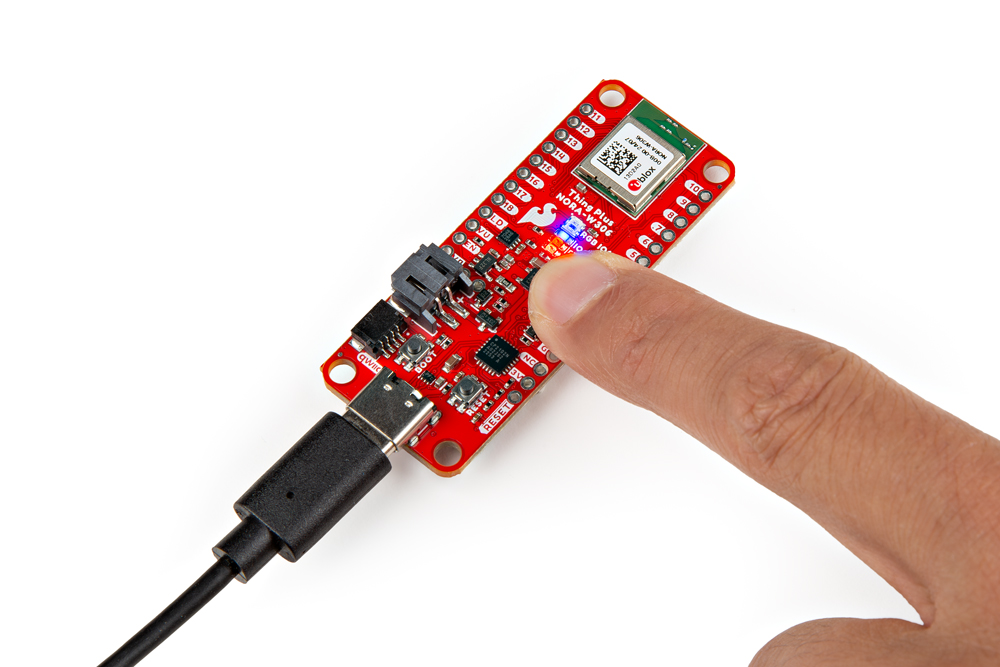

This example goes over how to use the built-in button with the [internal pull-up resistors](https://learn.sparkfun.com/tutorials/pull-up-resistors/all) on the microcontroller. While we are at it, we will also use the built-in LED to visually see what is going on right on the board without the need to open the Arduino Serial Monitor.


### Hardware Hookup

Connect the USB cable to the SparkFun Thing Plus NORA-W306 and the other end to your computer&apos;s COM port.

<div style="text-align: center;">
  <table>
    <tr style="vertical-align:middle;">
     <td style="text-align: center; vertical-align: middle; border: solid 1px #cccccc;"><a href="../assets/img/WRL-21637_Thing_Plus_NORA-W306_USB_Cable.jpg"></a></td>
    </tr>
    <tr style="vertical-align:middle;">
     <td style="text-align: center; vertical-align: middle; border: solid 1px #cccccc;"><i>USB Cable inserted into Thing Plus NORA-W306</i></td>
    </tr>
  </table>
</div>


### Arduino Code

Let's upload the sketch to check if there is a button press. The following code is a **modified example** that was built into the Arduino IDE (**File** > **Examples** > **02.Digital** > **Button** ) since there are no pull-up resistors connected to the button and the LED is on a different I/O pin.

You can also copy and paste the following code in the Arduino IDE. Select the correct board definition from the menu (in this case, **Tools** > **Board** > **Realtek Ameba Boards (32-bits ARM Cortex-M33 @200MHz)** > **SparkFun Thing Plus NORA-W306 (RTL8720DF)**). Then select the correct COM port that the board enumerated to (in this case, it was **COM13**). Hit upload button.

``` C++
/*
  Button

  Turns on and off a light emitting diode (LED) connected to digital pin 18,
  when pressing a pushbutton attached to pin 2.

  The circuit:
  - Built-in LED attached from pin 18 to ground and current limiting resistor
  - Built-in pushbutton attached to pin 2 from +5V


  modified 2024
  by Ho Yun "Bobby" Chan

  created 2005
  by DojoDave <http://www.0j0.org>
  modified 30 Aug 2011
  by Tom Igoe

  This example code is in the public domain.

  https://www.arduino.cc/en/Tutorial/BuiltInExamples/Button
*/

// constants won't change. They're used here to set pin numbers:
const int buttonPin = 2;  // the number of the pushbutton pin
const int ledPin = 18;    // the number of the LED pin

// variables will change:
int buttonState = 0;  // variable for reading the pushbutton status

void setup() {
  // initialize the LED pin as an output:
  pinMode(ledPin, OUTPUT);
  // initialize the pushbutton pin as an input pullup:
  pinMode(buttonPin, INPUT_PULLUP);
}

void loop() {
  // read the state of the pushbutton value:
  buttonState = digitalRead(buttonPin);

  // check if the pushbutton is pressed. If it is, the buttonState is HIGH:
  if (buttonState == HIGH) {
    // turn LED on:
    digitalWrite(ledPin, HIGH);
  } else {
    // turn LED off:
    digitalWrite(ledPin, LOW);
  }
}
```

Once uploaded, check the LED labeled as **18** on the board. Pressing down on the user button connected to pin 2 will light up the LED. Releasing the button, the LED will turn off.

<div style="text-align: center;">
  <table>
    <tr style="vertical-align:middle;">
     <td style="text-align: center; vertical-align: middle; border: solid 1px #cccccc;"><a href="../assets/img/WRL-21637_Thing_Plus_NORA-W306_Button_LED.jpg"></a></td>
    </tr>
    <tr style="vertical-align:middle;">
     <td style="text-align: center; vertical-align: middle; border: solid 1px #cccccc;"><i>SparkFun Thing Plus NORA-W306 Button Press with LED Turned On</i></td>
   </tr>
  </table>
</div>
