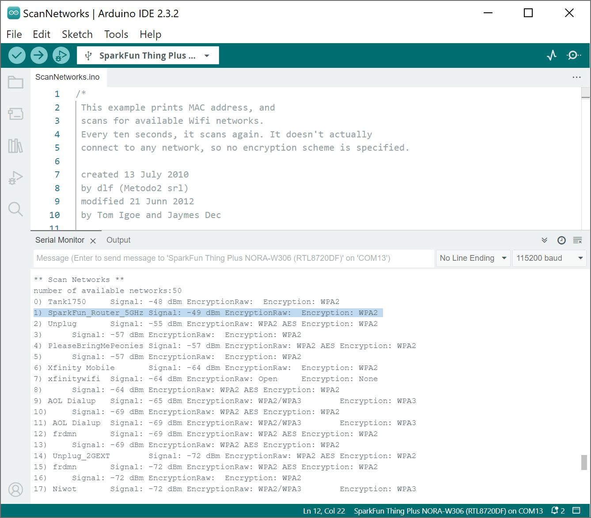

In this example, we will scan for WiFi networks in the area.


### Hardware Hookup

The connection is the same as explained earlier in the tutorial. Connect the USB cable to the SparkFun Thing Plus NORA-W306. Of course, make sure to connect the other end to your computer. You will also need a wireless router capable of 2.4GHz and 5GHz.

<div style="text-align: center;">
  <table>
    <tr style="vertical-align:middle;">
     <td style="text-align: center; vertical-align: middle; border: solid 1px #cccccc;"><a href="../assets/img/WRL-21637_Thing_Plus_NORA-W306_USB_Cable.jpg"></a></td>
    </tr>
    <tr style="vertical-align:middle;">
     <td style="text-align: center; vertical-align: middle; border: solid 1px #cccccc;"><i>USB Cable inserted into Thing Plus NORA-W306</i></td>
    </tr>
  </table>
</div>


### Arduino Code

Let's try to scan for some WiFi networks. You can find this example included after installing the board add-on. Head to **File** > **Examples** > <font style="color:gray"><b>Examples for SparkFun Thing Plus NORA-W306 (RTL8720DF)</b></font> | **WiFi** > **ScanNetworks** .

You can also copy and paste the following code in the Arduino IDE. Select the correct board definition from the menu (in this case, **Tools** > **Board** > **Realtek Ameba Boards (32-bits ARM Cortex-M33 @200MHz)** > **SparkFun Thing Plus NORA-W306 (RTL8720DF)**). Then select the correct COM port that the board enumerated to (in this case, it was **COM13**). Hit upload button.

``` C++
/*
 This example prints MAC address, and
 scans for available Wifi networks.
 Every ten seconds, it scans again. It doesn't actually
 connect to any network, so no encryption scheme is specified.

 created 13 July 2010
 by dlf (Metodo2 srl)
 modified 21 Junn 2012
 by Tom Igoe and Jaymes Dec

 modified 08 May 2023
 by Realtek SG

 Example guide:
 https://www.amebaiot.com/en/amebad-arduino-scan-wifi/
 */

#include <WiFi.h>

int status = WL_IDLE_STATUS;    // Indicater of Wifi status

void setup() {
    //Initialize serial and wait for port to open:
    Serial.begin(115200);
    while (!Serial) {
        ; // wait for serial port to connect. Needed for native USB port only
    }

    // check for WiFi status:
    status = WiFi.status();
    // Print WiFi MAC address:
    printMacAddress();
}

void loop() {
    // scan for existing networks:
    Serial.println("Scanning available networks...");
    listNetworks();
    delay(10000);
}

void printMacAddress() {
    // print your MAC address:
    byte mac[6];
    WiFi.macAddress(mac);
    Serial.print("MAC: ");
    Serial.print(mac[0], HEX);
    Serial.print(":");
    Serial.print(mac[1], HEX);
    Serial.print(":");
    Serial.print(mac[2], HEX);
    Serial.print(":");
    Serial.print(mac[3], HEX);
    Serial.print(":");
    Serial.print(mac[4], HEX);
    Serial.print(":");
    Serial.println(mac[5], HEX);
}

void listNetworks() {
    // scan for nearby networks:
    Serial.println("** Scan Networks **");
    int numSsid = WiFi.scanNetworks();
    if (numSsid == -1) {
        Serial.println("Couldn't get a wifi connection");
        while (true);
    }

    // print the list of networks seen:
    Serial.print("number of available networks:");
    Serial.println(numSsid);

    // print the network number and name for each network found:
    for (int thisNet = 0; thisNet < numSsid; thisNet++) {
        Serial.print(thisNet);
        Serial.print(") ");
        Serial.print(WiFi.SSID(thisNet));
        Serial.print("\tSignal: ");
        Serial.print(WiFi.RSSI(thisNet));
        Serial.print(" dBm");
        Serial.print("\tEncryptionRaw: ");
        printEncryptionTypeEx(WiFi.encryptionTypeEx(thisNet));
        Serial.print("\tEncryption: ");
        printEncryptionType(WiFi.encryptionType(thisNet));
    }
}

void printEncryptionTypeEx(uint32_t thisType) {
    /*  Arduino wifi api use encryption type to mapping to security type.
    *  This function demonstrate how to get more richful information of security type.
    */
    switch (thisType) {
        case SECURITY_OPEN:
            Serial.print("Open");
            break;
        case SECURITY_WEP_PSK:
            Serial.print("WEP");
            break;
        case SECURITY_WPA_TKIP_PSK:
            Serial.print("WPA TKIP");
            break;
        case SECURITY_WPA_AES_PSK:
            Serial.print("WPA AES");
            break;
        case SECURITY_WPA2_AES_PSK:
            Serial.print("WPA2 AES");
            break;
        case SECURITY_WPA2_TKIP_PSK:
            Serial.print("WPA2 TKIP");
            break;
        case SECURITY_WPA2_MIXED_PSK:
            Serial.print("WPA2 Mixed");
            break;
        case SECURITY_WPA_WPA2_MIXED:
            Serial.print("WPA/WPA2 AES");
            break;
        case SECURITY_WPA3_AES_PSK:
            Serial.print("WPA3 AES");
            break;
        case SECURITY_WPA2_WPA3_MIXED:
            Serial.print("WPA2/WPA3");
    }
}

void printEncryptionType(int thisType) {
    // read the encryption type and print out the name:
    switch (thisType) {
        case ENC_TYPE_WEP:
            Serial.println("WEP");
            break;
        case ENC_TYPE_WPA:
            Serial.println("WPA");
            break;
        case ENC_TYPE_WPA2:
            Serial.println("WPA2");
            break;
        case ENC_TYPE_WPA3:
            Serial.println("WPA3");
            break;
        case ENC_TYPE_NONE:
            Serial.println("None");
            break;
        case ENC_TYPE_AUTO:
            Serial.println("Auto");
            break;
    }
}
```

Open you [Arduino Serial Monitor](https://learn.sparkfun.com/tutorials/terminal-basics/arduino-serial-monitor-windows-mac-linux) at **115200**. The SparkFun Thing Plus NORA-W306 will begin scanning your area. Take note of the encryption type of the WiFi network that you are connecting to. In this case, I had set my home WiFi Router's 5GHz network name to "SparkFun_Router_5GHz" and it was using a WPA2 encryption (as highlighted in the Arduino Serial Monitor).

<div style="text-align: center;">
  <table>
    <tr style="vertical-align:middle;">
     <td style="text-align: center; vertical-align: middle; border: solid 1px #cccccc;"><a href="../assets/img/AmebaD_RealTek_NORA-W306_Arduino_WiFi_Scan.JPG"></a></td>
    </tr>
    <tr style="vertical-align:middle;">
     <td style="text-align: center; vertical-align: middle; border: solid 1px #cccccc;"><i>SparkFun Router 5GHz Highlighted Arduino Output</i></td>
    </tr>
  </table>
</div>
