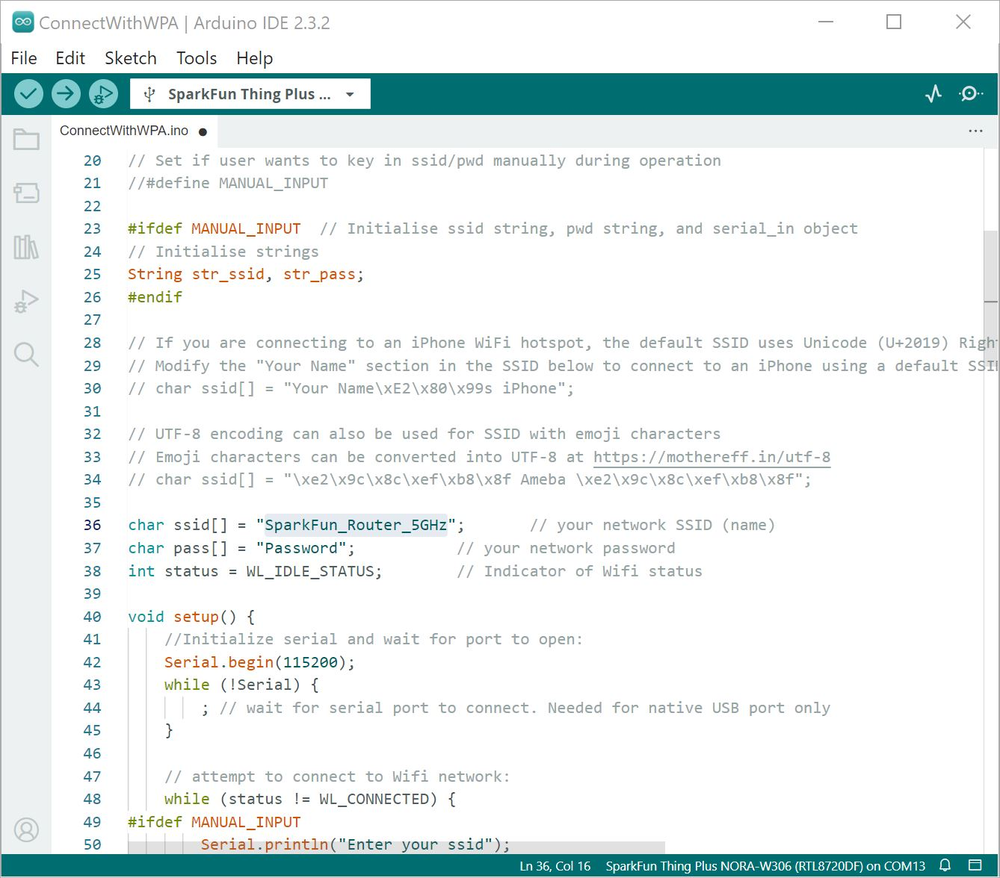

In this example, we will connect to a 5GHz WiFi network.


### Hardware Hookup

The connection is the same as explained earlier in the tutorial. Connect the USB cable to the SparkFun Thing Plus NORA-W306 and the other end to your computer. Again, you will need a wireless router capable of 2.4GHz and 5GHz.

<div style="text-align: center;">
  <table>
    <tr style="vertical-align:middle;">
     <td style="text-align: center; vertical-align: middle; border: solid 1px #cccccc;"><a href="../assets/img/WRL-21637_Thing_Plus_NORA-W306_USB_Cable.jpg"></a></td>
    </tr>
    <tr style="vertical-align:middle;">
     <td style="text-align: center; vertical-align: middle; border: solid 1px #cccccc;"><i>USB Cable inserted into Thing Plus NORA-W306</i></td>
    </tr>
  </table>
</div>


### Arduino Code

Let's upload the sketch to connect to the 5GHz network in your area. From the menu, select the following: **File** > **Examples** > **File** > **Examples** > <font style="color:gray"><b>Examples for SparkFun Thing Plus NORA-W306 (RTL8720DF)</b></font> | **WiFi** > **ConnectWithWiFi** > **ConnectWithWPA**. Depending on your encryption, you may select a different example.

!!! note
    Depending on your encryption, you may select a different Arduino sketch to connect to the WiFi. Based on the previous example, the connection used WPA so we selected the **ConnectWithWPA.ino** example.

Or you can copy and paste the following code in the Arduino IDE.

``` C++
/*
 This example connects to an unencrypted Wifi network.
 Then it prints the MAC address,
 the IP address obtained, and other network details.

 created 13 July 2010
 by dlf (Metodo2 srl)
 modified 31 May 2012
 by Tom Igoe

 modified 08 May 2023
 by Realtek SG

 Example guide:
 https://www.amebaiot.com/en/amebad-arduino-connect-wifi/
 */

#include <WiFi.h>

// Set if user wants to key in ssid/pwd manually during operation
//#define MANUAL_INPUT

#ifdef MANUAL_INPUT  // Initialise ssid string, pwd string, and serial_in object
// Initialise strings
String str_ssid, str_pass;
#endif

// If you are connecting to an iPhone WiFi hotspot, the default SSID uses Unicode (U+2019) Right Single Quotation Mark instead of ASCII apostrophe
// Modify the "Your Name" section in the SSID below to connect to an iPhone using a default SSID style
// char ssid[] = "Your Name\xE2\x80\x99s iPhone";

// UTF-8 encoding can also be used for SSID with emoji characters
// Emoji characters can be converted into UTF-8 at https://mothereff.in/utf-8
// char ssid[] = "\xe2\x9c\x8c\xef\xb8\x8f Ameba \xe2\x9c\x8c\xef\xb8\x8f";

char ssid[] = "Network_SSID";       // your network SSID (name)
char pass[] = "Password";           // your network password
int status = WL_IDLE_STATUS;        // Indicater of Wifi status

void setup() {
    //Initialize serial and wait for port to open:
    Serial.begin(115200);
    while (!Serial) {
        ; // wait for serial port to connect. Needed for native USB port only
    }

    // attempt to connect to Wifi network:
    while (status != WL_CONNECTED) {
#ifdef MANUAL_INPUT
        Serial.println("Enter your ssid");
        while (Serial.available() == 0) {}
            str_ssid = Serial.readString();
            str_ssid.trim();
            Serial.print("SSID entered: ");
            Serial.println(str_ssid);

        Serial.println("Enter your password");
        while (Serial.available() == 0) {}
        str_pass = Serial.readString();
        str_pass.trim();
            if (str_pass.length() != 0) { // user has entered data
                while (str_pass.length() <8 ) { // to catch pwd<8 exception
                    Serial.println("Password cannot be less than 8 characters! Try again");
                    while (Serial.available() == 0) {}
                    str_pass = Serial.readString();
                    str_pass.trim();
                }
                    Serial.print("Password entered: ");
                    Serial.println(str_pass);
            }
#endif
        Serial.print("Attempting to connect to WPA SSID: ");

#ifndef MANUAL_INPUT
        Serial.println(ssid);
        // Connect to WPA/WPA2 network:
        status = WiFi.begin(ssid, pass);
#else
        char ssid_cust[str_ssid.length() + 1];
        char pass_cust[str_pass.length() + 1];
        strcpy(ssid_cust, str_ssid.c_str());
        strcpy(pass_cust, str_pass.c_str());
        Serial.println(str_ssid.c_str());
        status = WiFi.begin(ssid_cust, pass_cust);
        str_ssid = str_pass = "";
#endif
        // wait 10 seconds for connection:
        delay(10000);
    }

    // you're connected now, so print out the data:
    Serial.println();
    Serial.print("You're connected to the network");
    printCurrentNet();
    printWifiData();
}

void loop() {
    // check the network connection once every 10 seconds:
    delay(10000);
    printCurrentNet();
}

void printWifiData() {
    // print your WiFi IP address:
    IPAddress ip = WiFi.localIP();
    Serial.print("IP Address: ");
    Serial.println(ip);
    Serial.println(ip);

    // print your MAC address:
    byte mac[6];
    WiFi.macAddress(mac);
    Serial.print("MAC address: ");
    Serial.print(mac[0], HEX);
    Serial.print(":");
    Serial.print(mac[1], HEX);
    Serial.print(":");
    Serial.print(mac[2], HEX);
    Serial.print(":");
    Serial.print(mac[3], HEX);
    Serial.print(":");
    Serial.print(mac[4], HEX);
    Serial.print(":");
    Serial.println(mac[5], HEX);
}

void printCurrentNet() {
    // print the SSID of the network you're attached to:
    Serial.print("SSID: ");
    Serial.println(WiFi.SSID());

    // print the MAC address of the router you're attached to:
    byte bssid[6];
    WiFi.BSSID(bssid);
    Serial.print("BSSID: ");
    Serial.print(bssid[5], HEX);
    Serial.print(":");
    Serial.print(bssid[4], HEX);
    Serial.print(":");
    Serial.print(bssid[3], HEX);
    Serial.print(":");
    Serial.print(bssid[2], HEX);
    Serial.print(":");
    Serial.print(bssid[1], HEX);
    Serial.print(":");
    Serial.println(bssid[0], HEX);

    // print the received signal strength:
    long rssi = WiFi.RSSI();
    Serial.print("signal strength (RSSI):");
    Serial.println(rssi);

    // print the encryption type:
    byte encryption = WiFi.encryptionType();
    Serial.print("Encryption Type:");
    Serial.println(encryption, HEX);
    Serial.println();
}

```

Then adjust the arrays that holed the SSID (i.e. `yourNetwork`) and password  (`secretPassword`) based on your WiFi network's settings.

<div style="text-align: center;">
  <table>
    <tr style="vertical-align:middle;">
     <td style="text-align: center; vertical-align: middle; border: solid 1px #cccccc;"><a href="../assets/img/AmebaD_RealTek_NORA-W306_Arduino_Connect_to_WPA_Rename_SSID_to_5GHz_Network.JPG"></a></td>
    </tr>
    <tr style="vertical-align:middle;">
     <td style="text-align: center; vertical-align: middle; border: solid 1px #cccccc;"><i>SSID Changed</i></td>
   </tr>
  </table>
</div>

Select the correct board definition from the menu (in this case, **Tools** > **Boards** > **SparkFun Thing Plus NORA-W306 (RTL8720DF)**). Then select the correct COM port that the board enumerated to (in this case, it was COM13). Hit upload button.

Open the Arduino Serial Monitor at **115200**. The SparkFun Thing Plus NORA-W306 will attempt to connect to the network.

<div style="text-align: center;">
  <table>
    <tr style="vertical-align:middle;">
     <td style="text-align: center; vertical-align: middle; border: solid 1px #cccccc;"><a href="../assets/img/AmebaD_RealTek_NORA-W306_Arduino_Connect_to_WPA_5GHz_Network.JPG"></a></td>
    </tr>
    <tr style="vertical-align:middle;">
     <td style="text-align: center; vertical-align: middle; border: solid 1px #cccccc;"><i>Serial Monitor attempting to connect to WiFi network</i></td>
   </tr>
  </table>
</div>

If all goes well, you should see some status outputs and message indicating that you are connected to your network! In this case, I had the following message:

<!-- Note: Using HTML tag for this message, otherwise there are weird syntax highlighting depending on the text editor that you are using. -->

<pre>
    <code class="language-bash" style="white-space: pre-wrap;">You're connected to the networkSSID: SparkFun_Router_5GHz</code>
</pre>

The serial output will then continue outputting the status of the connection some of which include the SSID, signal strength (RSSI), and encryption type.  If you have admin privileges, you can check to see if the device is connected to the 5GHz WiFi network as well. Try connecting to a website and pulling the local time or weather in your area!
