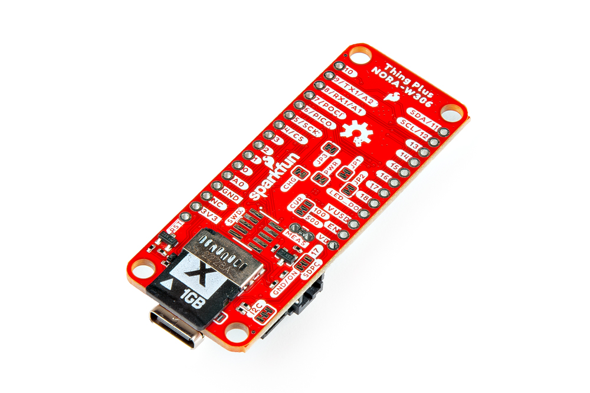
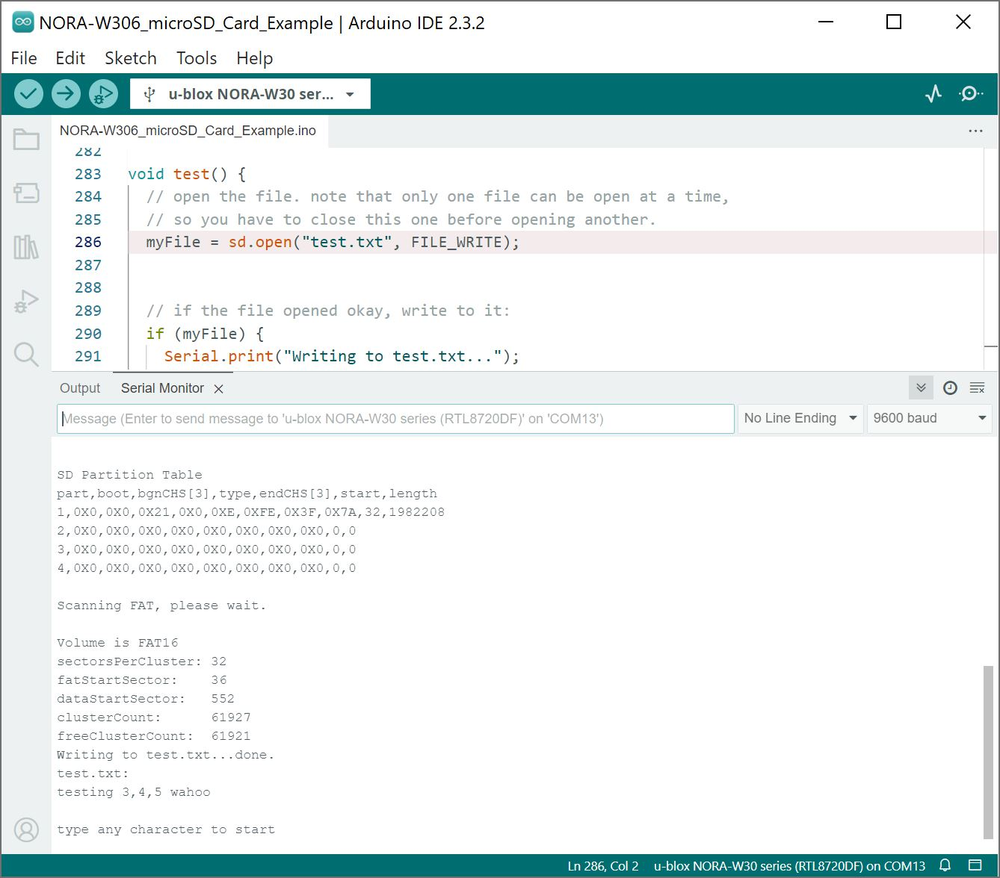

In this example, we will write some text to a microSD card and read the contents of the text file for verification.


### Hardware Hookup

Make sure to insert a microSD card into the microSD card socket on the back of the board.

<div style="text-align: center;">
  <table>
    <tr style="vertical-align:middle;">
     <td style="text-align: center; vertical-align: middle; border: solid 1px #cccccc;"><a href="../assets/img/WRL-21637_Thing_Plus_NORA-W306_microSD_Card.jpg"></a></td>
    </tr>
    <tr style="vertical-align:middle;">
     <td style="text-align: center; vertical-align: middle; border: solid 1px #cccccc;"><i>MicroSD Card in Socket</i></td>
    </tr>
  </table>
</div>

When ready, connect the board to your computer with the USB C cable.

### Arduino Library


### Arduino Code

Let&apos;s check your microSD card, write some text to a fill, and read hte contents of the file for verification

Copy and paste the following code in the Arduino IDE. Select the correct board definition from the menu (in this case, **Tools** > **Boards** > **SparkFun Thing Plus NORA-W306 (RTL8720DF)**). Then select the correct COM port that the board enumerated to (in this case, it was COM13). Hit upload button.

``` C++
/*
SparkFun Electronics
7/17/2024


SD card example for the SparkFun Thing Plus NORA-W306


Note, the SparkFun Thing Plus NORA-W306 does not use the SDIO hardware peripheral.
It utilizes SPI0 to communicate with the uSD card.


Using sdFAT and the onboard uSD socket (SPI0), this program attempts to:

  1. Initialize an SD card and analyze its structure.


  2. Create a file on the SD card and write a string to it.


  3. Open the file and print the contents to the serial monitor.


Hardware Hookup and Instructions:
  Insert an SD card into the SD card slot on the NORA-W306.
  Connect the NORA-W306 to your computer using a USB-C cable.
  Upload this code to the NORA-W306.
  Open the serial monitor to see the results.


Software versions used in this example:
  Arduino IDE 2.3.2
  usdFAT by Bill Greiman, Arduino Library Version 2.2.3
    (https://github.com/greiman/SdFat)
  Realtek Ameba Boards (32-bits ARM Cortex-M33 @200MHz) by Realtek Version 3.1.8
    (https://github.com/ambiot/ambd_arduino)
    (https://raw.githubusercontent.com/ambiot/ambd_arduino/dev/Arduino_package/package_realtek_amebad_early_index.json)


Original code is from the following two examples in the SdFat library:
  SdInfo - Program to read and display SD card information
    -MIT License, Copyright (c) 2011..2020 Bill Greiman
  examplesV1/ReadWrite - Program to test read and write functions
    -Public Domain, created Nov 2010 by David A. Mellis, modified 9 Apr 2012 by Tom Igoe


MIT License


Copyright (c) 2024 SparkFun Electronics


Permission is hereby granted, free of charge, to any person obtaining a copy of
this software and associated documentation files (the "Software"), to deal in the
Software without restriction, including without limitation the rights to use,
copy, modify, merge, publish, distribute, sublicense, and/or sell copies of the
Software, and to permit persons to whom the Software is furnished to do so,
subject to the following conditions:


The above copyright notice and this permission notice shall be included in all
copies or substantial portions of the Software.


THE SOFTWARE IS PROVIDED "AS IS", WITHOUT WARRANTY OF ANY KIND, EXPRESS OR IMPLIED,
INCLUDING BUT NOT LIMITED TO THE WARRANTIES OF MERCHANTABILITY, FITNESS FOR A
PARTICULAR PURPOSE AND NONINFRINGEMENT. IN NO EVENT SHALL THE AUTHORS OR COPYRIGHT
HOLDERS BE LIABLE FOR ANY CLAIM, DAMAGES OR OTHER LIABILITY, WHETHER IN AN ACTION
OF CONTRACT, TORT OR OTHERWISE, ARISING FROM, OUT OF OR IN CONNECTION WITH THE
SOFTWARE OR THE USE OR OTHER DEALINGS IN THE SOFTWARE.
*/


#include "SdFat.h"
#include "sdios.h"


File myFile;


/*
  Set DISABLE_CS_PIN to disable a second SPI device.
  For example, with the Ethernet shield, set DISABLE_CS_PIN
  to 10 to disable the Ethernet controller.
*/
const int8_t DISABLE_CS_PIN = -1;
/*
  Change the value of SD_CS_PIN if you are using SPI
  and your hardware does not use the default value, SS.
  Common values are:
  Arduino Ethernet shield: pin 4
  Sparkfun SD shield: pin 8
  Adafruit SD shields and modules: pin 10
  SparkFun Thing Plus NORA-W306: Arduino pin 4 (aka SS/PB_21/SPI0_CS)
*/
// SDCARD_SS_PIN is defined for the built-in SD on some boards.
#ifndef SDCARD_SS_PIN
const uint8_t SD_CS_PIN = SS;
#else   // SDCARD_SS_PIN
const uint8_t SD_CS_PIN = SDCARD_SS_PIN;
#endif  // SDCARD_SS_PIN


// Try to select the best SD card configuration.
#if HAS_SDIO_CLASS
#define SD_CONFIG SdioConfig(FIFO_SDIO)
#elif ENABLE_DEDICATED_SPI
#define SD_CONFIG SdSpiConfig(SD_CS_PIN, DEDICATED_SPI, SD_SCK_MHZ(16))
#else  // HAS_SDIO_CLASS
#define SD_CONFIG SdSpiConfig(SD_CS_PIN, SHARED_SPI, SD_SCK_MHZ(16))
#endif  // HAS_SDIO_CLASS


//------------------------------------------------------------------------------
SdFs sd;
cid_t cid;
csd_t csd;
scr_t scr;
uint8_t cmd6Data[64];
uint32_t eraseSize;
uint32_t ocr;
static ArduinoOutStream cout(Serial);
//------------------------------------------------------------------------------
void cidDmp() {
  cout << F("\nManufacturer ID: ");
  cout << uppercase << showbase << hex << int(cid.mid) << dec << endl;
  cout << F("OEM ID: ") << cid.oid[0] << cid.oid[1] << endl;
  cout << F("Product: ");
  for (uint8_t i = 0; i < 5; i++) {
    cout << cid.pnm[i];
  }
  cout << F("\nRevision: ") << cid.prvN() << '.' << cid.prvM() << endl;
  cout << F("Serial number: ") << hex << cid.psn() << dec << endl;
  cout << F("Manufacturing date: ");
  cout << cid.mdtMonth() << '/' << cid.mdtYear() << endl;
  cout << endl;
}
//------------------------------------------------------------------------------
void clearSerialInput() {
  uint32_t m = micros();
  do {
    if (Serial.read() >= 0) {
      m = micros();
    }
  } while (micros() - m < 10000);
}
//------------------------------------------------------------------------------
void csdDmp() {
  eraseSize = csd.eraseSize();
  cout << F("cardSize: ") << 0.000512 * csd.capacity();
  cout << F(" MB (MB = 1,000,000 bytes)\n");


  cout << F("flashEraseSize: ") << int(eraseSize) << F(" blocks\n");
  cout << F("eraseSingleBlock: ");
  if (csd.eraseSingleBlock()) {
    cout << F("true\n");
  } else {
    cout << F("false\n");
  }
  cout << F("dataAfterErase: ");
  if (scr.dataAfterErase()) {
    cout << F("ones\n");
  } else {
    cout << F("zeros\n");
  }
}
//------------------------------------------------------------------------------
void errorPrint() {
  if (sd.sdErrorCode()) {
    cout << F("SD errorCode: ") << hex << showbase;
    printSdErrorSymbol(&Serial, sd.sdErrorCode());
    cout << F(" = ") << int(sd.sdErrorCode()) << endl;
    cout << F("SD errorData = ") << int(sd.sdErrorData()) << dec << endl;
  }
}
//------------------------------------------------------------------------------
bool mbrDmp() {
  MbrSector_t mbr;
  bool valid = true;
  if (!sd.card()->readSector(0, (uint8_t *)&mbr)) {
    cout << F("\nread MBR failed.\n");
    errorPrint();
    return false;
  }
  cout << F("\nSD Partition Table\n");
  cout << F("part,boot,bgnCHS[3],type,endCHS[3],start,length\n");
  for (uint8_t ip = 1; ip < 5; ip++) {
    MbrPart_t *pt = &mbr.part[ip - 1];
    if ((pt->boot != 0 && pt->boot != 0X80) || getLe32(pt->relativeSectors) > csd.capacity()) {
      valid = false;
    }
    cout << int(ip) << ',' << uppercase << showbase << hex;
    cout << int(pt->boot) << ',';
    for (int i = 0; i < 3; i++) {
      cout << int(pt->beginCHS[i]) << ',';
    }
    cout << int(pt->type) << ',';
    for (int i = 0; i < 3; i++) {
      cout << int(pt->endCHS[i]) << ',';
    }
    cout << dec << getLe32(pt->relativeSectors) << ',';
    cout << getLe32(pt->totalSectors) << endl;
  }
  if (!valid) {
    cout << F("\nMBR not valid, assuming Super Floppy format.\n");
  }
  return true;
}
//------------------------------------------------------------------------------
void dmpVol() {
  cout << F("\nScanning FAT, please wait.\n");
  int32_t freeClusterCount = sd.freeClusterCount();
  if (sd.fatType() <= 32) {
    cout << F("\nVolume is FAT") << int(sd.fatType()) << endl;
  } else {
    cout << F("\nVolume is exFAT\n");
  }
  cout << F("sectorsPerCluster: ") << sd.sectorsPerCluster() << endl;
  cout << F("fatStartSector:    ") << sd.fatStartSector() << endl;
  cout << F("dataStartSector:   ") << sd.dataStartSector() << endl;
  cout << F("clusterCount:      ") << sd.clusterCount() << endl;
  cout << F("freeClusterCount:  ");
  if (freeClusterCount >= 0) {
    cout << freeClusterCount << endl;
  } else {
    cout << F("failed\n");
    errorPrint();
  }
}
//------------------------------------------------------------------------------
void printCardType() {
  cout << F("\nCard type: ");
  switch (sd.card()->type()) {
    case SD_CARD_TYPE_SD1:
      cout << F("SD1\n");
      break;
    case SD_CARD_TYPE_SD2:
      cout << F("SD2\n");
      break;
    case SD_CARD_TYPE_SDHC:
      if (csd.capacity() < 70000000) {
        cout << F("SDHC\n");
      } else {
        cout << F("SDXC\n");
      }
      break;
    default:
      cout << F("Unknown\n");
  }
}
//------------------------------------------------------------------------------
void printConfig(SdSpiConfig config) {
  if (DISABLE_CS_PIN < 0) {
    cout << F(
      "\nAssuming the SD is the only SPI device.\n"
      "Edit DISABLE_CS_PIN to disable an SPI device.\n");
  } else {
    cout << F("\nDisabling SPI device on pin ");
    cout << int(DISABLE_CS_PIN) << endl;
    pinMode(DISABLE_CS_PIN, OUTPUT);
    digitalWrite(DISABLE_CS_PIN, HIGH);
  }
  cout << F("\nAssuming the SD chip select pin is: ") << int(config.csPin);
  cout << F("\nEdit SD_CS_PIN to change the SD chip select pin.\n");
}
//------------------------------------------------------------------------------
void printConfig(SdioConfig config) {
  (void)config;
  cout << F("Assuming an SDIO interface.\n");
}
//-----------------------------------------------------------------------------
void setup() {
  Serial.begin(9600);
  // Wait for USB Serial
  while (!Serial) {
    yield();
  }
  cout << F("SdFat version: ") << SD_FAT_VERSION_STR << endl;
  printConfig(SD_CONFIG);
}
//------------------------------------------------------------------------------
void loop() {
  // Read any existing Serial data.
  clearSerialInput();


  // F stores strings in flash to save RAM
  cout << F("\ntype any character to start\n");
  while (!Serial.available()) {
    yield();
  }
  uint32_t t = millis();
  if (!sd.cardBegin(SD_CONFIG)) {
    cout << F(
      "\nSD initialization failed.\n"
      "Do not reformat the card!\n"
      "Is the card correctly inserted?\n"
      "Is there a wiring/soldering problem?\n");
    if (isSpi(SD_CONFIG)) {
      cout << F(
        "Is SD_CS_PIN set to the correct value?\n"
        "Does another SPI device need to be disabled?\n");
    }
    errorPrint();
    return;
  }
  t = millis() - t;
  cout << F("init time: ") << dec << t << " ms" << endl;


  if (!sd.card()->readCID(&cid) || !sd.card()->readCSD(&csd) || !sd.card()->readOCR(&ocr) || !sd.card()->readSCR(&scr)) {
    cout << F("readInfo failed\n");
    errorPrint();
    return;
  }
  printCardType();
  cout << F("sdSpecVer: ") << 0.01 * scr.sdSpecVer() << endl;
  cout << F("HighSpeedMode: ");
  if (scr.sdSpecVer() && sd.card()->cardCMD6(0X00FFFFFF, cmd6Data) && (2 & cmd6Data[13])) {
    cout << F("true\n");
  } else {
    cout << F("false\n");
  }
  cidDmp();
  csdDmp();
  cout << F("\nOCR: ") << uppercase << showbase;
  cout << hex << ocr << dec << endl;
  if (!mbrDmp()) {
    return;
  }
  if (!sd.volumeBegin()) {
    cout << F("\nvolumeBegin failed. Is the card formatted?\n");
    errorPrint();
    return;
  }
  dmpVol();
  test();
}
//------------------------------------------------------------------------------
void test() {
  // open the file. note that only one file can be open at a time,
  // so you have to close this one before opening another.
  myFile = sd.open("test.txt", FILE_WRITE);


  // if the file opened okay, write to it:
  if (myFile) {
    Serial.print("Writing to test.txt...");
    myFile.println("testing 3,4,5 wahoo");
    // close the file:
    myFile.close();
    Serial.println("done.");
  } else {
    // if the file didn't open, print an error:
    Serial.println("error opening test.txt");
  }


  // re-open the file for reading:
  myFile = sd.open("test.txt");
  if (myFile) {
    Serial.println("test.txt:");


    // read from the file until there's nothing else in it:
    while (myFile.available()) {
      Serial.write(myFile.read());
    }
    // close the file:
    myFile.close();
  } else {
    // if the file didn't open, print an error:
    Serial.println("error opening test.txt");
  }
}
```


Open the [Arduino Serial Monitor](https://learn.sparkfun.com/tutorials/terminal-basics/arduino-serial-monitor-windows-mac-linux) at **115200** baud. Send a character through the Arduino Serial Monitor. You should get a prompt in the Serial Monitor. Enter a chararacter (i.e. send <kbd>s</kbd> or any other keyboard character) to start. The example will then read the card. If the card is compatible, the output will provide information about the microSD card type, create a new file, write text to the file, and then close the file. The example will then re-open the file and read the contents of the file. You should see the following text in the file: "_testing 3,4,5 wahoo_". If the example code is run more than once, you may see the same text repeat a few times.

<div style="text-align: center;">
  <table>
    <tr style="vertical-align:middle;">
     <td style="text-align: center; vertical-align: middle; border: solid 1px #cccccc;"><a href="../assets/img/NORA-W306_sdFAT_microSD_Card_Example_Output.JPG"></a></td>
    </tr>
    <tr style="vertical-align:middle;">
     <td style="text-align: center; vertical-align: middle; border: solid 1px #cccccc;"><i>MicroSD Card Test Output</i></td>
    </tr>
  </table>
</div>

To open using the a file explorer, you can disconnect the SparkFun Thing Plus - NORA-W306, remove the microSD card, and connect it to a computer with a microSD card adapter. Once connected, you can open the **test.txt** file with a text editor to verify the text written in the file.

<div style="text-align: center;">
  <table>
    <tr style="vertical-align:middle;">
     <td style="text-align: center; vertical-align: middle; border: solid 1px #cccccc;"><a href="../assets/img/File_Explorer_Text_Editor_Verification.JPG"></a></td>
    </tr>
    <tr style="vertical-align:middle;">
     <td style="text-align: center; vertical-align: middle; border: solid 1px #cccccc;"><i>File Explorer Text Editor Verification</i></td>
    </tr>
  </table>
</div>
