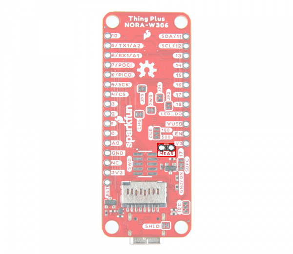
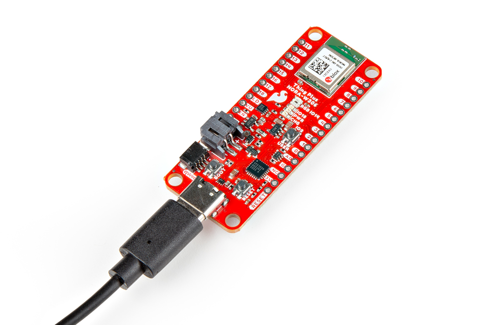
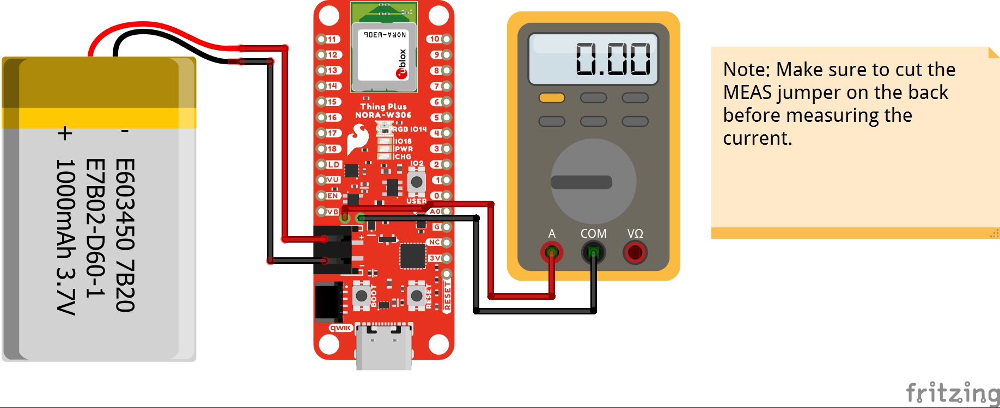
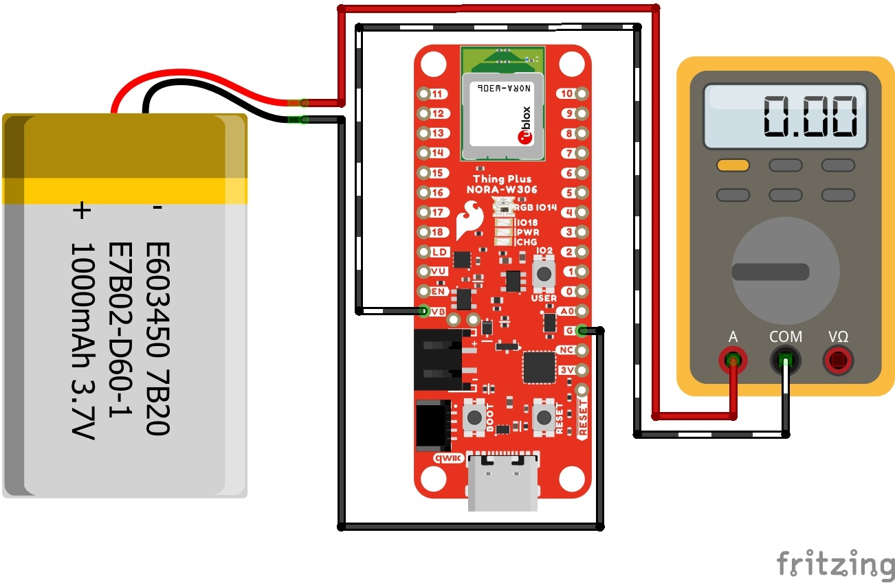

In this example, we will show how to set your board in deep sleep, blink the user LED as an indicator, and then go back into power saving mode.


!!! note
    This is a modified example from the Realtek's Arduino example for [Deep Sleep Mode](https://www.amebaiot.com/en/amebad-arduino-deepsleepmode/).


### Hardware Hookup

For users interested in measuring the current draw via the MEAS jumper, you can cut the trace located on the back of the board. Power the board via USB or battery. Then place a [multimeter set to measure current](https://learn.sparkfun.com/tutorials/how-to-use-a-multimeter#measuring-current) on the PTHs. This makes it easier to measure the current as opposed to measuring the current between the power source and connector.

!!! note
    The MEAS jumper is before the XC6222 3.3V voltage regulator. For users that are connecting power to the 3V3 pin or Qwiic connector, you will need to place a multimeter between the regulated 3.3V power source and the board.

<div style="text-align: center;">
  <table>
    <tr style="vertical-align:middle;">
     <td style="text-align: center; vertical-align: middle; border: solid 1px #cccccc;"><a href="../assets/img/WRL-21637_Thing_Plus_NORA-W306_MEAS_Jumper_Modified.jpg"></a></td>
    </tr>
    <tr style="vertical-align:middle;">
     <td style="text-align: center; vertical-align: middle; border: solid 1px #cccccc;"><i>MEAS Jumper Modified</i></td>
    </tr>
  </table>
</div>

To upload code, connect the USB cable to the SparkFun Thing Plus NORA-W306. Of course, make sure to connect the other end to your computer.

<div style="text-align: center;">
  <table>
    <tr style="vertical-align:middle;">
     <td style="text-align: center; vertical-align: middle; border: solid 1px #cccccc;"><a href="../assets/img/WRL-21637_Thing_Plus_NORA-W306_USB_Cable.jpg"></a></td>
    </tr>
    <tr style="vertical-align:middle;">
     <td style="text-align: center; vertical-align: middle; border: solid 1px #cccccc;"><i>USB Cable inserted into Thing Plus NORA-W306</i></td>
    </tr>
  </table>
</div>

!!! tip
    Make sure to add a solder blob on the MEAS jumper when finished measuring. Users can also solder a [2-pin male header](https://www.sparkfun.com/products/116) and [shunt](https://www.sparkfun.com/products/9044) to the PTHs to easily remove/add the connection.


### Arduino Code

This example builds upon Realtek's deep sleep mode. Once the deep sleep modes are set up, the NORA-W306 goes into deep sleep. In this particular example, we will use the timer (i.e. `SET_DS_AON_TIMER_WAKEUP`) as the source. After 5 seconds, the board wakes up with the user LED also blinking five times before going back to deep sleep for 5 seconds.

!!! note
    The serial UART is disabled to reduce amount the peripherals that are turned on. To save more power, you can cut the JP3 and PWR LED jumpers. There is also a fancy circuit to disable power to the CP2102 when there is no USB power. As an alternative to USB power, users can power the board with a LiPo battery.

Copy and paste the following code in the Arduino IDE. Select your Board (in this case the **SparkFun Thing Plus NORA-W306 (RTL8720DF)**), and associated COM port (in this case **COM13**). Then hit the upload button.

``` C++
/*
* SparkFun Electronics
* 7/17/2024
*
* SparkFun_ThingPlus_NORAW306_DeepSleepBlink.ino
*
* Deep Sleep mode example for the SparkFun Thing Plus NORA-W306
*
* This example demonstrates how to put the NORA-W306 into deep sleep mode and
* wake it up using the AON timer (every 5 seconds).
* When awake, the onboard LED will blink.
* When asleep, the current consumption can be monitored using the MEAS jumper.
*
* Hardware Hookup and Instructions:
*   Connect the NORA-W306 to your computer using a USB-C cable.
*   Upload this code to the NORA-W306.
*   To measure the low-power consumption of the NORA-W306, remove USB-C cable
*   and utilize the MEAS jumper to measure the current consumption.
*   
* Software versions used in this example:
*   Arduino IDE 2.3.2
*   Realtek Ameba Boards (32-bits ARM Cortex-M33 @200MHz) by Realtek Version 3.1.8
*     (https://github.com/ambiot/ambd_arduino)
*     (https://raw.githubusercontent.com/ambiot/ambd_arduino/dev/Arduino_package/package_realtek_amebad_early_index.json)
*
* Original code is from the following example in the RealTek Ameba Arduino package:
*  Examples -> AmebaPowerSave -> DeepSleepMode.ino
*
* MIT License
*
* Copyright (c) 2024 SparkFun Electronics
*
* Permission is hereby granted, free of charge, to any person obtaining a copy of
* this software and associated documentation files (the "Software"), to deal in the
* Software without restriction, including without limitation the rights to use,
* copy, modify, merge, publish, distribute, sublicense, and/or sell copies of the
* Software, and to permit persons to whom the Software is furnished to do so,
* subject to the following conditions:
*
* The above copyright notice and this permission notice shall be included in all
* copies or substantial portions of the Software.
*
* THE SOFTWARE IS PROVIDED "AS IS", WITHOUT WARRANTY OF ANY KIND, EXPRESS OR IMPLIED,
* INCLUDING BUT NOT LIMITED TO THE WARRANTIES OF MERCHANTABILITY, FITNESS FOR A
* PARTICULAR PURPOSE AND NONINFRINGEMENT. IN NO EVENT SHALL THE AUTHORS OR COPYRIGHT
* HOLDERS BE LIABLE FOR ANY CLAIM, DAMAGES OR OTHER LIABILITY, WHETHER IN AN ACTION
* OF CONTRACT, TORT OR OTHERWISE, ARISING FROM, OUT OF OR IN CONNECTION WITH THE
* SOFTWARE OR THE USE OR OTHER DEALINGS IN THE SOFTWARE.
*/

#include <PowerSave.h>

//SET_DS_AON_TIMER_WAKEUP
//SET_DS_RTC_WAKEUP
//For AMB21/22 only the AON GPIO pins listed below should be selected
    //SET_AON_GPIO_WAKEUP_PA25          // pin 16
    //SET_AON_GPIO_WAKEUP_PA26          // pin 17
    //SET_AON_GPIO_WAKEUP_PA21          // pin 26
    //SET_AON_GPIO_WAKEUP_PA20          // pin 27
    //SET_AON_GPIO_WAKEUP_PA19          // pin 28
//For AMB23 only the AON GPIO pins listed below should be selected
    //SET_AON_GPIO_WAKEUP_PA12          // pin 9
    //SET_AON_GPIO_WAKEUP_PA13          // pin 10
    //SET_AON_GPIO_WAKEUP_PA14          // pin 11
    //SET_AON_GPIO_WAKEUP_PA15          // pin 12
    //SET_AON_GPIO_WAKEUP_PA16          // pin 13
    //SET_AON_GPIO_WAKEUP_PA18          // pin 15
    //SET_AON_GPIO_WAKEUP_PA19          // pin 16
    //SET_AON_GPIO_WAKEUP_PA21          // pin 18
//For BW16/BW16-TypeC only the AON GPIO pins listed below should be selected
    //SET_AON_GPIO_WAKEUP_PA25          // pin 7
    //SET_AON_GPIO_WAKEUP_PA26          // pin 8
    //SET_AON_GPIO_WAKEUP_PA15          // pin 9
    //SET_AON_GPIO_WAKEUP_PA14          // pin 10
    //SET_AON_GPIO_WAKEUP_PA13          // pin 11
    //SET_AON_GPIO_WAKEUP_PA12          // pin 12
//For board AW-CU488_ThingPlus
    //SET_AON_GPIO_WAKEUP_PA18          // pin 0
    //SET_AON_GPIO_WAKEUP_PA16          // pin 1
    //SET_AON_GPIO_WAKEUP_PA17          // pin 2
    //SET_AON_GPIO_WAKEUP_PA13          // pin 3
    //SET_AON_GPIO_WAKEUP_PA12          // pin 4
    //SET_AON_GPIO_WAKEUP_PA26          // pin 5
    //SET_AON_GPIO_WAKEUP_PA25          // pin 6
    //SET_AON_GPIO_WAKEUP_PA19          // pin 8
    //SET_AON_GPIO_WAKEUP_PA15          // pin 28
    //SET_AON_GPIO_WAKEUP_PA14          // pin 29
//For board AMB25/AMB26
    //SET_AON_GPIO_WAKEUP_PA12          // pin 3
    //SET_AON_GPIO_WAKEUP_PA13          // pin 2
    //SET_AON_GPIO_WAKEUP_PA14          // pin 1
    //SET_AON_GPIO_WAKEUP_PA15          // pin 0
    //SET_AON_GPIO_WAKEUP_PA25          // pin 7
    //SET_AON_GPIO_WAKEUP_PA26          // pin 6
//For board SparkFun Thing Plus NORA-W306
    //SET_AON_GPIO_WAKEUP_PA18          // pin 6
    //SET_AON_GPIO_WAKEUP_PA13          // pin 13
    //SET_AON_GPIO_WAKEUP_PA12          // pin 14
    //SET_AON_GPIO_WAKEUP_PA26          // pin 11
    //SET_AON_GPIO_WAKEUP_PA25          // pin 12
    //SET_AON_GPIO_WAKEUP_PA15          // pin 15
    //SET_AON_GPIO_WAKEUP_PA14          // pin 16

#define DS_WAKEUP_SOURCE                SET_DS_AON_TIMER_WAKEUP

#define AON_TIMER_SLEEP_DURATION        5000
#define DS_RTC_ALARM_DAY                0
#define DS_RTC_ALARM_HOUR               0
#define DS_RTC_ALARM_MIN                0
#define DS_RTC_ALARM_SEC                10

void DeepSleep_wakeup(void) {
    //printf("\r\nDeep sleep wakeuped! \r\n");
    uint32_t wakereason_number = PowerSave.AONWakeReason();

    //pinMode(17, OUTPUT); // 17 SDPC uSD power control
    //digitalWrite(17, LOW); // Turn on uSD power if you'd like to measure its current consumption   

    if (wakereason_number == AONWakeReason_AON_GPIO) {
        //printf("AonWakepin wakeup. Wait 5s sleep again.    \r\n");
        delay(5000);
    } else if (wakereason_number == AONWakeReason_AON_TIMER) {
        PowerSave.AONTimerCmd();
        //printf("AonTimer wakeup. Wait 5s sleep again.    \r\n");

        pinMode(LED_BUILTIN, OUTPUT);
        for(int i = 0 ; i < 5 ; i ++)
        {
          digitalWrite(LED_BUILTIN, HIGH);
          delay(1000);
          digitalWrite(LED_BUILTIN, LOW);
          delay(1000);
        }
        pinMode(LED_BUILTIN, INPUT);
        //delay(5000);
    } else if (wakereason_number == AONWakeReason_RTC) {
        //printf("RTC wakeup. Wait 5s sleep again.    \r\n");
        delay(5000);
    }

    //pinMode(17, INPUT_PULLUP); // 17 SDPC uSD power control (Pullup = off)

    PowerSave.AONWakeClear();
}

void setup() {
    // If you want serial debug messages, uncomment the following lines and others
    // below, as desired.
    // Open serial communications and wait for port to open:
    // Serial.begin(115200);
    // while (!Serial) {
    //     ; // wait for serial port to connect. Needed for native USB port only
    // }

    // Pin configuration - specific to the SparkFun Thing Plus NORA-W306

    pinMode(0, INPUT_PULLDOWN); // LOG RX, can backpower the CP2102
    pinMode(1, INPUT_PULLDOWN); // LOG TX, can backpower the CP2102
    pinMode(4, INPUT_PULLDOWN); // SPI0_CS, can sink current from 3V3 via R16 (100K), note, this is only possible if you leave uSD power on
    pinMode(5, INPUT_PULLDOWN); // SPI0_CLK
    pinMode(6, INPUT_PULLDOWN); // SPI0_PICO
    pinMode(7, INPUT_PULLDOWN); // SPI0_POCI

    pinMode(11, INPUT_PULLUP); // SDA
    pinMode(12, INPUT_PULLUP); // SCL
    pinMode(17, INPUT_PULLUP); // 17 SDPC uSD power control
    pinMode(20, INPUT_PULLNONE); // aka PB_24, this is tied internally to PB_23 (aka Arduino pin "17") and also defaults to internal pulldown.

    PowerSave.begin(DEEPSLEEP_MODE);

    if (TRUE == (PowerSave.DsleepWakeStatusGet())) {
        DeepSleep_wakeup();
    }

    PowerSave.AONTimerDuration(0);

    switch (DS_WAKEUP_SOURCE) {
        case SET_DS_AON_TIMER_WAKEUP:
            PowerSave.DS_AON_TIMER_WAKEUP();
            PowerSave.AONTimerDuration(AON_TIMER_SLEEP_DURATION);
            break;
        case SET_DS_RTC_WAKEUP:
            PowerSave.DS_RTC_WAKEUP();
            PowerSave.RTCWakeSetup(DS_RTC_ALARM_DAY, DS_RTC_ALARM_HOUR, DS_RTC_ALARM_MIN, DS_RTC_ALARM_SEC);
            break;
        case SET_AON_GPIO_WAKEUP_PA12:
            PowerSave.AON_WAKEPIN_WAKEUP_PA12();
            break;
        case SET_AON_GPIO_WAKEUP_PA13:
            PowerSave.AON_WAKEPIN_WAKEUP_PA13();
            break;
        case SET_AON_GPIO_WAKEUP_PA14:
            PowerSave.AON_WAKEPIN_WAKEUP_PA14();
            break;
        case SET_AON_GPIO_WAKEUP_PA15:
            PowerSave.AON_WAKEPIN_WAKEUP_PA15();
            break;
        case SET_AON_GPIO_WAKEUP_PA16:
            PowerSave.AON_WAKEPIN_WAKEUP_PA16();
            break;
        case SET_AON_GPIO_WAKEUP_PA17:
            PowerSave.AON_WAKEPIN_WAKEUP_PA17();
            break;
        case SET_AON_GPIO_WAKEUP_PA18:
            PowerSave.AON_WAKEPIN_WAKEUP_PA18();
            break;
        case SET_AON_GPIO_WAKEUP_PA19:
            PowerSave.AON_WAKEPIN_WAKEUP_PA19();
            break;
        case SET_AON_GPIO_WAKEUP_PA20:
            PowerSave.AON_WAKEPIN_WAKEUP_PA20();
            break;
        case SET_AON_GPIO_WAKEUP_PA21:
            PowerSave.AON_WAKEPIN_WAKEUP_PA21();
            break;
        case SET_AON_GPIO_WAKEUP_PA25:
            PowerSave.AON_WAKEPIN_WAKEUP_PA25();
            break;
        case SET_AON_GPIO_WAKEUP_PA26:
            PowerSave.AON_WAKEPIN_WAKEUP_PA26();
            break;
        default:
            printf("Unknown wakeup source.    \r\n");
        break;
    }

    PowerSave.enable();
}

void loop() {
    delay(1000);
}
```

Once connected, choose a power source to connect to the SparkFun Thing Plus NORA-W306. This can be through the PTHs on the edge of the board (VU, VB, or 3V3) or the connectors (USB C, 2-pin JST, or Qwiic). Note that the board will draw more power through the USB C connector and VU PTH as this will power the CP2102. Power will also be drawn with the LiPo charger and 3.3V voltage regulator.

Below are a few diagrams showing two possible ways to measure the current draw when the board is in deep sleep mode.

<div style="text-align: center;">
  <table>
    <tr style="vertical-align:middle;">
     <td style="text-align: center; vertical-align: middle; border: solid 1px #cccccc;"><a href="../assets/img/NORA-W306_Low_Power_Deep_Sleep_Multimeter_bb.jpg"></a></td>
     <td style="text-align: center; vertical-align: middle; border: solid 1px #cccccc;"><a href="../assets/img/NORA-W306_Low_Power_Deep_Sleep_Multimeter_PTH_bb.jpg"></a></td>
    </tr>
    <tr style="vertical-align:middle;">
     <td style="text-align: center; vertical-align: middle; border: solid 1px #cccccc;"><i>Fritzing Diagram of Multimeter Measuring Current through MEAS and a LiPo Battery as the Power Source</i></td>
     <td style="text-align: center; vertical-align: middle; border: solid 1px #cccccc;"><i>Fritzing Diagram of Multimeter Measuring Current LiPo Battery and Board</i></td>
    </tr>
  </table>
</div>

If you haven't already, check out the demo video that was linked earlier in the hardware overview showing the current draw for the board in low power mode!

<div style="text-align: center;">
  <iframe width="560" height="315" src="https://www.youtube.com/embed/ElCYbEnyYH4?si=EVBnWnvqqZ6KBMxX" title="YouTube video player" frameborder="0" allow="accelerometer; autoplay; clipboard-write; encrypted-media; gyroscope; picture-in-picture; web-share" referrerpolicy="strict-origin-when-cross-origin" allowfullscreen></iframe>
</div>
