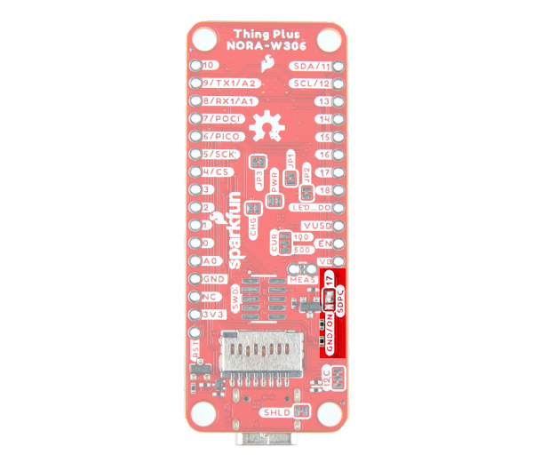
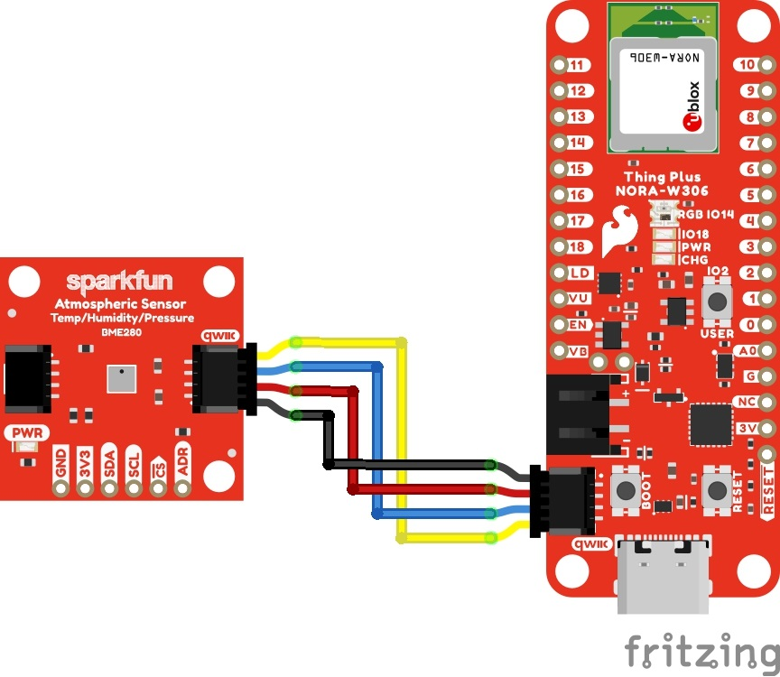
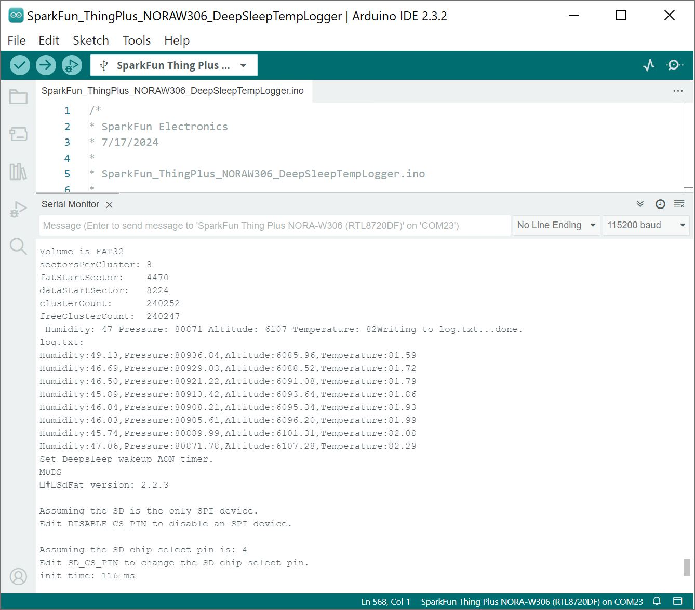
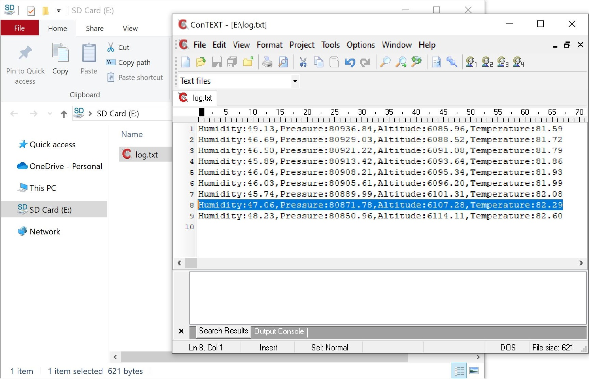
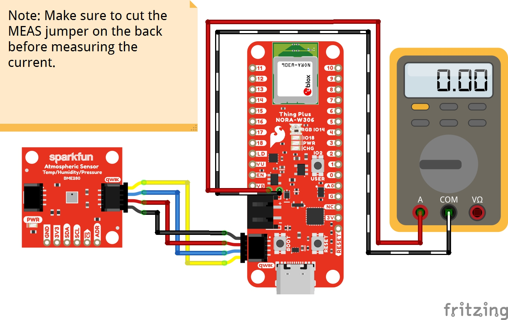
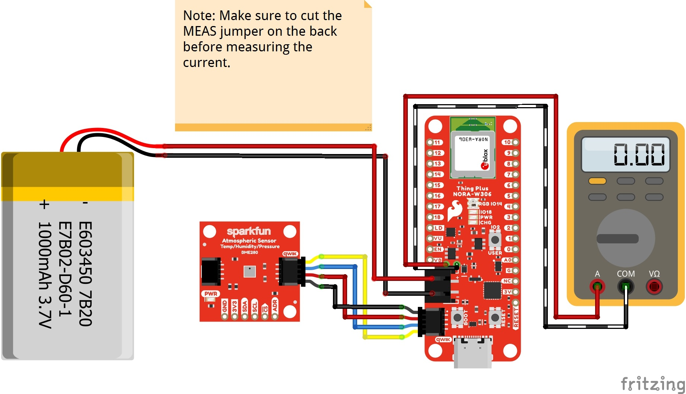

In this example, we will read sensor readings from a BME280, log the data to a microSD card, and then go into deep sleep.


### Hardware Hookup

To take advantage of the SD power control (SDPC), you will need to make sure to cut the trace on the back of the board and add a solder blob between the center pad and pad labeled as `17`.

<div style="text-align: center;">
  <table>
    <tr style="vertical-align:middle;">
     <td style="text-align: center; vertical-align: middle; border: solid 1px #cccccc;"><a href="../assets/img/WRL-21637_Thing_Plus_NORA-W306_SDPC_Jumper_Modification.jpg"></a></td>
    </tr>
    <tr style="vertical-align:middle;">
     <td style="text-align: center; vertical-align: middle; border: solid 1px #cccccc;"><i>MicroSD Card Power Control Jumper Modified</i></td>
    </tr>
  </table>
</div>

When ready, insert a microSD card into the socket on the back of the board. Then connect the Qwiic BME280 to the SparkFun Thing Plus NORA-W306 using a Qwiic cable.


<div style="text-align: center;">
  <table>
    <tr style="vertical-align:middle;">
     <td style="text-align: center; vertical-align: middle; border: solid 1px #cccccc;"><a href="../assets/img/NORA-W306_Low_Power_Deep_Sleep_microSD_BME280_bb.jpg"></a></td>
    </tr>
    <tr style="vertical-align:middle;">
     <td style="text-align: center; vertical-align: middle; border: solid 1px #cccccc;"><i>Fritzing Diagram BME280 connected to NORA-W306 via Qwiic</i></td>
    </tr>
  </table>
</div>

Connect a USB cable to the board to power and upload code.


### Arduino Code

This example builds upon Realtek's deep sleep like the previous example. In addition to blinking the LED, we will also read the temperature from a BME280 and write the sensor data to the microSD card.


Copy and paste the following code in the Arduino IDE. Select your Board (in this case the **SparkFun Thing Plus NORA-W306 (RTL8720DF)**), and associated COM port (in this case **COM23**). Then hit the upload button.

``` C++
/*
* SparkFun Electronics
* 7/17/2024
*
* SparkFun_ThingPlus_NORAW306_DeepSleepTempLogger.ino
*
* Deep Sleep mode with data logging  - example for the SparkFun Thing Plus NORA-W306
*
* This example demonstrates how to put the NORA-W306 into deep sleep mode and
* wake it up using the AON timer (every 5 seconds).
* When awake, it will log the temperature from the BME280 sensor to the uSD card.
* When awake, it will also blink the stat LED three times to indicate a log has happened.
* When asleep, the current consumption can be monitored using the MEAS jumper.
*
* Hardware Hookup and Instructions:
*   Connect the NORA-W306 to your computer using a USB-C cable.
*   Connect the BME280 sensor with a Qwiic Cable.
*   Upload this code to the NORA-W306.
*   To measure the low-power consumption of the NORA-W306, remove USB-C cable
*   and utilize the MEAS jumper to measure the current consumption.
*   
* Software versions used in this example:
*   Arduino IDE 2.3.2
*   Realtek Ameba Boards (32-bits ARM Cortex-M33 @200MHz) by Realtek Version 3.1.8
*     (https://github.com/ambiot/ambd_arduino)
*     (https://raw.githubusercontent.com/ambiot/ambd_arduino/dev/Arduino_package/package_realtek_amebad_early_index.json)
*   BME280 library by SparkFun Electronics
*     (https://github.com/sparkfun/SparkFun_BME280_Arduino_Library)
*
* Original code is from the following example in the RealTek Ameba Arduino package:
*  Examples -> AmebaPowerSave -> DeepSleepMode.ino
*
* MIT License
*
* Copyright (c) 2024 SparkFun Electronics
*
* Permission is hereby granted, free of charge, to any person obtaining a copy of
* this software and associated documentation files (the "Software"), to deal in the
* Software without restriction, including without limitation the rights to use,
* copy, modify, merge, publish, distribute, sublicense, and/or sell copies of the
* Software, and to permit persons to whom the Software is furnished to do so,
* subject to the following conditions:
*
* The above copyright notice and this permission notice shall be included in all
* copies or substantial portions of the Software.
*
* THE SOFTWARE IS PROVIDED "AS IS", WITHOUT WARRANTY OF ANY KIND, EXPRESS OR IMPLIED,
* INCLUDING BUT NOT LIMITED TO THE WARRANTIES OF MERCHANTABILITY, FITNESS FOR A
* PARTICULAR PURPOSE AND NONINFRINGEMENT. IN NO EVENT SHALL THE AUTHORS OR COPYRIGHT
* HOLDERS BE LIABLE FOR ANY CLAIM, DAMAGES OR OTHER LIABILITY, WHETHER IN AN ACTION
* OF CONTRACT, TORT OR OTHERWISE, ARISING FROM, OUT OF OR IN CONNECTION WITH THE
* SOFTWARE OR THE USE OR OTHER DEALINGS IN THE SOFTWARE.
*/

// variables to store the readings from the sensor
float humidity;
float pressure;
float altitude;
float temperature;

#include "SdFat.h"
#include "sdios.h"

File myFile;

/*
  Set DISABLE_CS_PIN to disable a second SPI device.
  For example, with the Ethernet shield, set DISABLE_CS_PIN
  to 10 to disable the Ethernet controller.
*/
const int8_t DISABLE_CS_PIN = -1;
/*
  Change the value of SD_CS_PIN if you are using SPI
  and your hardware does not use the default value, SS.
  Common values are:
  Arduino Ethernet shield: pin 4
  Sparkfun SD shield: pin 8
  Adafruit SD shields and modules: pin 10
  SparkFun Thing Plus NORA-W306: Arduino pin 4 (aka SS/PB_21/SPI0_CS)
*/
// SDCARD_SS_PIN is defined for the built-in SD on some boards.
#ifndef SDCARD_SS_PIN
const uint8_t SD_CS_PIN = SS;
#else  // SDCARD_SS_PIN
const uint8_t SD_CS_PIN = SDCARD_SS_PIN;
#endif  // SDCARD_SS_PIN

// Try to select the best SD card configuration.
#if HAS_SDIO_CLASS
#define SD_CONFIG SdioConfig(FIFO_SDIO)
#elif ENABLE_DEDICATED_SPI
#define SD_CONFIG SdSpiConfig(SD_CS_PIN, DEDICATED_SPI, SD_SCK_MHZ(16))
#else  // HAS_SDIO_CLASS
#define SD_CONFIG SdSpiConfig(SD_CS_PIN, SHARED_SPI, SD_SCK_MHZ(16))
#endif  // HAS_SDIO_CLASS

//------------------------------------------------------------------------------
SdFs sd;
cid_t cid;
csd_t csd;
scr_t scr;
uint8_t cmd6Data[64];
uint32_t eraseSize;
uint32_t ocr;
static ArduinoOutStream cout(Serial);


#include <Wire.h>

#include "SparkFunBME280.h"
BME280 mySensor;

#include <PowerSave.h>

//SET_DS_AON_TIMER_WAKEUP
//SET_DS_RTC_WAKEUP
//For AMB21/22 only the AON GPIO pins listed below should be selected
    //SET_AON_GPIO_WAKEUP_PA25          // pin 16
    //SET_AON_GPIO_WAKEUP_PA26          // pin 17
    //SET_AON_GPIO_WAKEUP_PA21          // pin 26
    //SET_AON_GPIO_WAKEUP_PA20          // pin 27
    //SET_AON_GPIO_WAKEUP_PA19          // pin 28
//For AMB23 only the AON GPIO pins listed below should be selected
    //SET_AON_GPIO_WAKEUP_PA12          // pin 9
    //SET_AON_GPIO_WAKEUP_PA13          // pin 10
    //SET_AON_GPIO_WAKEUP_PA14          // pin 11
    //SET_AON_GPIO_WAKEUP_PA15          // pin 12
    //SET_AON_GPIO_WAKEUP_PA16          // pin 13
    //SET_AON_GPIO_WAKEUP_PA18          // pin 15
    //SET_AON_GPIO_WAKEUP_PA19          // pin 16
    //SET_AON_GPIO_WAKEUP_PA21          // pin 18
//For BW16/BW16-TypeC only the AON GPIO pins listed below should be selected
    //SET_AON_GPIO_WAKEUP_PA25          // pin 7
    //SET_AON_GPIO_WAKEUP_PA26          // pin 8
    //SET_AON_GPIO_WAKEUP_PA15          // pin 9
    //SET_AON_GPIO_WAKEUP_PA14          // pin 10
    //SET_AON_GPIO_WAKEUP_PA13          // pin 11
    //SET_AON_GPIO_WAKEUP_PA12          // pin 12
//For board AW-CU488_ThingPlus
    //SET_AON_GPIO_WAKEUP_PA18          // pin 0
    //SET_AON_GPIO_WAKEUP_PA16          // pin 1
    //SET_AON_GPIO_WAKEUP_PA17          // pin 2
    //SET_AON_GPIO_WAKEUP_PA13          // pin 3
    //SET_AON_GPIO_WAKEUP_PA12          // pin 4
    //SET_AON_GPIO_WAKEUP_PA26          // pin 5
    //SET_AON_GPIO_WAKEUP_PA25          // pin 6
    //SET_AON_GPIO_WAKEUP_PA19          // pin 8
    //SET_AON_GPIO_WAKEUP_PA15          // pin 28
    //SET_AON_GPIO_WAKEUP_PA14          // pin 29
//For board AMB25/AMB26
    //SET_AON_GPIO_WAKEUP_PA12          // pin 3
    //SET_AON_GPIO_WAKEUP_PA13          // pin 2
    //SET_AON_GPIO_WAKEUP_PA14          // pin 1
    //SET_AON_GPIO_WAKEUP_PA15          // pin 0
    //SET_AON_GPIO_WAKEUP_PA25          // pin 7
    //SET_AON_GPIO_WAKEUP_PA26          // pin 6
//For board SparkFun Thing Plus NORA-W306
    //SET_AON_GPIO_WAKEUP_PA18          // pin 6
    //SET_AON_GPIO_WAKEUP_PA13          // pin 13
    //SET_AON_GPIO_WAKEUP_PA12          // pin 14
    //SET_AON_GPIO_WAKEUP_PA26          // pin 11
    //SET_AON_GPIO_WAKEUP_PA25          // pin 12
    //SET_AON_GPIO_WAKEUP_PA15          // pin 15
    //SET_AON_GPIO_WAKEUP_PA14          // pin 16

#define DS_WAKEUP_SOURCE                SET_DS_AON_TIMER_WAKEUP

#define AON_TIMER_SLEEP_DURATION        5000
#define DS_RTC_ALARM_DAY                0
#define DS_RTC_ALARM_HOUR               0
#define DS_RTC_ALARM_MIN                0
#define DS_RTC_ALARM_SEC                10

void DeepSleep_wakeup(void) {
    //printf("\r\nDeep sleep wakeuped! \r\n");
    uint32_t wakereason_number = PowerSave.AONWakeReason();

    readSensor();

    if (wakereason_number == AONWakeReason_AON_GPIO) {
        //printf("AonWakepin wakeup. Wait 5s sleep again.    \r\n");
        delay(5000);
    } else if (wakereason_number == AONWakeReason_AON_TIMER) {
        PowerSave.AONTimerCmd();
        //printf("AonTimer wakeup. Wait 5s sleep again.    \r\n");

        pinMode(LED_BUILTIN, OUTPUT);
        for(int i = 0 ; i < 3 ; i ++)
        {
          digitalWrite(LED_BUILTIN, HIGH);
          delay(100);
          digitalWrite(LED_BUILTIN, LOW);
          delay(100);
        }
        pinMode(LED_BUILTIN, INPUT);
        //delay(5000);
    } else if (wakereason_number == AONWakeReason_RTC) {

        printf("RTC wakeup. Wait 5s sleep again.    \r\n");

        delay(5000);
    }

    pinMode(0, INPUT_PULLDOWN); // LOG RX, can backpower the CP2102
    pinMode(1, INPUT_PULLDOWN); // LOG TX, can backpower the CP2102
    pinMode(4, INPUT_PULLDOWN); // SPI0_CS, can sink current from 3V3 via R16 (100K), note, this is only possible if you leave uSD power on
    pinMode(5, INPUT_PULLDOWN); // SPI0_CLK
    pinMode(6, INPUT_PULLDOWN); // SPI0_PICO
    pinMode(7, INPUT_PULLDOWN); // SPI0_POCI
    pinMode(11, INPUT_PULLUP); // SDA
    pinMode(12, INPUT_PULLUP); // SCL
    pinMode(17, INPUT_PULLUP); // 17 SDPC uSD power control
    pinMode(20, INPUT_PULLNONE); // aka PB_24, this is tied internally to PB_23 (aka Arduino pin "17") and also defaults to internal pulldown.

    PowerSave.AONWakeClear();
}

void setup() {
    // If you want serial debug messages, uncomment the following lines and others
    // below, as desired.
    // Open serial communications and wait for port to open:
    // Serial.begin(115200);
    // while (!Serial) {
    //     ; // wait for serial port to connect. Needed for native USB port only
    // }

    PowerSave.begin(DEEPSLEEP_MODE);

    if (TRUE == (PowerSave.DsleepWakeStatusGet())) {
        DeepSleep_wakeup();
    }

    PowerSave.AONTimerDuration(0);

    switch (DS_WAKEUP_SOURCE) {
        case SET_DS_AON_TIMER_WAKEUP:
            PowerSave.DS_AON_TIMER_WAKEUP();
            PowerSave.AONTimerDuration(AON_TIMER_SLEEP_DURATION);
            break;
        case SET_DS_RTC_WAKEUP:
            PowerSave.DS_RTC_WAKEUP();
            PowerSave.RTCWakeSetup(DS_RTC_ALARM_DAY, DS_RTC_ALARM_HOUR, DS_RTC_ALARM_MIN, DS_RTC_ALARM_SEC);
            break;
        case SET_AON_GPIO_WAKEUP_PA12:
            PowerSave.AON_WAKEPIN_WAKEUP_PA12();
            break;
        case SET_AON_GPIO_WAKEUP_PA13:
            PowerSave.AON_WAKEPIN_WAKEUP_PA13();
            break;
        case SET_AON_GPIO_WAKEUP_PA14:
            PowerSave.AON_WAKEPIN_WAKEUP_PA14();
            break;
        case SET_AON_GPIO_WAKEUP_PA15:
            PowerSave.AON_WAKEPIN_WAKEUP_PA15();
            break;
        case SET_AON_GPIO_WAKEUP_PA16:
            PowerSave.AON_WAKEPIN_WAKEUP_PA16();
            break;
        case SET_AON_GPIO_WAKEUP_PA17:
            PowerSave.AON_WAKEPIN_WAKEUP_PA17();
            break;
        case SET_AON_GPIO_WAKEUP_PA18:
            PowerSave.AON_WAKEPIN_WAKEUP_PA18();
            break;
        case SET_AON_GPIO_WAKEUP_PA19:
            PowerSave.AON_WAKEPIN_WAKEUP_PA19();
            break;
        case SET_AON_GPIO_WAKEUP_PA20:
            PowerSave.AON_WAKEPIN_WAKEUP_PA20();
            break;
        case SET_AON_GPIO_WAKEUP_PA21:
            PowerSave.AON_WAKEPIN_WAKEUP_PA21();
            break;
        case SET_AON_GPIO_WAKEUP_PA25:
            PowerSave.AON_WAKEPIN_WAKEUP_PA25();
            break;
        case SET_AON_GPIO_WAKEUP_PA26:
            PowerSave.AON_WAKEPIN_WAKEUP_PA26();
            break;
        default:
            printf("Unknown wakeup source.    \r\n");
        break;
    }

    PowerSave.enable();
}

void loop() {
    delay(1000);
}

void readSensor()
{
    pinMode(0, INPUT); // LOG RX, can backpower the CP2102
    pinMode(1, OUTPUT); // LOG TX, can backpower the CP2102

    pinMode(11, OUTPUT); // SDA
    pinMode(12, OUTPUT); // SCL

    pinMode(17, OUTPUT); // 17 SDPC uSD power control
    digitalWrite(17, LOW); // uSD power GND = ON

    Serial.begin(115200);

    cout << F("SdFat version: ") << SD_FAT_VERSION_STR << endl;
    printConfig(SD_CONFIG);
uint32_t t = millis();
      if (!sd.cardBegin(SD_CONFIG)) {
    cout << F(
           "\nSD initialization failed.\n"
           "Do not reformat the card!\n"
           "Is the card correctly inserted?\n"
           "Is there a wiring/soldering problem?\n");
    if (isSpi(SD_CONFIG)) {
      cout << F(
           "Is SD_CS_PIN set to the correct value?\n"
           "Does another SPI device need to be disabled?\n"
           );
    }
    errorPrint();
    return;
  }

    t = millis() - t;
  cout << F("init time: ") << dec << t << " ms" << endl;

  if (!sd.card()->readCID(&cid) ||
      !sd.card()->readCSD(&csd) ||
      !sd.card()->readOCR(&ocr) ||
      !sd.card()->readSCR(&scr)) {
    cout << F("readInfo failed\n");
    errorPrint();
    return;
  }
  printCardType();
  cout << F("sdSpecVer: ") << 0.01*scr.sdSpecVer() << endl;
  cout << F("HighSpeedMode: ");
  if (scr.sdSpecVer() &&
    sd.card()->cardCMD6(0X00FFFFFF, cmd6Data) && (2 & cmd6Data[13])) {
    cout << F("true\n");
  } else {
    cout << F("false\n");
  }      
  cidDmp();
  csdDmp();
  cout << F("\nOCR: ") << uppercase << showbase;
  cout << hex << ocr << dec << endl;
  if (!mbrDmp()) {
    return;
  }
  if (!sd.volumeBegin()) {
    cout << F("\nvolumeBegin failed. Is the card formatted?\n");
    errorPrint();
    return;
  }
  dmpVol();


    Wire.begin();
    Wire.setClock(400000); //Increase to fast I2C speed!
    if (mySensor.beginI2C() == false) //Begin communication over I2C
    {
        printf("The sensor did not respond. Please check wiring.");
        while(1); //Freeze
    }

    mySensor.setMode(MODE_FORCED); //Wake up sensor and take reading

    while(mySensor.isMeasuring() == false) ; //Wait for sensor to start measurment
    while(mySensor.isMeasuring() == true) ; //Hang out while sensor completes the reading    

    humidity = mySensor.readFloatHumidity();
    pressure = mySensor.readFloatPressure();
    altitude = mySensor.readFloatAltitudeFeet();
    temperature = mySensor.readTempF();

    printf(" Humidity: ");
    printf("%d", int(humidity));

    printf(" Pressure: ");
    printf("%d", int(pressure));

    printf(" Altitude: ");
    printf("%d", int(altitude));

    printf(" Temperature: ");
    printf("%d", int(temperature));

    mySensor.setMode(MODE_SLEEP); //Sleep for now

    Wire.end();

    logDataToSd();
}

//------------------------------------------------------------------------------
void cidDmp() {
  cout << F("\nManufacturer ID: ");
  cout << uppercase << showbase << hex << int(cid.mid) << dec << endl;
  cout << F("OEM ID: ") << cid.oid[0] << cid.oid[1] << endl;
  cout << F("Product: ");
  for (uint8_t i = 0; i < 5; i++) {
    cout << cid.pnm[i];
  }
  cout << F("\nRevision: ") << cid.prvN() << '.' << cid.prvM() << endl;
  cout << F("Serial number: ") << hex << cid.psn() << dec << endl;
  cout << F("Manufacturing date: ");
  cout << cid.mdtMonth() << '/' << cid.mdtYear() << endl;
  cout << endl;
}
//------------------------------------------------------------------------------
void clearSerialInput() {
  uint32_t m = micros();
  do {
    if (Serial.read() >= 0) {
      m = micros();
    }
  } while (micros() - m < 10000);
}
//------------------------------------------------------------------------------
void csdDmp() {
  eraseSize = csd.eraseSize();
  cout << F("cardSize: ") << 0.000512 * csd.capacity();
  cout << F(" MB (MB = 1,000,000 bytes)\n");


  cout << F("flashEraseSize: ") << int(eraseSize) << F(" blocks\n");
  cout << F("eraseSingleBlock: ");
  if (csd.eraseSingleBlock()) {
    cout << F("true\n");
  } else {
    cout << F("false\n");
  }
  cout << F("dataAfterErase: ");
  if (scr.dataAfterErase()) {
    cout << F("ones\n");
  } else {
    cout << F("zeros\n");
  }
}
//------------------------------------------------------------------------------
void errorPrint() {
  if (sd.sdErrorCode()) {
    cout << F("SD errorCode: ") << hex << showbase;
    printSdErrorSymbol(&Serial, sd.sdErrorCode());
    cout << F(" = ") << int(sd.sdErrorCode()) << endl;
    cout << F("SD errorData = ") << int(sd.sdErrorData()) << dec << endl;
  }
}
//------------------------------------------------------------------------------
bool mbrDmp() {
  MbrSector_t mbr;
  bool valid = true;
  if (!sd.card()->readSector(0, (uint8_t*)&mbr)) {
    cout << F("\nread MBR failed.\n");
    errorPrint();
    return false;
  }
  cout << F("\nSD Partition Table\n");
  cout << F("part,boot,bgnCHS[3],type,endCHS[3],start,length\n");
  for (uint8_t ip = 1; ip < 5; ip++) {
    MbrPart_t *pt = &mbr.part[ip - 1];
    if ((pt->boot != 0 && pt->boot != 0X80) ||
        getLe32(pt->relativeSectors) > csd.capacity()) {
      valid = false;
    }
    cout << int(ip) << ',' << uppercase << showbase << hex;
    cout << int(pt->boot) << ',';
    for (int i = 0; i < 3; i++ ) {
      cout << int(pt->beginCHS[i]) << ',';
    }
    cout << int(pt->type) << ',';
    for (int i = 0; i < 3; i++ ) {
      cout << int(pt->endCHS[i]) << ',';
    }
    cout << dec << getLe32(pt->relativeSectors) << ',';
    cout << getLe32(pt->totalSectors) << endl;
  }
  if (!valid) {
    cout << F("\nMBR not valid, assuming Super Floppy format.\n");
  }
  return true;
}
//------------------------------------------------------------------------------
void dmpVol() {
  cout << F("\nScanning FAT, please wait.\n");
  int32_t freeClusterCount = sd.freeClusterCount();
  if (sd.fatType() <= 32) {
    cout << F("\nVolume is FAT") << int(sd.fatType()) << endl;
  } else {
    cout << F("\nVolume is exFAT\n");
  }
  cout << F("sectorsPerCluster: ") << sd.sectorsPerCluster() << endl;
  cout << F("fatStartSector:    ") << sd.fatStartSector() << endl;
  cout << F("dataStartSector:   ") << sd.dataStartSector() << endl;
  cout << F("clusterCount:      ") << sd.clusterCount() << endl;  
  cout << F("freeClusterCount:  ");
  if (freeClusterCount >= 0) {
    cout << freeClusterCount << endl;
  } else {
    cout << F("failed\n");
    errorPrint();    
  }
}
//------------------------------------------------------------------------------
void printCardType() {
  cout << F("\nCard type: ");
  switch (sd.card()->type()) {
    case SD_CARD_TYPE_SD1:
      cout << F("SD1\n");
      break;
    case SD_CARD_TYPE_SD2:
      cout << F("SD2\n");
      break;
    case SD_CARD_TYPE_SDHC:
      if (csd.capacity() < 70000000) {
        cout << F("SDHC\n");
      } else {
        cout << F("SDXC\n");
      }
      break;
    default:
      cout << F("Unknown\n");
  }
}
//------------------------------------------------------------------------------
void printConfig(SdSpiConfig config) {
  if (DISABLE_CS_PIN < 0) {
    cout << F(
           "\nAssuming the SD is the only SPI device.\n"
           "Edit DISABLE_CS_PIN to disable an SPI device.\n");
  } else {
    cout << F("\nDisabling SPI device on pin ");
    cout << int(DISABLE_CS_PIN) << endl;
    pinMode(DISABLE_CS_PIN, OUTPUT);
    digitalWrite(DISABLE_CS_PIN, HIGH);
  }
  cout << F("\nAssuming the SD chip select pin is: ") << int(config.csPin);
  cout << F("\nEdit SD_CS_PIN to change the SD chip select pin.\n");
}
//------------------------------------------------------------------------------
void printConfig(SdioConfig config) {
  (void)config;
  cout << F("Assuming an SDIO interface.\n");
}

//------------------------------------------------------------------------------
void logDataToSd()
{
  // open the file. note that only one file can be open at a time,
  // so you have to close this one before opening another.
  myFile = sd.open("log.txt", FILE_WRITE);

  // if the file opened okay, write to it:
  if (myFile) {
    Serial.print("Writing to log.txt...");

    myFile.print("Humidity:");
    myFile.print(humidity);
    myFile.print(",Pressure:");
    myFile.print(pressure);
    myFile.print(",Altitude:");
    myFile.print(altitude);
    myFile.print(",Temperature:");
    myFile.println(temperature);

    // close the file:
    myFile.close();
    Serial.println("done.");
  } else {
    // if the file didn't open, print an error:
    Serial.println("error opening log.txt");
  }

  // re-open the file for reading:
  myFile = sd.open("log.txt");
  if (myFile) {
    Serial.println("log.txt:");


    // read from the file until there's nothing else in it:
    while (myFile.available()) {
      Serial.write(myFile.read());
    }
    // close the file:
    myFile.close();
  } else {
    // if the file didn't open, print an error:
    Serial.println("error opening log.txt");
  }
}

```

Open the Arduino Serial Monitor at **115200** to view the output. You should see the NORA-W306 wake up, read the sensor data, user LED blink, print the data as an integer through the serial terminal, write to a file, and then close the file. For verification, the code will also re-open the file, print the contents of the file, and then close the file again. This is a good time to verify if the sensor readings are being written at the end of the file.

<div style="text-align: center;">
  <table>
    <tr style="vertical-align:middle;">
     <td style="text-align: center; vertical-align: middle; border: solid 1px #cccccc;"><a href="../assets/img/NORA-W306_Deep_Sleep_DataLogging_BME280_Arduino.JPG"></a></td>
    </tr>
    <tr style="vertical-align:middle;">
     <td style="text-align: center; vertical-align: middle; border: solid 1px #cccccc;"><i>Arduino Output from the NORA-W306's Deep Sleep and Datalogging Example</i></td>
    </tr>
  </table>
</div>

!!! tip
    For users that need to comment out the lines of code to re-open the file and read the sensor data, you will just need to add a multiline comment (i.e. /* and `*/`) around the following lines of code as shown below.

    ``` c++
      // re-open the file for reading:
      /*myFile = sd.open("log.txt");
      if (myFile) {
        Serial.println("log.txt:");


        // read from the file until there's nothing else in it:
        while (myFile.available()) {
          Serial.write(myFile.read());
        }
        // close the file:
        myFile.close();
      } else {
        // if the file didn't open, print an error:
        Serial.println("error opening log.txt");
      }*/
    ```

!!! note
    The sensor output in the Arduino Serial Monitor displayed the sensor reading as integers. When writing to the file, the sensor readings were floats.


For those that want to verify through a text editor, remove the USB cable from the NORA-W306. Then remove the microSD card from the board. Connect the microSD card to your computer. Using a text editor, open the file labeled as **log.txt**. You should see the sensor readings that were logged earlier. You may have an additional line of comma separated values written to the file before removing power from the board.

<div style="text-align: center;">
  <table>
    <tr style="vertical-align:middle;">
     <td style="text-align: center; vertical-align: middle; border: solid 1px #cccccc;"><a href="../assets/img/NORA-W306_datalogging_log_file_BME280_sensor_reading.JPG"></a></td>
    </tr>
    <tr style="vertical-align:middle;">
     <td style="text-align: center; vertical-align: middle; border: solid 1px #cccccc;"><i>Log File Opened Through Text Editor Displaying Sensor Readings</i></td>
    </tr>
  </table>
</div>

For those interested in viewing the current consumption, cut the MEAS jumper on the back of the NORA-W306. Solder a 1x2 breakaway male header to the board. Then connect it to a multimeter to measure the current consumption. Using a LiPo battery will bring down the current consumption since the LiPo battery charger, CHG LED, and CP2102 USB-to-serial converter are not being powered. Try disabling the power LED jumpers on the NORA-W306 and BME280. You can take it a step further by also disabling power to the WS2812 by cutting the JP3 jumper.

<div style="text-align: center;">
  <table>
    <tr style="vertical-align:middle;">
     <td style="text-align: center; vertical-align: middle; border: solid 1px #cccccc;"><a href="../assets/img/NORA-W306_Low_Power_Deep_Sleep_microSD_BME280_Multimeter_PTH_no_battery_bb.jpg"></a></td>
     <td style="text-align: center; vertical-align: middle; border: solid 1px #cccccc;"><a href="../assets/img/NORA-W306_Low_Power_Deep_Sleep_microSD_BME280_Multimeter_PTH_bb.jpg"></a></td>
    </tr>
    <tr style="vertical-align:middle;">
     <td style="text-align: center; vertical-align: middle; border: solid 1px #cccccc;" colspan="2"><i>Fritzing Diagrams with Multimeter Connected to NORA-W306's MEAS Jumper</i></td>
    </tr>
  </table>
</div>
