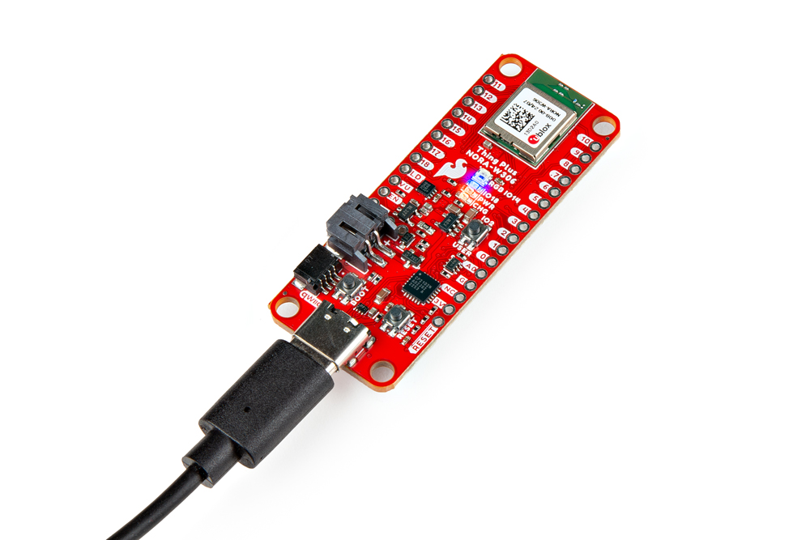
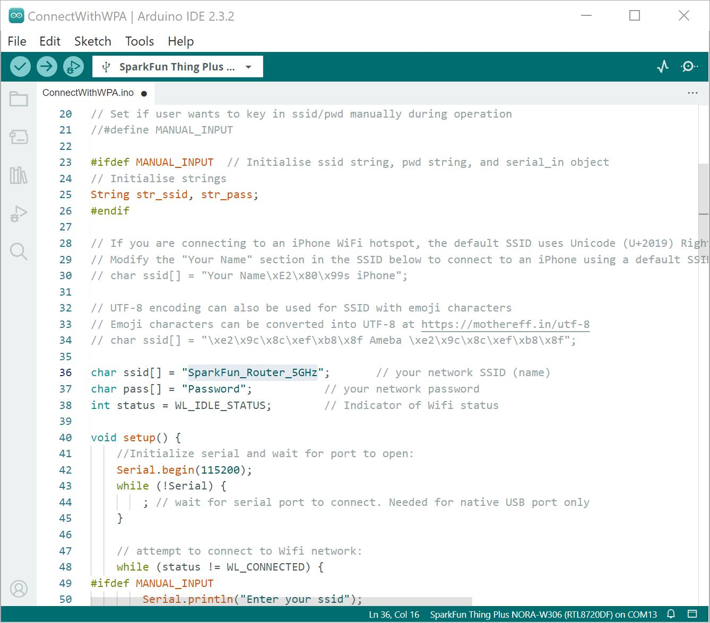
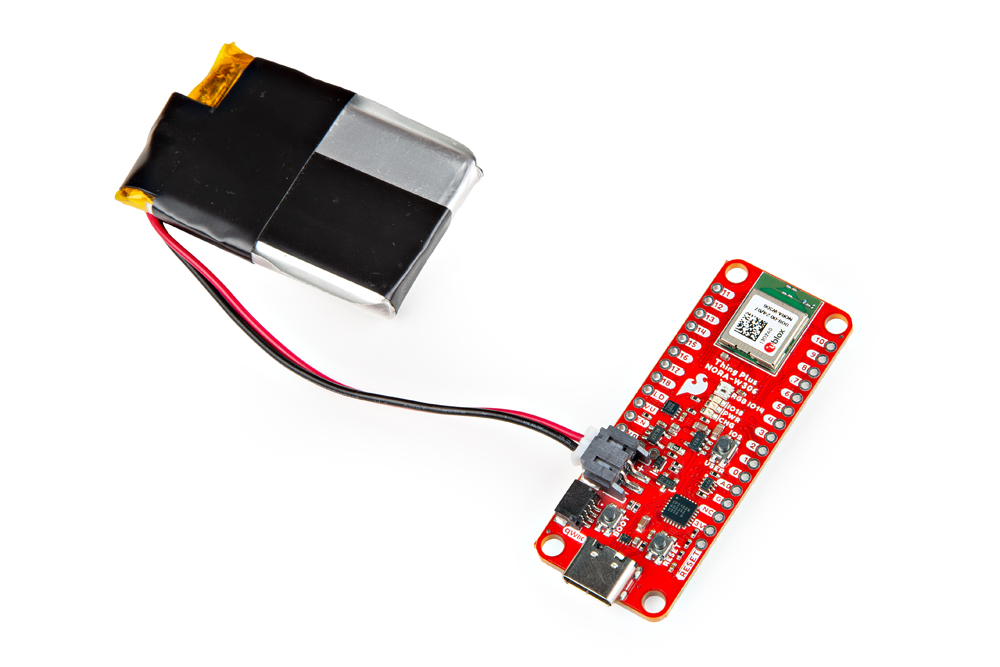
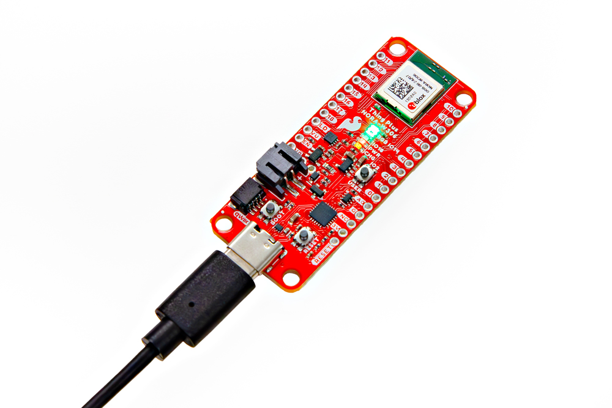

Now that we have our library and board add-on installed, we can get started playing around with the development board. For the scope of this tutorial, we will highlight a few of the features on the board. From there we will be able to build our own custom code to integrate the development board into a project.


## Example 1: Blink

In this example, we will blink the LED that is built into the SparkFun Thing Plus NORA-W306. The connection is the same as explained earlier in the tutorial. Connect the USB cable to the SparkFun Thing Plus NORA-W306. Of course, make sure to connect the other end to your computer.

<div style="text-align: center;">
  <table>
    <tr style="vertical-align:middle;">
     <td style="text-align: center; vertical-align: middle; border: solid 1px #cccccc;"><a href="../assets/img/WRL-21637_Thing_Plus_NORA-W306_USB_Cable.jpg"></a></td>
    </tr>
    <tr style="vertical-align:middle;">
     <td style="text-align: center; vertical-align: middle; border: solid 1px #cccccc;"><i>USB Cable inserted into Thing Plus NORA-W306</i></td>
    </tr>
  </table>
</div>


### Arduino Code

Let's upload a sketch to the board. This example is the basic Arduino blink example. Note that we specify pin `18` instead of using the macro called `LED_BUILTIN`.

Copy and paste the following code in the Arduino IDE. Select the correct board definition from the menu (in this case, **Tools** > **Board** > **Realtek Ameba Boards (32-bits ARM Cortex-M33 @200MHz)** > **SparkFun Thing Plus NORA-W306 (RTL8720DF)**. Then select the correct COM port that the board enumerated to (in this case, it was **COM13**). Hit upload button.

``` C++
/*
  Blink
  Turns on an LED on for one second, then off for one second, repeatedly.

  This example code is in the public domain.
 */

// Pin 18 has an LED connected on most Arduino boards.
// give it a name:
int led = 18; //LED is connected to pin 18 on the SparkFun Thing Plus NORA-W306

//NOTE: You can also use LED_BUILTIN.

// the setup routine runs once when you press reset:
void setup() {
  // initialize the digital pin as an output.
  pinMode(led, OUTPUT);
}

// the loop routine runs over and over again forever:
void loop() {
  digitalWrite(led, HIGH);   // turn the LED on (HIGH is the voltage level)
  delay(1000);               // wait for a second
  digitalWrite(led, LOW);    // turn the LED off by making the voltage LOW
  delay(1000);               // wait for a second
}
```

!!! note
    <b>Note:</b> You can also use the macro for the LED by using <code>LED_BUILTIN</code>. The code in the built-in Arduino examples will function the same as well!

Once uploaded, check the LED labeled as **18** on the board. It should be blinking on and off every second! Sweet!

<div style="text-align: center;">
  <table>
    <tr style="vertical-align:middle;">
     <td style="text-align: center; vertical-align: middle; border: solid 1px #cccccc;"><a href="../assets/img/WRL-21637_Thing_Plus_NORA-W306_Blink_User_LED.jpg"></a></td>
    </tr>
    <tr style="vertical-align:middle;">
     <td style="text-align: center; vertical-align: middle; border: solid 1px #cccccc;"><i>SparkFun Thing Plus NORA-W306 User LED On</i></td>
   </tr>
  </table>
</div>


## Example 2: Button

This example goes over how to use the built-in button with the [internal pull-up resistors](https://learn.sparkfun.com/tutorials/pull-up-resistors/all) on the microcontroller. While we are at it, we will also use the built-in LED to visually see what is going on right on the board without the need to open the Arduino Serial Monitor. Connect the USB cable to the SparkFun Thing Plus NORA-W306 and the other end to your computer&apos;s COM port.

<div style="text-align: center;">
  <table>
    <tr style="vertical-align:middle;">
     <td style="text-align: center; vertical-align: middle; border: solid 1px #cccccc;"><a href="../assets/img/WRL-21637_Thing_Plus_NORA-W306_USB_Cable.jpg"></a></td>
    </tr>
    <tr style="vertical-align:middle;">
     <td style="text-align: center; vertical-align: middle; border: solid 1px #cccccc;"><i>USB Cable inserted into Thing Plus NORA-W306</i></td>
    </tr>
  </table>
</div>


### Arduino Code | Button

Let's upload the sketch to check if there is a button press. The following code is a **modified example** that was built into the Arduino IDE (**File** > **Examples** > **02.Digital** > **Button** ) since there are no pull-up resistors connected to the button and the LED is on a different I/O pin.

You can also copy and paste the following code in the Arduino IDE. Select the correct board definition from the menu (in this case, **Tools** > **Board** > **Realtek Ameba Boards (32-bits ARM Cortex-M33 @200MHz)** > **SparkFun Thing Plus NORA-W306 (RTL8720DF)**). Then select the correct COM port that the board enumerated to (in this case, it was **COM13**). Hit upload button.

``` C++
/*
  Button

  Turns on and off a light emitting diode (LED) connected to digital pin 18,
  when pressing a pushbutton attached to pin 2.

  The circuit:
  - Built-in LED attached from pin 18 to ground and current limiting resistor
  - Built-in pushbutton attached to pin 2 from +5V


  modified 2024
  by Ho Yun "Bobby" Chan

  created 2005
  by DojoDave <http://www.0j0.org>
  modified 30 Aug 2011
  by Tom Igoe

  This example code is in the public domain.

  https://www.arduino.cc/en/Tutorial/BuiltInExamples/Button
*/

// constants won't change. They're used here to set pin numbers:
const int buttonPin = 2;  // the number of the pushbutton pin
const int ledPin = 18;    // the number of the LED pin

// variables will change:
int buttonState = 0;  // variable for reading the pushbutton status

void setup() {
  // initialize the LED pin as an output:
  pinMode(ledPin, OUTPUT);
  // initialize the pushbutton pin as an input pullup:
  pinMode(buttonPin, INPUT_PULLUP);
}

void loop() {
  // read the state of the pushbutton value:
  buttonState = digitalRead(buttonPin);

  // check if the pushbutton is pressed. If it is, the buttonState is HIGH:
  if (buttonState == HIGH) {
    // turn LED on:
    digitalWrite(ledPin, HIGH);
  } else {
    // turn LED off:
    digitalWrite(ledPin, LOW);
  }
}
```

Once uploaded, check the LED labeled as **18** on the board. Pressing down on the user button connected to pin 2 will light up the LED. Releasing the button, the LED will turn off.

<div style="text-align: center;">
  <table>
    <tr style="vertical-align:middle;">
     <td style="text-align: center; vertical-align: middle; border: solid 1px #cccccc;"><a href="../assets/img/WRL-21637_Thing_Plus_NORA-W306_Button_LED.jpg"></a></td>
    </tr>
    <tr style="vertical-align:middle;">
     <td style="text-align: center; vertical-align: middle; border: solid 1px #cccccc;"><i>SparkFun Thing Plus NORA-W306 Button Press with LED Turned On</i></td>
   </tr>
  </table>
</div>


## Example 3: Scanning WiFi Networks

The connection is the same as explained earlier in the tutorial. Connect the USB cable to the SparkFun Thing Plus NORA-W306. Of course, make sure to connect the other end to your computer. You will also need a wireless router capable of 2.4GHz and 5GHz.

<div style="text-align: center;">
  <table>
    <tr style="vertical-align:middle;">
     <td style="text-align: center; vertical-align: middle; border: solid 1px #cccccc;"><a href="../assets/img/WRL-21637_Thing_Plus_NORA-W306_USB_Cable.jpg"></a></td>
    </tr>
    <tr style="vertical-align:middle;">
     <td style="text-align: center; vertical-align: middle; border: solid 1px #cccccc;"><i>USB Cable inserted into Thing Plus NORA-W306</i></td>
    </tr>
  </table>
</div>


### Arduino Code: ScanNetworks

Let's try to scan for some WiFi networks. You can find this example included after installing the board add-on. Head to **File** > **Examples** > <font style="color:gray"><b>Examples for SparkFun Thing Plus NORA-W306 (RTL8720DF)</b></font> | **WiFi** > **ScanNetworks** .

You can also copy and paste the following code in the Arduino IDE. Select the correct board definition from the menu (in this case, **Tools** > **Board** > **Realtek Ameba Boards (32-bits ARM Cortex-M33 @200MHz)** > **SparkFun Thing Plus NORA-W306 (RTL8720DF)**). Then select the correct COM port that the board enumerated to (in this case, it was **COM13**). Hit upload button.

``` C++
/*
 This example prints MAC address, and
 scans for available Wifi networks.
 Every ten seconds, it scans again. It doesn't actually
 connect to any network, so no encryption scheme is specified.

 created 13 July 2010
 by dlf (Metodo2 srl)
 modified 21 Junn 2012
 by Tom Igoe and Jaymes Dec

 modified 08 May 2023
 by Realtek SG

 Example guide:
 https://www.amebaiot.com/en/amebad-arduino-scan-wifi/
 */

#include <WiFi.h>

int status = WL_IDLE_STATUS;    // Indicater of Wifi status

void setup() {
    //Initialize serial and wait for port to open:
    Serial.begin(115200);
    while (!Serial) {
        ; // wait for serial port to connect. Needed for native USB port only
    }

    // check for WiFi status:
    status = WiFi.status();
    // Print WiFi MAC address:
    printMacAddress();
}

void loop() {
    // scan for existing networks:
    Serial.println("Scanning available networks...");
    listNetworks();
    delay(10000);
}

void printMacAddress() {
    // print your MAC address:
    byte mac[6];
    WiFi.macAddress(mac);
    Serial.print("MAC: ");
    Serial.print(mac[0], HEX);
    Serial.print(":");
    Serial.print(mac[1], HEX);
    Serial.print(":");
    Serial.print(mac[2], HEX);
    Serial.print(":");
    Serial.print(mac[3], HEX);
    Serial.print(":");
    Serial.print(mac[4], HEX);
    Serial.print(":");
    Serial.println(mac[5], HEX);
}

void listNetworks() {
    // scan for nearby networks:
    Serial.println("** Scan Networks **");
    int numSsid = WiFi.scanNetworks();
    if (numSsid == -1) {
        Serial.println("Couldn't get a wifi connection");
        while (true);
    }

    // print the list of networks seen:
    Serial.print("number of available networks:");
    Serial.println(numSsid);

    // print the network number and name for each network found:
    for (int thisNet = 0; thisNet < numSsid; thisNet++) {
        Serial.print(thisNet);
        Serial.print(") ");
        Serial.print(WiFi.SSID(thisNet));
        Serial.print("\tSignal: ");
        Serial.print(WiFi.RSSI(thisNet));
        Serial.print(" dBm");
        Serial.print("\tEncryptionRaw: ");
        printEncryptionTypeEx(WiFi.encryptionTypeEx(thisNet));
        Serial.print("\tEncryption: ");
        printEncryptionType(WiFi.encryptionType(thisNet));
    }
}

void printEncryptionTypeEx(uint32_t thisType) {
    /*  Arduino wifi api use encryption type to mapping to security type.
    *  This function demonstrate how to get more richful information of security type.
    */
    switch (thisType) {
        case SECURITY_OPEN:
            Serial.print("Open");
            break;
        case SECURITY_WEP_PSK:
            Serial.print("WEP");
            break;
        case SECURITY_WPA_TKIP_PSK:
            Serial.print("WPA TKIP");
            break;
        case SECURITY_WPA_AES_PSK:
            Serial.print("WPA AES");
            break;
        case SECURITY_WPA2_AES_PSK:
            Serial.print("WPA2 AES");
            break;
        case SECURITY_WPA2_TKIP_PSK:
            Serial.print("WPA2 TKIP");
            break;
        case SECURITY_WPA2_MIXED_PSK:
            Serial.print("WPA2 Mixed");
            break;
        case SECURITY_WPA_WPA2_MIXED:
            Serial.print("WPA/WPA2 AES");
            break;
        case SECURITY_WPA3_AES_PSK:
            Serial.print("WPA3 AES");
            break;
        case SECURITY_WPA2_WPA3_MIXED:
            Serial.print("WPA2/WPA3");
    }
}

void printEncryptionType(int thisType) {
    // read the encryption type and print out the name:
    switch (thisType) {
        case ENC_TYPE_WEP:
            Serial.println("WEP");
            break;
        case ENC_TYPE_WPA:
            Serial.println("WPA");
            break;
        case ENC_TYPE_WPA2:
            Serial.println("WPA2");
            break;
        case ENC_TYPE_WPA3:
            Serial.println("WPA3");
            break;
        case ENC_TYPE_NONE:
            Serial.println("None");
            break;
        case ENC_TYPE_AUTO:
            Serial.println("Auto");
            break;
    }
}
```

Open you Arduino Serial Monitor at **115200**. The SparkFun Thing Plus NORA-W306 will begin scanning your area. Take note of the encryption type of the WiFi network that you are connecting to. In this case, I had set my home WiFi Router's 5GHz network name to "SparkFun_Router_5GHz" and it was using a WPA2 encryption (as highlighted in the Arduino Serial Monitor).

<div style="text-align: center;">
  <table>
    <tr style="vertical-align:middle;">
     <td style="text-align: center; vertical-align: middle; border: solid 1px #cccccc;"><a href="../assets/img/AmebaD_RealTek_NORA-W306_Arduino_WiFi_Scan.JPG"></a></td>
    </tr>
    <tr style="vertical-align:middle;">
     <td style="text-align: center; vertical-align: middle; border: solid 1px #cccccc;"><i>SparkFun Router 5GHz Highlighted Arduino Output</i></td>
    </tr>
  </table>
</div>


## Example 4: Connecting to a WiFi Network

The connection is the same as explained earlier in the tutorial. Connect the USB cable to the SparkFun Thing Plus NORA-W306 and the other end to your computer. Again, you will need a wireless router capable of 2.4GHz and 5GHz.

<div style="text-align: center;">
  <table>
    <tr style="vertical-align:middle;">
     <td style="text-align: center; vertical-align: middle; border: solid 1px #cccccc;"><a href="../assets/img/WRL-21637_Thing_Plus_NORA-W306_USB_Cable.jpg"></a></td>
    </tr>
    <tr style="vertical-align:middle;">
     <td style="text-align: center; vertical-align: middle; border: solid 1px #cccccc;"><i>USB Cable inserted into Thing Plus NORA-W306</i></td>
    </tr>
  </table>
</div>


### Arduino Code | ConnectWithWPA

Let's upload the sketch to connect to the 5GHz network in your area. From the menu, select the following: **File** > **Examples** > **File** > **Examples** > <font style="color:gray"><b>Examples for SparkFun Thing Plus NORA-W306 (RTL8720DF)</b></font> | **WiFi** > **ConnectWithWiFi** > **ConnectWithWPA**. Depending on your encryption, you may select a different example.

!!! note
    Depending on your encryption, you may select a different Arduino sketch to connect to the WiFi. Based on the previous example, the connection used WPA so we selected the **ConnectWithWPA.ino** example.

Or you can copy and paste the following code in the Arduino IDE.

``` C++
/*
 This example connects to an unencrypted Wifi network.
 Then it prints the MAC address,
 the IP address obtained, and other network details.

 created 13 July 2010
 by dlf (Metodo2 srl)
 modified 31 May 2012
 by Tom Igoe

 modified 08 May 2023
 by Realtek SG

 Example guide:
 https://www.amebaiot.com/en/amebad-arduino-connect-wifi/
 */

#include <WiFi.h>

// Set if user wants to key in ssid/pwd manually during operation
//#define MANUAL_INPUT

#ifdef MANUAL_INPUT  // Initialise ssid string, pwd string, and serial_in object
// Initialise strings
String str_ssid, str_pass;
#endif

// If you are connecting to an iPhone WiFi hotspot, the default SSID uses Unicode (U+2019) Right Single Quotation Mark instead of ASCII apostrophe
// Modify the "Your Name" section in the SSID below to connect to an iPhone using a default SSID style
// char ssid[] = "Your Name\xE2\x80\x99s iPhone";

// UTF-8 encoding can also be used for SSID with emoji characters
// Emoji characters can be converted into UTF-8 at https://mothereff.in/utf-8
// char ssid[] = "\xe2\x9c\x8c\xef\xb8\x8f Ameba \xe2\x9c\x8c\xef\xb8\x8f";

char ssid[] = "Network_SSID";       // your network SSID (name)
char pass[] = "Password";           // your network password
int status = WL_IDLE_STATUS;        // Indicater of Wifi status

void setup() {
    //Initialize serial and wait for port to open:
    Serial.begin(115200);
    while (!Serial) {
        ; // wait for serial port to connect. Needed for native USB port only
    }

    // attempt to connect to Wifi network:
    while (status != WL_CONNECTED) {
#ifdef MANUAL_INPUT
        Serial.println("Enter your ssid");
        while (Serial.available() == 0) {}
            str_ssid = Serial.readString();
            str_ssid.trim();
            Serial.print("SSID entered: ");
            Serial.println(str_ssid);

        Serial.println("Enter your password");
        while (Serial.available() == 0) {}
        str_pass = Serial.readString();
        str_pass.trim();
            if (str_pass.length() != 0) { // user has entered data
                while (str_pass.length() <8 ) { // to catch pwd<8 exception
                    Serial.println("Password cannot be less than 8 characters! Try again");
                    while (Serial.available() == 0) {}
                    str_pass = Serial.readString();
                    str_pass.trim();
                }
                    Serial.print("Password entered: ");
                    Serial.println(str_pass);
            }
#endif
        Serial.print("Attempting to connect to WPA SSID: ");

#ifndef MANUAL_INPUT
        Serial.println(ssid);
        // Connect to WPA/WPA2 network:
        status = WiFi.begin(ssid, pass);
#else
        char ssid_cust[str_ssid.length() + 1];
        char pass_cust[str_pass.length() + 1];
        strcpy(ssid_cust, str_ssid.c_str());
        strcpy(pass_cust, str_pass.c_str());
        Serial.println(str_ssid.c_str());
        status = WiFi.begin(ssid_cust, pass_cust);
        str_ssid = str_pass = "";
#endif
        // wait 10 seconds for connection:
        delay(10000);
    }

    // you're connected now, so print out the data:
    Serial.println();
    Serial.print("You're connected to the network");
    printCurrentNet();
    printWifiData();
}

void loop() {
    // check the network connection once every 10 seconds:
    delay(10000);
    printCurrentNet();
}

void printWifiData() {
    // print your WiFi IP address:
    IPAddress ip = WiFi.localIP();
    Serial.print("IP Address: ");
    Serial.println(ip);
    Serial.println(ip);

    // print your MAC address:
    byte mac[6];
    WiFi.macAddress(mac);
    Serial.print("MAC address: ");
    Serial.print(mac[0], HEX);
    Serial.print(":");
    Serial.print(mac[1], HEX);
    Serial.print(":");
    Serial.print(mac[2], HEX);
    Serial.print(":");
    Serial.print(mac[3], HEX);
    Serial.print(":");
    Serial.print(mac[4], HEX);
    Serial.print(":");
    Serial.println(mac[5], HEX);
}

void printCurrentNet() {
    // print the SSID of the network you're attached to:
    Serial.print("SSID: ");
    Serial.println(WiFi.SSID());

    // print the MAC address of the router you're attached to:
    byte bssid[6];
    WiFi.BSSID(bssid);
    Serial.print("BSSID: ");
    Serial.print(bssid[5], HEX);
    Serial.print(":");
    Serial.print(bssid[4], HEX);
    Serial.print(":");
    Serial.print(bssid[3], HEX);
    Serial.print(":");
    Serial.print(bssid[2], HEX);
    Serial.print(":");
    Serial.print(bssid[1], HEX);
    Serial.print(":");
    Serial.println(bssid[0], HEX);

    // print the received signal strength:
    long rssi = WiFi.RSSI();
    Serial.print("signal strength (RSSI):");
    Serial.println(rssi);

    // print the encryption type:
    byte encryption = WiFi.encryptionType();
    Serial.print("Encryption Type:");
    Serial.println(encryption, HEX);
    Serial.println();
}

```

Then adjust the arrays that holed the SSID (i.e. `yourNetwork`) and password  (`secretPassword`) based on your WiFi network's settings.

<div style="text-align: center;">
  <table>
    <tr style="vertical-align:middle;">
     <td style="text-align: center; vertical-align: middle; border: solid 1px #cccccc;"><a href="../assets/img/AmebaD_RealTek_NORA-W306_Arduino_Connect_to_WPA_Rename_SSID_to_5GHz_Network.JPG"></a></td>
    </tr>
    <tr style="vertical-align:middle;">
     <td style="text-align: center; vertical-align: middle; border: solid 1px #cccccc;"><i>SSID Changed</i></td>
   </tr>
  </table>
</div>

Select the correct board definition from the menu (in this case, **Tools** > **Boards** > **SparkFun Thing Plus NORA-W306 (RTL8720DF)**). Then select the correct COM port that the board enumerated to (in this case, it was COM13). Hit upload button.

Open the Arduino Serial Monitor at **115200**. The SparkFun Thing Plus NORA-W306 will attempt to connect to the network.

<div style="text-align: center;">
  <table>
    <tr style="vertical-align:middle;">
     <td style="text-align: center; vertical-align: middle; border: solid 1px #cccccc;"><a href="../assets/img/AmebaD_RealTek_NORA-W306_Arduino_Connect_to_WPA_5GHz_Network.JPG"></a></td>
    </tr>
    <tr style="vertical-align:middle;">
     <td style="text-align: center; vertical-align: middle; border: solid 1px #cccccc;"><i>Serial Monitor attempting to connect to WiFi network</i></td>
   </tr>
  </table>
</div>

If all goes well, you should see some status outputs and message indicating that you are connected to your network! In this case, I had the following message:

<!-- Note: Using HTML tag for this message, otherwise there are weird syntax highlighting depending on the text editor that you are using. -->

<pre>
    <code class="language-bash" style="white-space: pre-wrap;">You're connected to the networkSSID: SparkFun_Router_5GHz</code>
</pre>

The serial output will then continue outputting the status of the connection some of which include the SSID, signal strength (RSSI), and encryption type.  If you have admin privileges, you can check to see if the device is connected to the 5GHz WiFi network as well. Try connecting to a website and pulling the local time or weather in your area!


## Example 5a: Bluetooth UART Service

Connect the USB C cables to the boards and two different COM ports on your computer.

!!! tip
    To keep track of which board that you are connecting to, use a sticky note and label the boards that you are using as the Service and Client.

<div style="text-align: center;">
  <table>
    <tr style="vertical-align:middle;">
     <td style="text-align: center; vertical-align: middle; border: solid 1px #cccccc;"><a href="../assets/img/WRL-21637_Thing_Plus_NORA-W306_USB_Cable.jpg"></a></td>
    </tr>
    <tr style="vertical-align:middle;">
     <td style="text-align: center; vertical-align: middle; border: solid 1px #cccccc;"><i>USB Cable inserted into Thing Plus NORA-W306</i></td>
    </tr>
  </table>
</div>

When connecting and disconnecting the boards from your computer, you will noticed that the COM port enumerates to a certain number from the menu **Tools** > **Port**. Feel free to write down the COM port on the sticky note as well after uploading code.


### Arduino Code

Let&apos;s upload the sketch to send serial data between two SparkFun Thing Plus NORA-W306 boards wirelessly using the Bluetooth&reg; Low Energy (BLE) feature. From the menu, select the following: **File** > **Examples** > **File** > **Examples** > <font style="color:gray"><b>Examples for SparkFun Thing Plus NORA-W306 (RTL8720DF)</b></font> | **AmebaBLE** > **BLEUartService**.

Or you can copy and paste the following code in the Arduino IDE. Select the correct board definition from the menu (in this case, **Tools** > **Boards** > **SparkFun Thing Plus NORA-W306 (RTL8720DF)**). Then select the correct COM port that the board enumerated to (in this case, it was COM13). Hit upload button.

``` C++
/*

 Example guide:
 https://www.amebaiot.com/en/amebad-arduino-ble-uart-service/
 */

#include "BLEDevice.h"

#define UART_SERVICE_UUID      "6E400001-B5A3-F393-E0A9-E50E24DCCA9E"
#define CHARACTERISTIC_UUID_RX "6E400002-B5A3-F393-E0A9-E50E24DCCA9E"
#define CHARACTERISTIC_UUID_TX "6E400003-B5A3-F393-E0A9-E50E24DCCA9E"

#define STRING_BUF_SIZE 100

BLEService UartService(UART_SERVICE_UUID);
BLECharacteristic Rx(CHARACTERISTIC_UUID_RX);
BLECharacteristic Tx(CHARACTERISTIC_UUID_TX);
BLEAdvertData advdata;
BLEAdvertData scndata;
bool notify = false;

void readCB (BLECharacteristic* chr, uint8_t connID) {
    Serial.print("Characteristic ");
    Serial.print(chr->getUUID().str());
    Serial.print(" read by connection ");
    Serial.println(connID);
}

void writeCB (BLECharacteristic* chr, uint8_t connID) {
    Serial.print("Characteristic ");
    Serial.print(chr->getUUID().str());
    Serial.print(" write by connection ");
    Serial.println(connID);
    if (chr->getDataLen() > 0) {
        Serial.print("Received string: ");
        Serial.print(chr->readString());
        Serial.println();
    }
}

void notifCB(BLECharacteristic* chr, uint8_t connID, uint16_t cccd) {
    if (cccd & GATT_CLIENT_CHAR_CONFIG_NOTIFY) {
        //printf("Notifications enabled on Characteristic %s for connection %d \n", chr->getUUID().str(), connID);
        Serial.print("Notifications enabled on Characteristic");
        notify = true;
    } else {
        //printf("Notifications disabled on Characteristic %s for connection %d \n", chr->getUUID().str(), connID);
        Serial.print("Notifications disabled on Characteristic");
        notify = false;
    }
    Serial.print(chr->getUUID().str());
    Serial.print(" for connection");
    Serial.println(connID);
}

void setup() {
    Serial.begin(115200);

    advdata.addFlags(GAP_ADTYPE_FLAGS_LIMITED | GAP_ADTYPE_FLAGS_BREDR_NOT_SUPPORTED);
    advdata.addCompleteName("AMEBA_BLE_DEV");
    scndata.addCompleteServices(BLEUUID(UART_SERVICE_UUID));

    Rx.setWriteProperty(true);
    Rx.setWritePermissions(GATT_PERM_WRITE);
    Rx.setWriteCallback(writeCB);
    Rx.setBufferLen(STRING_BUF_SIZE);
    Tx.setReadProperty(true);
    Tx.setReadPermissions(GATT_PERM_READ);
    Tx.setReadCallback(readCB);
    Tx.setNotifyProperty(true);
    Tx.setCCCDCallback(notifCB);
    Tx.setBufferLen(STRING_BUF_SIZE);

    UartService.addCharacteristic(Rx);
    UartService.addCharacteristic(Tx);

    BLE.init();
    BLE.configAdvert()->setAdvData(advdata);
    BLE.configAdvert()->setScanRspData(scndata);
    BLE.configServer(1);
    BLE.addService(UartService);

    BLE.beginPeripheral();
}

void loop() {
    if (Serial.available()) {
        Tx.writeString(Serial.readString());
        if (BLE.connected(0) && notify) {
            Tx.notify(0);
        }
    }
    delay(100);
}
```

When finished uploading, head to the next section to upload code to a second SparkFun Thing Plus NORA-W306 board.


## Example 5b: Bluetooth UART Client

We will upload code for the Bluetooth UART client in this example. Then we will send characters between two serial terminals.


### Arduino Code

Let&apos;s upload the corresponding sketch to send serial data between two SparkFun Thing Plus NORA-W306 boards wirelessly using the Bluetooth&reg; Low Energy (BLE) feature. From the menu, select the following: **File** > **Examples** > **File** > **Examples** > <font style="color:gray"><b>Examples for SparkFun Thing Plus NORA-W306 (RTL8720DF)</b></font> | **AmebaBLE** > **BLEUartClient**.

Or you can copy and paste the following code in the Arduino IDE. Select the correct board definition from the menu (in this case, **Tools** > **Boards** > **SparkFun Thing Plus NORA-W306 (RTL8720DF)**). Then select the correct COM port that the board enumerated to (in this case, it was COM22). Hit upload button.

``` C++
/*

 Example guide:
 https://www.amebaiot.com/en/amebad-arduino-ble-uart/
 */

#include "BLEDevice.h"

#define UART_SERVICE_UUID      "6E400001-B5A3-F393-E0A9-E50E24DCCA9E"
#define CHARACTERISTIC_UUID_RX "6E400002-B5A3-F393-E0A9-E50E24DCCA9E"
#define CHARACTERISTIC_UUID_TX "6E400003-B5A3-F393-E0A9-E50E24DCCA9E"

#define STRING_BUF_SIZE 100

BLEAdvertData foundDevice;
BLEAdvertData targetDevice;
BLEClient* client;
BLERemoteService* UartService;
BLERemoteCharacteristic* Rx;
BLERemoteCharacteristic* Tx;

void scanCB(T_LE_CB_DATA* p_data) {
    foundDevice.parseScanInfo(p_data);
    if (foundDevice.hasName()) {
        if (foundDevice.getName() == String("AMEBA_BLE_DEV")) {
            Serial.print("Found Ameba BLE Device at address ");
            Serial.println(foundDevice.getAddr().str());
            targetDevice = foundDevice;
        }
    }
}

void notificationCB (BLERemoteCharacteristic* chr, uint8_t* data, uint16_t len) {
    char msg[len+1] = {0};
    memcpy(msg, data, len);
    Serial.print("Notification received for chr UUID: ");
    Serial.println(chr->getUUID().str());
    Serial.print("Received string: ");
    Serial.println(String(msg));
}

void setup() {
    Serial.begin(115200);

    BLE.init();
    BLE.setScanCallback(scanCB);
    BLE.beginCentral(1);

    BLE.configScan()->startScan(2000);
    BLE.configConnection()->connect(targetDevice, 2000);
    delay(2000);
    int8_t connID = BLE.configConnection()->getConnId(targetDevice);
    if (!BLE.connected(connID)) {
        Serial.println("BLE not connected");
    } else {
        BLE.configClient();
        client = BLE.addClient(connID);
        client->discoverServices();
        Serial.print("Discovering services of connected device");
        do {
            Serial.print(".");
            delay(1000);
        } while (!(client->discoveryDone()));
        Serial.println();

        UartService = client->getService(UART_SERVICE_UUID);
        if (UartService != nullptr) {
            Tx = UartService->getCharacteristic(CHARACTERISTIC_UUID_TX);
            if (Tx != nullptr) {
                Serial.println("TX characteristic found");
                Tx->setBufferLen(STRING_BUF_SIZE);
                Tx->setNotifyCallback(notificationCB);
                Tx->enableNotifyIndicate();
            }
            Rx = UartService->getCharacteristic(CHARACTERISTIC_UUID_RX);
            if (Rx != nullptr) {
                Serial.println("RX characteristic found");
                Rx->setBufferLen(STRING_BUF_SIZE);
            }
        }
    }
}

void loop() {
    if (Serial.available()) {
        Rx->writeString(Serial.readString());
    }
    delay(100);
}
```

To test, open the Arduino Serial Monitor for the client device on its respective COM port at **115200**. Then open a second serial terminal (in this case we used TeraTerm) for the previous service device on its respective COM port at **115200**. Type some characters and hit **Send** button from the client device. You should see the same characters received on the service device! Then try typing messages from the service to the client. Again, you should see the same characters on the other end. You may need to turn on the local echo depending on the terminal window that you are using.

<div style="text-align: center;">
  <table>
    <tr style="vertical-align:middle;">
     <td style="text-align: center; vertical-align: middle; border: solid 1px #cccccc;"><a href="../assets/img/Arduino_NORA_W306_BLE_UART_Service_Output.JPG"></a></td>
     <td style="text-align: center; vertical-align: middle; border: solid 1px #cccccc;"><a href="../assets/img/Arduino_NORA_W306_BLE_UART_Client_Output.JPG"></a></td>
    </tr>
    <tr style="vertical-align:middle;">
     <td style="text-align: center; vertical-align: middle; border: solid 1px #cccccc;"><i>BLE UART Service via Tera Term</i></td>
     <td style="text-align: center; vertical-align: middle; border: solid 1px #cccccc;"><i>BLE UART Client via Arduino Serial Monitor</i></td>
    </tr>
  </table>
</div>


## Example 8: LiPo Fuel Gauge MAX17048

In this example, we will test the LiPo Fuel Gauge. We recommend connecting a LiPo battery to the 2-pin JST style connector. If you have not already, connect a compatible single cell, LiPo battery to the board.

<div style="text-align: center;">
  <table>
    <tr style="vertical-align:middle;">
     <td style="text-align: center; vertical-align: middle; border: solid 1px #cccccc;"><a href="../assets/img/WRL-21637_Thing_Plus_NORA-W306_LiPo_Battery.jpg"></a></td>
    </tr>
    <tr style="vertical-align:middle;">
     <td style="text-align: center; vertical-align: middle; border: solid 1px #cccccc;"><i>Battery Connected</i></td>
    </tr>
  </table>
</div>

When ready, connect the board to your computer with the USB C cable.


### Installing the Arduino Library

First, you&apos;ll need to download and install the **SparkFun MAX1704x Fuel Gauge Arduino Library**. You can install this library automatically in the Arduino IDE&apos;s Library Manager by searching for "**SparkFun MAX1704x Fuel Gauge**". Or you can manually download it from the [GitHub repository](https://github.com/sparkfun/SparkFun_MAX1704x_Fuel_Gauge_Arduino_Library).

<div style="text-align: center"><a href="https://github.com/sparkfun/SparkFun_MAX1704x_Fuel_Gauge_Arduino_Library/archive/refs/heads/main.zip" class="md-button">Download the SparkFun MAX1704x Fuel Gauge Arduino Library (ZIP)</a></div>


### Arduino Code

In this example, we will be checking a single cell LiPo battery&apos;s voltage and the state of charge using the MAX17048. The output will be sent to the Serial Monitor.

From the menu, select the following: **File** > **Examples** > **SparkFun_MAX1704x_Fuel_Gauge_Arduino_Library** > **Example1_Simple**. Comment out the default instance for the MAX17043 and uncomment the line for the MAX17048.

``` C++
//SFE_MAX1704X lipo; // Defaults to the MAX17043

//SFE_MAX1704X lipo(MAX1704X_MAX17043); // Create a MAX17043
//SFE_MAX1704X lipo(MAX1704X_MAX17044); // Create a MAX17044
SFE_MAX1704X lipo(MAX1704X_MAX17048); // Create a MAX17048
//SFE_MAX1704X lipo(MAX1704X_MAX17049); // Create a MAX17049
```

Or you can copy and paste the following code in the Arduino IDE. Select your Board (in this case the **SparkFun Thing Plus NORA-W306 (RTL8720DF)**), and associated COM port (in this case **COM13**). Then hit the upload button.

``` C++
/******************************************************************************
Example1_Simple
By: Paul Clark
Date: October 23rd 2020

Based extensively on:
MAX17043_Simple_Serial.cpp
SparkFun MAX17043 Example Code
Jim Lindblom @ SparkFun Electronics
Original Creation Date: June 22, 2015

This file demonstrates the simple API of the SparkFun MAX17043 Arduino library.

This example will print the gauge's voltage and state-of-charge (SOC) readings
to Serial (115200 baud)

This code is released under the MIT license.

Distributed as-is; no warranty is given.
******************************************************************************/

#include <Wire.h> // Needed for I2C

#include <SparkFun_MAX1704x_Fuel_Gauge_Arduino_Library.h> // Click here to get the library: http://librarymanager/All#SparkFun_MAX1704x_Fuel_Gauge_Arduino_Library

//SFE_MAX1704X lipo; // Defaults to the MAX17043

//SFE_MAX1704X lipo(MAX1704X_MAX17043); // Create a MAX17043
//SFE_MAX1704X lipo(MAX1704X_MAX17044); // Create a MAX17044
SFE_MAX1704X lipo(MAX1704X_MAX17048); // Create a MAX17048
//SFE_MAX1704X lipo(MAX1704X_MAX17049); // Create a MAX17049

double voltage = 0; // Variable to keep track of LiPo voltage
double soc = 0; // Variable to keep track of LiPo state-of-charge (SOC)
bool alert; // Variable to keep track of whether alert has been triggered

void setup()
{
	Serial.begin(115200); // Start serial, to output debug data
  while (!Serial)
    ; //Wait for user to open terminal
  Serial.println(F("MAX17043 Example"));

  Wire.begin();

  lipo.enableDebugging(); // Uncomment this line to enable helpful debug messages on Serial

  // Set up the MAX17043 LiPo fuel gauge:
  if (lipo.begin() == false) // Connect to the MAX17043 using the default wire port
  {
    Serial.println(F("MAX17043 not detected. Please check wiring. Freezing."));
    while (1)
      ;
  }

	// Quick start restarts the MAX17043 in hopes of getting a more accurate
	// guess for the SOC.
	lipo.quickStart();

	// We can set an interrupt to alert when the battery SoC gets too low.
	// We can alert at anywhere between 1% - 32%:
	lipo.setThreshold(20); // Set alert threshold to 20%.
}

void loop()
{
  // lipo.getVoltage() returns a voltage value (e.g. 3.93)
  voltage = lipo.getVoltage();
  // lipo.getSOC() returns the estimated state of charge (e.g. 79%)
  soc = lipo.getSOC();
  // lipo.getAlert() returns a 0 or 1 (0=alert not triggered)
  alert = lipo.getAlert();

  // Print the variables:
  Serial.print("Voltage: ");
  Serial.print(voltage);  // Print the battery voltage
  Serial.println(" V");

  Serial.print("Percentage: ");
  Serial.print(soc); // Print the battery state of charge
  Serial.println(" %");

  Serial.print("Alert: ");
  Serial.println(alert);
  Serial.println();

  delay(500);
}
```

Open the Arduino Serial Monitor and set it to 115200 baud to view the serial output. You should see the voltage, battery percent, alert flag, and several more readings. In this case, the single cell LiPo battery that was connected to the IC was fully charged and at about 4.10V.

<div style="text-align: center;">
  <table>
    <tr style="vertical-align:middle;">
     <td style="text-align: center; vertical-align: middle; border: solid 1px #cccccc;"><a href="../assets/img/Arduino_Output_MAX17048_LiPo_Fuel_Gauge_NORA-W306.JPG"></a></td>
    </tr>
    <tr style="vertical-align:middle;">
     <td style="text-align: center; vertical-align: middle; border: solid 1px #cccccc;"><i>Arduino Output Showing the LiPo Battery's Capacity</i></td>
    </tr>
  </table>
</div>    

But wait! If you looked closely at the circuit of the SparkFun Thing Plus NORA-W306, there is also a charge circuit built in. Try closing out the Arduino Serial Monitor, disconnecting the USB, and disconnecting the LiPo battery. Then reinsert the LiPo battery, connect the USB cable, and reopen the Arduino Serial Monitor. The IC will recalculate everything. In the image below, the voltage is a bit misleading since the charge IC is charging the LiPo battery and may not be the true representation of the LiPo battery's voltage. The remaining charge was closer to what was expected.

<div style="text-align: center;">
  <table>
    <tr style="vertical-align:middle;">
      <td style="text-align: center; vertical-align: middle; border: solid 1px #cccccc;"><a href="../assets/img/Arduino_Output_MAX17048_LiPo_Fuel_Gauge_NORA-W306-2.JPG"></a></td>
    </tr>
    <tr style="vertical-align:middle;">
      <td style="text-align: center; vertical-align: middle; border: solid 1px #cccccc;"><i>Arduino Output Showing the LiPo Battery's Capacity</i></td>
    </tr>
  </table>
</div>    

!!! note
    For development boards that have a built in charge circuit and fuel gauge, you may want to consider using a display to view the LiPo battery's true voltage and remaining charge. Otherwise, you could use a multimeter to measure the LiPo battery's voltage when a USB cable is not plugged in. Below is an example that uses the Qwiic Micro OLED to display the LiPo battery's voltage and remaining charge since the SparkFun Thing Plus NORA-W306 includes a built in charge circuit and fuel gauge (MAX17048). Just make sure to adjust the code for your fuel gauge and display.

    <div style="text-align: center;">
      <table>
        <tr style="vertical-align:middle;">
         <td style="text-align: center; vertical-align: middle; border: solid 1px #cccccc;"><a href="../assets/img/WRL-21637_Thing_Plus_NORA-W306_LiPo_Fuel_Gauge_OLED.jpg"></a></td>
        </tr>
        <tr style="vertical-align:middle;">
         <td style="text-align: center; vertical-align: middle; border: solid 1px #cccccc;"><i>LiPo Fuel Gauge Monitoring LiPo Battery and Displaying Battery Capacity on Qwiic Micro OLED</i></td>
       </tr>
      </table>
    </div>


## Example 9: RGB Addressable LED - WS2812B

The connection is the same as explained earlier in the tutorial. Connect the USB cable to the SparkFun Thing Plus NORA-W306 and the other end to your computer. For the scope of this tutorial, we will be using the built-in WS2812B on the development board.

    insert here


    USB cable connected to development board

    For users that are interested in connecting additional WS2812...
    NORAW306       <=>    WS2812 LED Strip
    VB             <=>    VIN
    LD/LED_DO      <=>    DI
    GND            <=>    GND


### Arduino Code | WS2812B_Basics

Let&apos;s upload the sketch control the WS2812. We recommend using the WS2812B Arduino Library that came installed with the board add-on. Below is a modified example of the **WS2812B_Basics.ino** sketch since we the LED is on the secondary SPI port and we are using new terminology for the macro. Of course, since we are using only one WS2812, we also adjusted the code to acknowledge that we have only controlling one LED. Copy and paste the following code in the Arduino IDE.


!!! note
    This code is modified and not the same as the one in the board-add on!!! A few lines were commented out, a macro was used when making an instance of the WS2812B, and the LED is blinking in the loop. For a comparison, you could view the original code provided in the board support pacakge by heading to: **File** > **Examples** > **File** > **Examples** > <font style="color:gray"><b>Examples for SparkFun Thing Plus NORA-W306 (RTL8720DF)</b></font> | **AmebaWS2812B** > **WS2812B_Basics**.

Copy and paste the following code in the Arduino IDE. Select the correct board definition from the menu (in this case, **Tools** > **Board** > **Realtek Ameba Boards (32-bits ARM Cortex-M33 @200MHz)** > **SparkFun Thing Plus NORA-W306 (RTL8720DF)**). Then select the correct COM port that the board enumerated to (in this case, it was **COM13**). Hit upload button.  

``` C++
/*

 Example guide:
 https://www.amebaiot.com/en/amebad-arduino-ws2812b-basics/
 */

#include "WS2812B.h"

#define TOTAL_NUM_OF_LED 1
#define NUM_OF_LEDS 1

// There are multiple choice of SPI_MOSI pins depends on different boards. The default is SPI_MOSI/SPI1_MOSI
// AMB21/AMB22              pin 11 /  pin21
// AMB23                    pin 9  /  pin 4
// BW16/BW16 Type C         pin 12
// AW-CU488 ThingPlus       pin 1  /  pin 14
// AMB25/AMB26              pin 17 /  pin 3
// NORA-W306 Thing Plus     pin 6  /  pin 14


//WS2812B led(SPI_MOSI, TOTAL_NUM_OF_LED);  //default SPI macro
WS2812B led(SPI1_PICO, TOTAL_NUM_OF_LED); // SPI1 macro for NORA-W306 since built-in WS2812 is attached to secondary SPI pin

void setup() {
    Serial.begin(115200);
    Serial.println("WS2812B test");
    led.begin();
    //Set a specific LED with a certain color
    led.setPixelColor(0, 50, 0, 0);
    //led.setPixelColor(1, 0, 50, 0);
    //led.setPixelColor(2, 0, 0, 50);
    led.show();
    delay(1000);
    //Fill the entire LED strip with the same color
    //led.fill(60, 0, 25, 0, NUM_OF_LEDS);
    //led.show();
}

void loop() {
    led.setPixelColor(0, 50, 0, 0);
    led.show();
    delay(1000);

    led.setPixelColor(0, 0, 50, 0);
    led.show();
    delay(1000);
}

```

After uploading code, the built-in WS2812B LED will light up red momentarily. Once in the loop, the red and green LED will blink back and forth every second. Try adjusting the code to control the LED to make primary, secondary, or tertiary colors with the press of a button! Or changing the color of the LED based on how much power your LiPo battery has available. Or even modify the **WS2812B_Patterns.ino** included with the board add-on to add effects and patterns to your LED. You can even go as far as soldering additional WS2812Bs by daisy chaining them to the DO / LED_DO pin. Just make sure that you have a [sufficient power supply to power your all of your LEDs](https://learn.sparkfun.com/tutorials/how-to-power-a-project/all#voltagecurrent-considerations).

<div style="text-align: center;">
  <table>
    <tr style="vertical-align:middle;">
     <td style="text-align: center; vertical-align: middle; border: solid 1px #cccccc;"><a href="../assets/img/WRL-21637_Thing_Plus_NORA-W306_WS2812_RGB_Addressable_LED.jpg"></a></td>
    </tr>
    <tr style="vertical-align:middle;">
     <td style="text-align: center; vertical-align: middle; border: solid 1px #cccccc;"><i>WS2812 Addressable LED Green LED Turned On</i></td>
   </tr>
  </table>
</div>


## Example 10: Qwiic Micro OLED

To connect the Qwiic Micro OLED, simply insert a Qwiic cable between the display and the SparkFun Thing Plus NORA-W306.

<div style="text-align: center;">
  <table>
    <tr style="vertical-align:middle;">
     <td style="text-align: center; vertical-align: middle; border: solid 1px #cccccc;"><a href="../assets/img/WRL-21637_Thing_Plus_NORA-W306_Qwiic_Enabled_Device_OLED.jpg"></a></td>
    </tr>
    <tr style="vertical-align:middle;">
     <td style="text-align: center; vertical-align: middle; border: solid 1px #cccccc;"><i>Qwiic Micro OLED Connected to SparkFun Thing Plus NORA-W306</i></td>
    </tr>
  </table>
</div>

When ready, connect the board to your computer with the USB C cable.


### Installing the Arduino Library

!!! note
    There are two SparkFun Arduino Libraries for the Qwiic micro OLED. We recommend using the SparkFun Qwiic OLED Arduino Library.

First, you&apos;ll need to download and install the **SparkFun Qwiic Micro OLED Arduino Library**. You can install this library automatically in the Arduino IDE&apos;s Library Manager by searching for "**SparkFun Qwiic OLED Graphics Library**". Or you can manually download it from the [GitHub repository](https://github.com/sparkfun/SparkFun_Qwiic_OLED_Arduino_Library).

<div style="text-align: center"><a href="https://github.com/sparkfun/SparkFun_Qwiic_OLED_Arduino_Library/archive/refs/heads/main.zip" class="md-button">Download the SparkFun Qwiic OLED Arduino Library (ZIP)</a></div>

<div style="text-align: center;">
  <table>
    <tr style="vertical-align:middle;">
     <td style="text-align: center; vertical-align: middle; border: solid 1px #cccccc;"><a href="../assets/img/WRL-21637_Thing_Plus_NORA-W306_Qwiic_OLED_Hello_World.jpg"></a></td>
    </tr>
    <tr style="vertical-align:middle;">
     <td style="text-align: center; vertical-align: middle; border: solid 1px #cccccc;"><i>Qwiic Micro OLED Connected to SparkFun Thing Plus NORA-W306 and with the Word &quot;hello&quot; Displayed</i></td>
    </tr>
  </table>
</div>


### Arduino Code | Example 1: Hello

Let&apos;s upload the sketch to display graphics and characters on the Qwiic Micro OLED. From the menu, select the following: **File** > **Examples** > <font style="color:gray">Examples from Custom Libraries</font> | **SparkFun OLED Graphics Library** > **Example-01_Hello**.

Or you can copy and paste the following code in the Arduino IDE. Select the correct board definition from the menu (in this case, **Tools** > **Boards** > **SparkFun Thing Plus NORA-W306 (RTL8720DF)**). Then select the correct COM port that the board enumerated to (in this case, it was **COM13**). Hit upload button.

``` C++
/*

  Example-01_Hello.ino

  This demo shows the basic setup of the OLED library, generating simple graphics and displaying
  the results on the target device.

   Micro OLED             https://www.sparkfun.com/products/14532
   Transparent OLED       https://www.sparkfun.com/products/15173
   "Narrow" OLED          https://www.sparkfun.com/products/24606
   Qwiic OLED 1.3in       https://www.sparkfun.com/products/23453

  Written by Kirk Benell @ SparkFun Electronics, March 2022

  Repository:
     https://github.com/sparkfun/SparkFun_Qwiic_OLED_Arduino_Library

  Documentation:
     https://sparkfun.github.io/SparkFun_Qwiic_OLED_Arduino_Library/

  SparkFun code, firmware, and software is released under the MIT License(http://opensource.org/licenses/MIT).
*/

#include <SparkFun_Qwiic_OLED.h> //http://librarymanager/All#SparkFun_Qwiic_OLED

// The Library supports four different types of SparkFun boards. The demo uses the following
// defines to determine which device is being used. Uncomment the device being used for this demo.

QwiicMicroOLED myOLED;
//QwiicTransparentOLED myOLED;
//QwiicNarrowOLED myOLED;
//Qwiic1in3OLED myOLED;


void setup()
{
    Serial.begin(115200);
    Serial.println("Running OLED example");

    Wire.begin();

    // Initalize the OLED device and related graphics system
    if (myOLED.begin() == false)
    {
        Serial.println("Device begin failed. Freezing...");
        while (true)
            ;
    }
    Serial.println("Begin success");

    // Do a simple test - fill a rectangle on the screen and then print hello!

    // Fill a rectangle on the screen that has a 4 pixel board
    myOLED.rectangleFill(4, 4, myOLED.getWidth() - 8, myOLED.getHeight() - 8);

    String hello = "hello"; // our message

    // Center our message on the screen. Get the screen size of the "hello" string,
    // calling the getStringWidth() and getStringHeight() methods on the oled

    // starting x position - screen width minus string width  / 2
    int x0 = (myOLED.getWidth() - myOLED.getStringWidth(hello)) / 2;

    // starting y position - screen height minus string height / 2
    int y0 = (myOLED.getHeight() - myOLED.getStringHeight(hello)) / 2;

    // Draw the text - color of black (0)
    myOLED.text(x0, y0, hello, 0);

    // There's nothing on the screen yet - Now send the graphics to the device
    myOLED.display();

    // That's it - HELLO!
}

void loop()
{
    delay(1000); // Do nothing
}
```

Once the code has been uploaded, check the Qwiic Micro OLED screen. You should see the entire screen filled with a rectangle with the "hello" in the middle. Try exploring the other examples in the folder and writing your own code to output on the screen.


## LiPo Fuel Gauge (MAX17048) with Micro OLED Display Demo

Based on the examples from the LiPo Fuel Gauge and Micro OLED, we will measure a battery's capacity and display the readings on a micro OLED.

<div style="text-align: center;">
  <table>
    <tr style="vertical-align:middle;">
     <td style="text-align: center; vertical-align: middle; border: solid 1px #cccccc;"><a href="../assets/img/"></a></td>
    </tr>
    <tr style="vertical-align:middle;">
     <td style="text-align: center; vertical-align: middle; border: solid 1px #cccccc;"><i>Fritzing Diagram Qwiic micro OLED and LiPo Battery</i></td>
   </tr>
  </table>
</div>


### Installing the Arduino Libraries

If you have not already, make sure to install the following libraries as explained in the previous sections. As for the WS2812, we will be using the built-in Realtek Arduino library for the WS2812.

* [MAX17048](https://github.com/sparkfun/SparkFun_MAX1704x_Fuel_Gauge_Arduino_Library)
* [Qwiic OLED](https://github.com/sparkfun/SparkFun_Qwiic_OLED_Arduino_Library)


### Arduino Code

Copy and paste the following code in the Arduino IDE.

``` C++
/******************************************************************************
  Combined Simple Serial, Qwiic Micro OLED, WS2812 Example
  Modified By: Ho Yun "Bobby" Chan
  SparkFun Electronics
  Date: July 10, 2024
  License: MIT. See license file for more information but you can
  basically do whatever you want with this code.

  This is a combined example of Paul Clark's MAX17043 Fuel Guage
  simple serial example, Kirk Benell's Qwiic OLED Hello example,
  and Nathan Seidle's RTK Display Test Sketch. The example reads a
  single cell LiPo battery's voltage and state-of-charge (SOC)
  using the MAX1704X. The voltage, percent remaining (i.e. the
  SOC), and alert flag are displayed as an output on the Qwiic
  Micro OLED. A graphic of a LiPo battery's remaining charge is
  displayed on the Qwiic Micro OLED as well. This example also uses
  the built-in WS2812-2020 addressable LED to indicate the status
  of the battery.

  By opening the Arduino Serial Monitor (115200 baud), the example
  will also print the gauge's voltage, state-of-charge (SOC)
  readings, alert status to Serial.

  Feel like supporting open source hardware?
  Buy a board from SparkFun!

  LiPo Fuel Gauge - MAX17043 : https://www.sparkfun.com/products/20680
  Qwiic Micro OLED: https://www.sparkfun.com/products/14532

  Distributed as-is; no warranty is given.
******************************************************************************/

#include <Wire.h> // Needed for I2C


//////////LIPO FUEL GAUGE//////////
#include <SparkFun_MAX1704x_Fuel_Gauge_Arduino_Library.h> // Click here to get the library: http://librarymanager/All#SparkFun_MAX1704x_Fuel_Gauge_Arduino_Library

//SFE_MAX1704X lipo; // Defaults to the MAX17043

//SFE_MAX1704X lipo(MAX1704X_MAX17043); // Create a MAX17043
//SFE_MAX1704X lipo(MAX1704X_MAX17044); // Create a MAX17044
SFE_MAX1704X lipo(MAX1704X_MAX17048); // Create a MAX17048
//SFE_MAX1704X lipo(MAX1704X_MAX17049); // Create a MAX17049

double voltage = 0; // Variable to keep track of LiPo voltage
double soc = 0; // Variable to keep track of LiPo state-of-charge (SOC)
bool alert; // Variable to keep track of whether alert has been triggered


//////////QWIIC MICRO OLED//////////
#include <SparkFun_Qwiic_OLED.h> //http://librarymanager/All#SparkFun_Qwiic_Graphic_OLED
#include "icons.h"

// The Qwiic OLED Library supports three different types of SparkFun boards. The demo uses the following
// defines to determine which device is being used. Uncomment the device being used for this demo.
QwiicMicroOLED myOLED;
// QwiicTransparentOLED myOLED;
// QwiicNarrowOLED myOLED;

// Fonts
#include <res/qw_fnt_5x7.h>
//#include <res/qw_fnt_8x16.h>, not used
//#include <res/qw_fnt_31x48.h>, not used
//#include <res/qw_fnt_7segment.h>, not used
//#include <res/qw_fnt_largenum.h>, not used


// NOTE: This example uses the Realtek Arduino Core's WS2812 Library
//////////WS2812 LED//////////
#include "WS2812B.h"

#define TOTAL_NUM_OF_LED 1
#define NUM_OF_LEDS 1

// There are multiple choice of SPI_MOSI pins depends on different boards. The default is SPI_MOSI/SPI1_MOSI
// AMB21/AMB22              pin 11 /  pin21
// AMB23                    pin 9  /  pin 4
// BW16/BW16 Type C         pin 12
// AW-CU488 ThingPlus       pin 1  /  pin 14
// AMB25/AMB26              pin 17 /  pin 3

WS2812B led(SPI1_PICO, NUM_OF_LEDS);

void setup() {
  Serial.begin(115200); // Start serial, to output debug data
  //while (!Serial)
  //  ; //Wait for user to open terminal
  Serial.println(F("Combined MAX17048, Qwiic OLED, and Realtek WS2812 Example"));

  Wire.begin();

  lipo.enableDebugging(); // Uncomment this line to enable helpful debug messages on Serial

  // Set up the MAX17043 LiPo fuel gauge:
  if (lipo.begin() == false) // Connect to the MAX17043 using the default wire port
  {
    Serial.println(F("MAX17043 not detected. Please check wiring. Freezing."));
    while (1)
      ;
  }

  // Initalize the OLED device and related graphics system
  if (myOLED.begin() == false)
  {
    Serial.println(F("Device begin failed. Freezing..."));
    while (true)
      ;
  }

  // Quick start restarts the MAX17043 in hopes of getting a more accurate
  // guess for the SOC.
  lipo.quickStart();

  // We can set an interrupt to alert when the battery SoC gets too low.
  // We can alert at anywhere between 1% - 32%:
  lipo.setThreshold(20); // Set alert threshold to 20%.

  //Set up WS2812B
  led.begin();
  //led.setPixelColor(led_position, red, green, blue);...
  //led.setPixelColor(0, 0, 0, 0);
  //led.show();
  delay(1000);

}

void loop() {

  // lipo.getVoltage() returns a voltage value (e.g. 3.93)
  voltage = lipo.getVoltage();

  // lipo.getSOC() returns the estimated state of charge (e.g. 79%)
  soc = lipo.getSOC();

  // lipo.getAlert() clears the alert flag
  // Output: 0 on success, positive integer on fail.
  lipo.clearAlert();
  // lipo.getAlert() returns a 0 or 1 (0=alert not triggered)
  alert = lipo.getAlert();

  myOLED.erase(); //clear display

  //set font type, we'll use a character size of 5x7
  myOLED.setFont(&QW_FONT_5X7);
  //myOLED.setFont(&QW_FONT_8X16); //not used
  //myOLED.setFont(&QW_FONT_31X48); //not used
  //myOLED.setFont(&QW_FONT_LARGENUM); //not used
  //myOLED.setFont(&QW_FONT_7SEGMENT); //not used

  // "Print" Voltage
  myOLED.setCursor(0, 0);
  myOLED.print(voltage, 2);
  myOLED.print(F("V"));

  // "Print" Battery %
  myOLED.setCursor(0, 10);
  myOLED.print(soc, 2);
  myOLED.print(F("%"));

  // "Print" Alert Status
  myOLED.setCursor(0, 20);
  myOLED.print(F("VBAT:")); //alert pin
  if (alert == HIGH) {
    myOLED.print(F("LOW")); //Flag was raised, battery is low!!!
  }
  else {

    myOLED.print(F("OK")); //Battery charge is good. 8)
  }

  if (soc >= 60.00) {
    //Battery Level 60-100%
    displayBitmap(0, 30, Battery_2_Width, Battery_2_Height, Battery_3);

    //GREEN
    led.setPixelColor(0, 0, 50, 0);
    led.show();

  }
  else if (30.00 <= soc < 60.00) {
    //Battery Level 30-60%
    displayBitmap(0, 30, Battery_2_Width, Battery_2_Height, Battery_2);

    //YELLOW
    led.setPixelColor(0, 50, 50, 0);
    led.show();
  }
  else if (10.00 <= soc < 30.00) {
    //Battery Level 10%-30%
    displayBitmap(0, 30, Battery_2_Width, Battery_2_Height, Battery_1);

    //ORANGE
    led.setPixelColor(0, 50, 25, 0);
    led.show();
  }
  else {
    //Battery Level <10%
    displayBitmap(0, 30, Battery_2_Width, Battery_2_Height, Battery_0);

    //RED
    led.setPixelColor(0, 50, 0, 0);
    led.show();
  }


  // There's nothing on the screen yet - Now send the graphics to the device
  myOLED.display();


  // Print the variables to Serial Terminal:
  Serial.print(F("Voltage: "));
  Serial.print(voltage);  // Print the battery voltage
  Serial.println(" V");

  Serial.print(F("Percentage: "));
  Serial.print(soc); // Print the battery state of charge
  Serial.println(" %");

  Serial.print(F("Alert: "));
  Serial.println(alert);
  Serial.println();

  delay(500);
}


//Wrapper to avoid needing to pass width/height data twice
void displayBitmap(uint8_t x, uint8_t y, uint8_t imageWidth, uint8_t imageHeight, uint8_t *imageData) {
  myOLED.bitmap(x, y, x + imageWidth, y + imageHeight, imageData, imageWidth, imageHeight);
}
```


To keep track of the icons that we create, we are going to create a header file with the **&ast;.ino**. This is useful when writing code for big projects that involve a lot of components. Click on the icon to create a new tab. We will name this **icons.h**.

<div style="text-align: center;">
  <table>
    <tr style="vertical-align:middle;">
     <td style="text-align: center; vertical-align: middle; border: solid 1px #cccccc;"><a href="../assets/img/Creating_New_Tab_Arduino.JPG"></a></td>
    </tr>
    <tr style="vertical-align:middle;">
     <td style="text-align: center; vertical-align: middle; border: solid 1px #cccccc;"><i> New Tab</i></td>
   </tr>
  </table>
</div>


Copy and paste the following code into tab.

``` C++
uint8_t Battery_3 [] = {
0xFF, 0x01, 0xFD, 0xFD, 0xFD, 0x01, 0x01, 0xFD, 0xFD, 0xFD, 0x01, 0x01, 0xFD, 0xFD, 0xFD, 0x01,
0x0F, 0x08, 0xF8, 0x0F, 0x08, 0x0B, 0x0B, 0x0B, 0x08, 0x08, 0x0B, 0x0B, 0x0B, 0x08, 0x08, 0x0B,
0x0B, 0x0B, 0x08, 0x0F, 0x01, 0x01,
};
int Battery_3_Height = 12;
int Battery_3_Width = 19;

uint8_t Battery_2 [] = {
0xFF, 0x01, 0xFD, 0xFD, 0xFD, 0x01, 0x01, 0xFD, 0xFD, 0xFD, 0x01, 0x01, 0x01, 0x01, 0x01, 0x01,
0x0F, 0x08, 0xF8, 0x0F, 0x08, 0x0B, 0x0B, 0x0B, 0x08, 0x08, 0x0B, 0x0B, 0x0B, 0x08, 0x08, 0x08,
0x08, 0x08, 0x08, 0x0F, 0x01, 0x01,
};
int Battery_2_Height = 12;
int Battery_2_Width = 19;

uint8_t Battery_1 [] = {
0xFF, 0x01, 0xFD, 0xFD, 0xFD, 0x01, 0x01, 0x01, 0x01, 0x01, 0x01, 0x01, 0x01, 0x01, 0x01, 0x01,
0x0F, 0x08, 0xF8, 0x0F, 0x08, 0x0B, 0x0B, 0x0B, 0x08, 0x08, 0x08, 0x08, 0x08, 0x08, 0x08, 0x08,
0x08, 0x08, 0x08, 0x0F, 0x01, 0x01,
};
int Battery_1_Height = 12;
int Battery_1_Width = 19;

uint8_t Battery_0 [] = {
0xFF, 0x01, 0x01, 0x01, 0x01, 0x01, 0x01, 0x01, 0x01, 0x01, 0x01, 0x01, 0x01, 0x01, 0x01, 0x01,
0x0F, 0x08, 0xF8, 0x0F, 0x08, 0x08, 0x08, 0x08, 0x08, 0x08, 0x08, 0x08, 0x08, 0x08, 0x08, 0x08,
0x08, 0x08, 0x08, 0x0F, 0x01, 0x01,
};
int Battery_0_Height = 12;
int Battery_0_Width = 19;
```

If you have not already, select your Board (in this case the **SparkFun Thing Plus NORA-W306 (RTL8720DF)**), and associated COM port (in this case **COM13**). Then hit the upload button. Disconnect the USB cable from the SparkFun Thing Plus NORA-W306 and hit the reset button on the board.

Looking close at the display, you should see the voltage, remaining charge, the alert flag indicating if the battery is low, and a battery meter icon. These values may be different depending on how much charge the LiPo battery has available! The RGB LED color will also change to the following colors based as well: green (battery level > 60%), yellow (battery level 30%-60%), orange (battery level 10%-30%), and red (battery level <10%).

<div style="text-align: center;">
  <table>
    <tr style="vertical-align:middle;">
     <td style="text-align: center; vertical-align: middle; border: solid 1px #cccccc;"><a href="../assets/img/WRL-21637_Thing_Plus_NORA-W306_LiPo_Fuel_Gauge_OLED.jpg"></a></td>
    </tr>
    <tr style="vertical-align:middle;">
     <td style="text-align: center; vertical-align: middle; border: solid 1px #cccccc;"><i>LiPo Fuel Gauge Monitoring LiPo Battery and Displaying Battery Capacity on Qwiic Micro OLED</i></td>
   </tr>
  </table>
</div>


## More Examples!!!

Of course, this only skims the surface of what the SparkFun Thing Plus - NORA-W306 can do. There are a handful of examples from teh board support package that were not highlighted in this tutorial and are being ported by our friends at Realtek with the NORA-W306 module. From the menu, try opening the other examples listed for hte board: **File** > **Examples** > <font style="color:gray">Examples for AW_CU488 Thing Plus (RTL8721DM)</font>

<div style="text-align: center;">
  <table>
    <tr style="vertical-align:middle;">
     <td style="text-align: center; vertical-align: middle; border: solid 1px #cccccc;"><a href="../assets/img/AmebaD_RealTek_Additional_Arduino_Examples.JPG"></a></td>
    </tr>
    <tr style="vertical-align:middle;">
     <td style="text-align: center; vertical-align: middle; border: solid 1px #cccccc;"><i>More Arduino Examples!</i></td>
   </tr>
  </table>
</div>

!!! note
    Some of the examples listed in the menu may still be under development. Make sure to be patient as they include more support for the NORA-W306 module.

Or try adding another [Qwiic-enabled device](https://www.sparkfun.com/qwiic) or a breakout board to your next project!

<div style="text-align: center"><a href="https://www.sparkfun.com/qwiic" class="md-button md-button--primary">Qwiic Connect System</a></div>
