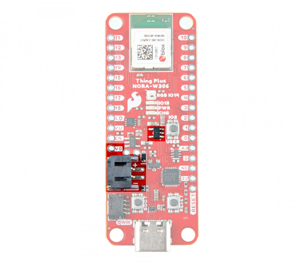
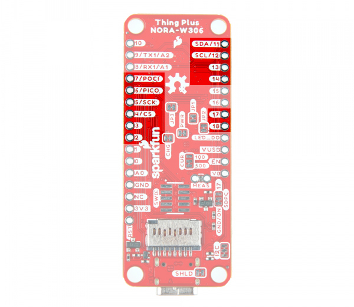

In this section, we will highlight the hardware and pins that are broken out on the SparkFun Thing Plus NORA-W306. For more information, check out our [Resources and Going Further](../resources/) for the u-blox NORA-W306 module or Realtek RTL8720DF that is contained within the module.

  <table>
    <tr style="vertical-align:middle;">
     <td style="text-align: center; vertical-align: middle; border: solid 1px #cccccc;"></td>
     <td style="text-align: center; vertical-align: middle; border: solid 1px #cccccc;"></td>
    </tr>
    <tr style="vertical-align:middle;">
     <td style="text-align: center; vertical-align: middle; border: solid 1px #cccccc;"><i>Top View</i></td>
     <td style="text-align: center; vertical-align: middle; border: solid 1px #cccccc;"><i>Bottom View</i></td>
    </tr>
  </table>

### Power

There are a variety of power and power-related nets broken out to connectors and through hole pads. Power is regulated down to 3.3V for the NORA-W306 so the [logic level](https://learn.sparkfun.com/tutorials/logic-levels/all) is 3.3V. There are Schottky diode and transistors to safely select voltage from the USB or LiPo battery. This avoids any conflicting voltages between the two sources.

* **VU** or **VUSB** &mdash; The _V_BUS_ net is connected to the USB Type C connector and the VU/VUSB PTH. You can use 5V from a USB port by connecting to the USB Type C connector or connecting power to the VBUS PTH. Make sure that power you provide to this pin does not exceed 6 volts. Power is regulated down with the XC6222 3.3V/700mA voltage regulator. The USB Type C connector is also used to upload code to your processor, send serial data to a terminal window, or charging the LiPo battery. Of course for portable power, you could connect a USB battery as an alternative to using a LiPo battery.
* **VB** &mdash;  The _V_BATT_ net is connected to the 2-pin JST style connector, VB PTH, and the NORA-W306's MEAS pin. For portable applications, you can connect a nominal 3.7V single cell, LiPo battery to the 2-pin JST style connector. This pin is also connected to the MCP73831 charge IC to safely charge the LiPo battery to its maximum voltage of about 4.2V. We recommend connecting only LiPo batteries to the VBAT net to power the board. Of course, you can power a separate device through the VBAT PTH pin. Power is regulated down with the XC6222 3.3V/700mA voltage regulator.
* **3V** or **3V3** &mdash; The 3.3V net is labeled as 3V or 3V3. You can apply power to the board if you have a regulated voltage of 3.3V. Otherwise, you could power a separate device through the 3V3 PTH pin. This is also connected to the Qwiic connector's 3.3V pin to power Qwiic enabled devices.
* **EN** &mdash; The 3.3V voltage regulator's EN pin is labeled as EN. Pulling this pin low will disable the 3.3V voltage regulator.
* **G** or **GND** &mdash; Of course, is the common, ground voltage (0V reference) for the system.

  <table>
    <tr style="vertical-align:middle;">
     <td style="text-align: center; vertical-align: middle; border: solid 1px #cccccc;"></td>
     <td style="text-align: center; vertical-align: middle; border: solid 1px #cccccc;"></td>
    </tr>
    <tr style="vertical-align:middle;">
     <td style="text-align: center; vertical-align: middle; border: solid 1px #cccccc;" colspan="2"><i>Power, Ground, and Connectors Highlighted (Top & Bottom View)</i></td>
    </tr>
  </table>

!!! note
    You will notice the pads of the SWD pins are also highlighted! 3.3V and ground are also connected to these pads. Users can easily access these pins using a SWD header and cable. Of course, you could also solder wire to those pads if you needed another way to connect to the traces.

!!! tip
    To complement the module's low-power options, we've optimized components and added the ability to depower all subsystems to conserve as much power as possible for remote battery-powered applications. Without a battery attached or charging, and cutting the power to WS2812 (i.e. jumper JP3); the current draw was as low as 14&micro;A in low power mode! Amazing! Under normal conditions, we measured the current draw as low as 30mA.

    Let's compare the Thing Plus ESP32 (USB-C) against the Thing Plus NORA-W306. The power LED jumper was cut on the Thing Plus ESP32. A microSD card was inserted in the microSD card socket (which does not have a way to turn off power through a GPIO) and the board was powered via a single cell LiPo battery. The current draw was 884&micro;A in deep sleep mode while it was 40mA when awake.

    For the Thing Plus NORA-W306, we cut the power LED and WS28112 LED jumpers. The SDPC (microSD Power Control) jumper was modified so power to the microSD card can be controlled through GPIO 17. A microSD card was inserted in the microSD card socket. With the MEAS jumper cut, a multimeter (set to measure current) was connected to monitor the current draw. Power was also provided via a single cell LiPo battery. The current draw was 115&micro;A in deep sleep mode while it was 21mA when awake.

    For more information, check out the demo video below with current draw for the board in low power mode!

    

    <iframe width="560" height="315" src="https://www.youtube.com/embed/ElCYbEnyYH4?si=EVBnWnvqqZ6KBMxX" title="YouTube video player" frameborder="0" allow="accelerometer; autoplay; clipboard-write; encrypted-media; gyroscope; picture-in-picture; web-share" referrerpolicy="strict-origin-when-cross-origin" allowfullscreen></iframe>
    

    <!--
    

      <table>
        <tr style="vertical-align:middle;">
         <td style="text-align: center; vertical-align: middle; border: solid 1px #cccccc;">Component</td>
         <td style="text-align: center; vertical-align: middle; border: solid 1px #cccccc;">Power Usage Current [ &micro;A ]</td>
        </tr>
        <tr style="vertical-align:middle;">
         <td style="text-align: center; vertical-align: middle; border: solid 1px #cccccc;">CP2102</td>
         <td style="text-align: center; vertical-align: middle; border: solid 1px #cccccc;">199</td>
        </tr>
        <tr style="vertical-align:middle;">
         <td style="text-align: center; vertical-align: middle; border: solid 1px #cccccc;">microSD</td>
         <td style="text-align: center; vertical-align: middle; border: solid 1px #cccccc;">179</td>
        </tr>
        <tr style="vertical-align:middle;">
         <td style="text-align: center; vertical-align: middle; border: solid 1px #cccccc;">3.3V VREG (Powered with 4V at VBATT)</td>
         <td style="text-align: center; vertical-align: middle; border: solid 1px #cccccc;">93</td>
        </tr>
        <tr style="vertical-align:middle;">
         <td style="text-align: center; vertical-align: middle; border: solid 1px #cccccc;">NORA-W306 (Powered with 3.3V at 3V3 net)</td>
         <td style="text-align: center; vertical-align: middle; border: solid 1px #cccccc;">10 to 11</td>
        </tr>
      </table>
    

    -->

### LiPo Charge Circuit

The board includes the MCP73831 LiPo charger IC (the little black IC with 5 pins highlighted) to safely charge a single cell, LiPo battery. In this case, the charge rate is set to a default rate of **500mA**. Cutting the trace on the back while adding a solder jumper between the middle pad and the pad labeled as _100mA_ will set the charge rate to 100mA. The on-board LED (not highlighted) labeled as CHG can be used to get an indication of the **charge status** of your battery.

  <table>
    <tr style="vertical-align:middle;">
     <td style="text-align: center; vertical-align: middle; border: solid 1px #cccccc;"></td>
    </tr>
    <tr style="vertical-align:middle;">
     <td style="text-align: center; vertical-align: middle; border: solid 1px #cccccc;"><i>2-pin JST Style Connector, LiPo Charger IC, and VBATT PTH Highlighted (Top View)</i></td>
    </tr>
  </table>

!!! note
    For more information on proper handling of LiPo batteries, check out the tutorial on [Single Cell LiPo Battery Care](https://learn.sparkfun.com/tutorials/single-cell-lipo-battery-care).

    

    -   <a href="https://learn.sparkfun.com/tutorials/single-cell-lipo-battery-care">
          <figure markdown>
            
          </figure>
        </a>

        ---

        <a href="https://learn.sparkfun.com/tutorials/single-cell-lipo-battery-care">
          <b>Single Cell LiPo Battery Care</b>
        </a>
    <!-- ----------WHITE SPACE BETWEEN GRID CARDS---------- -->
    

### GPIO

The SparkFun Thing Plus - NORA-W306 breaks out the GPIO pins to plated through hole pads on the edge of the board using the Thing Plus/Feather Form Factor. Each of the pins on the edge of the board are tired to various components on the board. Check below for more information on each connection!

  <table>
    <tr style="vertical-align:middle;">
     <td style="text-align: center; vertical-align: middle; border: solid 1px #cccccc;"></td>
     <td style="text-align: center; vertical-align: middle; border: solid 1px #cccccc;"></td>
    </tr>
    <tr style="vertical-align:middle;">
     <td style="text-align: center; vertical-align: middle; border: solid 1px #cccccc;" colspan="2"><i>GPIO Pins Highlighted (Top & Bottom View)</i></td>
  </table>

Note that the pin label might have additional functionality that may not be apparent from the silkscreen. Below is a graphical datasheet of the SparkFun Thing Plus - NORA-W306 that highlights the additional functionality.

  <table>
    <tr style="vertical-align:middle;">
     <td style="text-align: center; vertical-align: middle; border: solid 1px #cccccc;"></td>
    </tr>
    <tr style="vertical-align:middle;">
     <td style="text-align: center; vertical-align: middle; border: solid 1px #cccccc;"><i>Graphical Datasheet</i></td>
  </table>

!!! note
    While the u-blox integration manual may have pins highlighted to show additional functionality, there are some that are not supported in the Realtek's Arduino core. Some of these features that are not supported in the Arduino core include SDIO, I2S, IR, and RTC.

### SWD

For advanced users, the SWD pins are broken out on the 2x5 header on the back of the board. Note that this is not populated so you will need to solder a [compatible header, 2x5 SWD cable, and compatible JTAG programmer](https://www.sparkfun.com/categories/tags/jtag) to connect. These pins are also connected to the edge of the board.

  <table>
    <tr style="vertical-align:middle;">
     <td style="text-align: center; vertical-align: middle; border: solid 1px #cccccc;"></td>
    </tr>
    <tr style="vertical-align:middle;">
     <td style="text-align: center; vertical-align: middle; border: solid 1px #cccccc;"><i>SWD Pins Highlighted</i></td>
  </table>

!!! note
    Pin `10` is tied to the SWD Data pad and `A0` is tied to SWD CLK pad on the back of the board.

### Reset and Boot Buttons

Each board includes a RESET and BOOT button. There is an additional reset PTH next to the reset button. Hit the reset button to restart the NORA-W306. To manually place the NORA-W306 into boot mode, hold down the BOOT button while pressing the RESET button momentarily and then release the BOOT button.

  <table>
    <tr style="vertical-align:middle;">
     <td style="text-align: center; vertical-align: middle; border: solid 1px #cccccc;"></td>
     <td style="text-align: center; vertical-align: middle; border: solid 1px #cccccc;"></td>
    </tr>
    <tr style="vertical-align:middle;">
     <td style="text-align: center; vertical-align: middle; border: solid 1px #cccccc;" colspan="2"><i>Reset and Boot Pins and Buttons Highlighted (Top & Bottom View)</i></td>
    </tr>
  </table>

!!! note
    The BOOT button is also connected to pin 0 (TX). The datasheet refers to this pin as the CHIP_EN.

!!! note
    You will notice a pad of the SWD is also highlighted. The reset pin is connected to this pad. Users can easily access these pins using a SWD header and cable. Of course, you could also solder wire to those pads if you needed another way to connect to the traces.

### User Button

The board also includes a user button that is connected pin `2`.

  <table>
    <tr style="vertical-align:middle;">
     <td style="text-align: center; vertical-align: middle; border: solid 1px #cccccc;"></td>
     <td style="text-align: center; vertical-align: middle; border: solid 1px #cccccc;"></td>
    </tr>
    <tr style="vertical-align:middle;">
     <td style="text-align: center; vertical-align: middle; border: solid 1px #cccccc;" colspan="2"><i>Reset & Boot Pins and Buttons Highlighted (Top & Bottom View)</i></td>
    </tr>
  </table>

!!! note
    When defining the pin for the user button, make sure to use an [internal pull-up resistor](https://docs.arduino.cc/tutorials/generic/digital-input-pullup) so that the button is not floating.

!!! tip
    Need a bigger button? Users can connect pin 2 on the edge of the board to an external button!

### Interrupts

Speaking of buttons, all GPIOs can also be set as [interrupts](https://learn.sparkfun.com/tutorials/processor-interrupts-with-arduino/all)!

  <table>
    <tr style="vertical-align:middle;">
     <td style="text-align: center; vertical-align: middle; border: solid 1px #cccccc;"></td>
     <td style="text-align: center; vertical-align: middle; border: solid 1px #cccccc;"></td>
    </tr>
    <tr style="vertical-align:middle;">
     <td style="text-align: center; vertical-align: middle; border: solid 1px #cccccc;" colspan="2"><i>Interrupt Pins Highlighted (Top & Bottom View)</i></td>
  </table>

### UART

There are two [UARTs](https://learn.sparkfun.com/tutorials/serial-communication). The primary hardware UART (UART0) is connected to the USB-to-serial converter. The secondary hardware UART (UART1) is broken out to the edge of the board. We recommend connecting a UART device to the secondary hardware UART to avoid any bus contention with the CP2102N.

  <table>
    <tr style="vertical-align:middle;">
     <td style="text-align: center; vertical-align: middle; border: solid 1px #cccccc;"></td>
     <td style="text-align: center; vertical-align: middle; border: solid 1px #cccccc;"></td>
    </tr>
    <tr style="vertical-align:middle;">
     <td style="text-align: center; vertical-align: middle; border: solid 1px #cccccc;" colspan="2"><i>UARTs Highlighted (Top & Bottom View)</i></td>
  </table>

#### CP2102N USB-to-Serial Converter

The board includes the CP2102N USB-to-Serial converter. This is used for serial programming or communicating with a serial terminal. The CP2102N is connected to the NORA-W306&apos;s primary hardware UART (UART0): TX pin is connected to pin `0` (RX0) while and RX pin is connected to pin `1` (TX0).

  <table>
    <tr style="vertical-align:middle;">
     <td style="text-align: center; vertical-align: middle; border: solid 1px #cccccc;"></td>
     <td style="text-align: center; vertical-align: middle; border: solid 1px #cccccc;"></td>
    </tr>
    <tr style="vertical-align:middle;">
     <td style="text-align: center; vertical-align: middle; border: solid 1px #cccccc;" colspan="2"><i>USB-to-Serial Converter, USB, and UART0 Highlighted (Top & Bottom View)</i></td>
  </table>

### Qwiic and I2C

The board includes one horizontal Qwiic connector on the board. These pins are connected to the primary <a href="https://learn.sparkfun.com/tutorials/i2c/all">I2C</a> bus and power (e.g. 3.3V and GND) allowing you to easily add a Qwiic-enabled device to your application. The I2C data and clock lines are also tied to 2.2k&ohm; pull-up resistors. The I2C SCL pin is connected to `12`. The I2C SDA is connected to `11`.

  <table>
    <tr style="vertical-align:middle;">
     <td style="text-align: center; vertical-align: middle; border: solid 1px #cccccc;"></td>
     <td style="text-align: center; vertical-align: middle; border: solid 1px #cccccc;"></td>
    </tr>
    <tr style="vertical-align:middle;">
     <td style="text-align: center; vertical-align: middle; border: solid 1px #cccccc;" colspan="2"><i>I2C and Qwiic Connector Highlighted (Top & Bottom View)</i></td>
  </table>

#### LiPo Fuel Gauge - MAX17048

Built into the board is also the single cell LiPo Fuel Gauge, specifically the [MAX17408](https://learn.sparkfun.com/tutorials/lipo-fuel-gauge-max1704x-hookup-guide/all). The 7-bit, unshifted address of the MAX17048 is **0x36**. The address becomes _0x6C_ for write and _0x6D_ for read.  

  <table>
    <tr style="vertical-align:middle;">
     <td style="text-align: center; vertical-align: middle; border: solid 1px #cccccc;"></td>
    </tr>
    <tr style="vertical-align:middle;">
     <td style="text-align: center; vertical-align: middle; border: solid 1px #cccccc;"><i>LiPo Fuel Gauge - MAX17048 Highlighted (Top View)</i></td>
  </table>

### SPI

There are two [SPI](https://learn.sparkfun.com/tutorials/serial-peripheral-interface-spi/all) ports available. The primary SPI pins (SPI0) is broken out as:  `5` (SPI0_SCK), `6` (SPI0_PICO), `7` (SPI0_POCI), and `4` (SPI0_CS). These are also connected to the microSD card that is populated on the back. The secondary SPI pins (SPI1) is broken out as: `16` (SPI1_SCK), `14` (SPI1_PICO), `13` (SPI1_POCI), and `15` (SPI1_CS)

  <table>
    <tr style="vertical-align:middle;">
     <td style="text-align: center; vertical-align: middle; border: solid 1px #cccccc;"></td>
     <td style="text-align: center; vertical-align: middle; border: solid 1px #cccccc;"></td>
    </tr>
    <tr style="vertical-align:middle;">
     <td style="text-align: center; vertical-align: middle; border: solid 1px #cccccc;" colspan="2"><i>SPI Pins Highlighted (Top & Bottom View)</i></td>
  </table>

!!! note
    Pin `14` is also connected to the addressable LED. The Realtek Arduino Core needed to use this specific SPI pin to control WS2812. Users can disable the addressable LED by cutting JP1 on the back of the board.

#### MicroSD Card Socket

Built into the board is a microSD card socket to log data. As explained in the SPI section, the data lines are connected to the primary SPI pins (SPI0). One special feature that is different from other Thing Plus boards is the transistor to toggle power to the microSD card socket. By default, it is always on. For users that want to conserve power, you can cut the jumper for the **SDPC**. You will then need to add a solder blob between the center pad and the pad that is labeled **17**.

  <table>
    <tr style="vertical-align:middle;">
     <td style="text-align: center; vertical-align: middle; border: solid 1px #cccccc;"></td>
     <td style="text-align: center; vertical-align: middle; border: solid 1px #cccccc;"></td>
    </tr>
    <tr style="vertical-align:middle;">
     <td style="text-align: center; vertical-align: middle; border: solid 1px #cccccc;" colspan="2"><i>Micro SD Card, Transistor, and Power Enable Pin Highlighted (Top & Bottom View)</i></td>
  </table>

### Pulse Width Modulation (PWM)

There are 12x [PWM](https://learn.sparkfun.com/tutorials/pulse-width-modulation/all) pins available: `2`, `3`, `4`, `5`, `6`, `7`, `11`, `12`, `13`, `14`, `17`, and `18`. Note that these are tied to other peripherals as well.

  <table>
    <tr style="vertical-align:middle;">
     <td style="text-align: center; vertical-align: middle; border: solid 1px #cccccc;"></td>
     <td style="text-align: center; vertical-align: middle; border: solid 1px #cccccc;"></td>
    </tr>
    <tr style="vertical-align:middle;">
     <td style="text-align: center; vertical-align: middle; border: solid 1px #cccccc;" colspan="2"><i>PWM Pins Highlighted (Top & Bottom View)</i></td>
  </table>

### Analog

There are 3x 12-bit [analog](https://learn.sparkfun.com/tutorials/analog-to-digital-conversion/all#what-is-the-adc) pins available: `A0`, `A1`, and `A2`.

  <table>
    <tr style="vertical-align:middle;">
     <td style="text-align: center; vertical-align: middle; border: solid 1px #cccccc;"></td>
     <td style="text-align: center; vertical-align: middle; border: solid 1px #cccccc;"></td>
    </tr>
    <tr style="vertical-align:middle;">
     <td style="text-align: center; vertical-align: middle; border: solid 1px #cccccc;" colspan="2"><i>ADC Pins Highlighted (Top & Bottom View)</i></td>
  </table>

### LEDs

There are 4x LEDs populated on the board.

* **PWR** &mdash; The **PWR** LED lights up to indicate when there is a 3.3V available after power is regulated down from the USB connector or LiPo battery. This can be disabled by cutting the jumper labeled as **PWR**.
* **CHG** &mdash; The on-board yellow **CHG** LED can be used to get an indication of the **charge status** of your battery. Below is a table of other status indicators depending on the state of the charge IC. This can be disabled by cutting the jumper labeled as **CHG**.
* **RGB IO14** &mdash; The **RGB IO14** LED is an WS2812-2020 LED. Users can control this addressable RGB LED using pin `14`. This LED can be disconnected from the pin by cutting the jumper labeled as **JP1**. For users that are not using this LED and want to conserve power, the 3.3V net can also be disconnected as well by cutting the jumper labeled as **JP3**. For users that are interested in daisy chaining additional WS2812 LEDs, users can connect to the PTH labled as **LD** or **LED D0**.
* **IO18** &mdash; The LED labeled as **IO18** can be configured by the user and is connected to pin `18`. This can be disconnect from the pin by cutting the jumper labeled **JP2**.

  <table>
    <tr style="vertical-align:middle;">
      <td style="text-align: center; vertical-align: middle;"><b>Charge State</b></td>
      <td style="text-align: center; vertical-align: middle;"><b>LED status</b></td>
    </tr>
    <tr align="center">
      <td style="text-align: center; vertical-align: middle;">No Battery</td>
      <td style="text-align: center; vertical-align: middle;">Floating (should be OFF, but may flicker)</td>
    </tr>
    <tr align="center">
      <td style="text-align: center; vertical-align: middle;">Shutdown</td>
      <td style="text-align: center; vertical-align: middle;">Floating (should be OFF, but may flicker)</td>
    </tr>
    <tr align="center">
      <td style="text-align: center; vertical-align: middle;">Charging</td>
      <td style="text-align: center; vertical-align: middle;">ON</td>
    </tr>
    <tr align="center">
      <td style="text-align: center; vertical-align: middle;">Charge Complete</td>
      <td style="text-align: center; vertical-align: middle;">OFF</td>
    </tr>
  </table>

  <table>
    <tr style="vertical-align:middle;">
     <td style="text-align: center; vertical-align: middle; border: solid 1px #cccccc;"></td>
     <td style="text-align: center; vertical-align: middle; border: solid 1px #cccccc;"></td>
    </tr>
    <tr style="vertical-align:middle;">
     <td style="text-align: center; vertical-align: middle; border: solid 1px #cccccc;" colspan="2"><i>LEDs and Connected PTHs Highlighted (Top & Bottom View)</i></td>
  </table>

### Jumpers

!!!note
    If this is your first time working with jumpers, check out the [How to Work with Jumper Pads and PCB Traces](https://learn.sparkfun.com/tutorials/how-to-work-with-jumper-pads-and-pcb-traces/all) tutorial for more information.

There are a few jumper pads available on the bottom of the board.

* **SHLD** &mdash; This jumper connects the USB Type C connector's shield pin to GND. Cut this to isolate the USB Type C connector's shield pin. This is for advanced users that want to ground their board to their enclosure instead of the ground plane.
* **MEAS** &mdash; To enable measurements and determine how long your battery might last, we've added a NC (normally closed) jumper between the two MEAS PTH pins. By cutting this jumper, the voltage connecting to the 3.3V voltage regulator input is interrupted. Soldering in a male jumper or wires into the accompanying holes will give you the ability to insert a current meter and precisely monitor how much current your application is consuming.
* **PWR** &mdash; By default, this jumper is closed. Cut this trace to disable the power LED that is connected to 3.3V.
* **CHG** &mdash; By default, this jumper is closed. Cut this trace to disable the charge LED that is connected to the LiPo charge IC.
* **LED_D0** &mdash; By default, this jumper is closed. Cut this trace to disable the WS2812 addressable RGB LED's output pin labeled as `D0`.
* **JP1** &mdash; By default, this jumper is closed. Cut this trace to disable the WS2812 addressable RGB LED's input pin that is connected to pin `14`.
* **JP2** &mdash; By default, this jumper is closed. Cut this trace to disable the user LED that is connected to pin `18`.
* **JP3** &mdash; By default, this jumper is closed. Cut this trace to disable power connected to the WS2812 addressable LED's 3.3V pin.
* **CUR** &mdash; This three way jumper sets the charge IC's charge rate. By default, it's connected to the pad labeled **500** so the charge rate is set to 500mA. Cutting a trace and adding a solder jumper between the center pad and the pad labeled as **100** will set the charge rate to 100mA.
* **I2C** &mdash; By default, this three-pad jumper is closed and located on the bottom of the board. The three way jumper labeled I2C connect the two 2.2k&ohm; pull-up resistors to the I2C data and clock lines. If multiple devices are connected to the bus with the pull-up resistors enabled, the parallel equivalent resistance will create too strong of a pull-up for the bus to operate correctly. As a general rule of thumb, [disable all but one pair of pull-up resistors](https://learn.sparkfun.com/tutorials/i2c/all#i2c-at-the-hardware-level) if multiple devices are connected to the bus.
* **SDPC** &mdash; By default, this jumper is closed and for the microSD card's power control circuit. Cut this trace on the **GND/ON** side to disable power to the microSD card's socket. For users that want to control the transistor via a GPIO, add a solder blob between the center pad and the pad that is labeled **17**. Make sure to also define the pin in code to toggle power to the microSD card.

  <table>
    <tr style="vertical-align:middle;">
     <td style="text-align: center; vertical-align: middle; border: solid 1px #cccccc;"></td>
     <td style="text-align: center; vertical-align: middle; border: solid 1px #cccccc;"></td>
    </tr>
    <tr style="vertical-align:middle;">
     <td style="text-align: center; vertical-align: middle; border: solid 1px #cccccc;" colspan="2"><i>Jumpers Highlighted (Top & Bottom View)</i></td>
  </table>

### Board Dimensions

The board is 0.9" x 2.3" (22.86mm x 58.42mm) and uses the [standard Thing+](https://www.sparkfun.com/thing_plus) footprint. There are 4x mounting holes by each corner of the board. You can use 4-40 standoffs to mount the board to a panel or enclosure.

  <table>
    <tr style="vertical-align:middle;">
     <td style="text-align: center; vertical-align: middle; border: solid 1px #cccccc;"></td>
    </tr>
    <tr style="vertical-align:middle;">
     <td style="text-align: center; vertical-align: middle; border: solid 1px #cccccc;"><i>Board Dimensions</i></td>
    </tr>
  </table>

