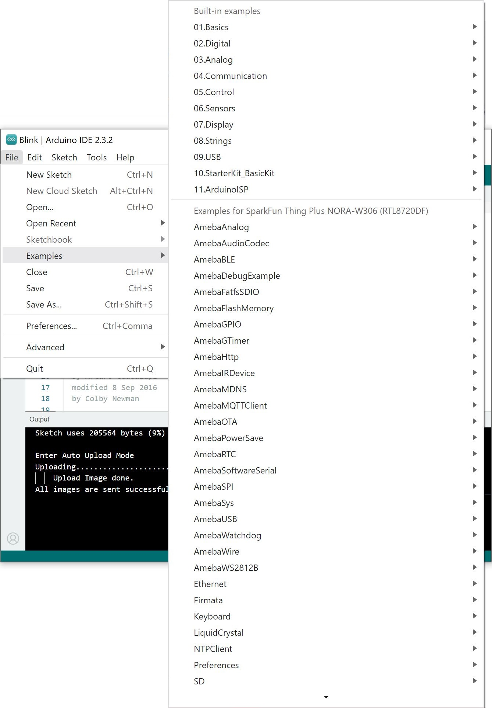

Of course, this only skims the surface of what the SparkFun Thing Plus - NORA-W306 can do. There are a handful of examples from the board support package that were not highlighted in this tutorial and are being ported by our friends at Realtek with the NORA-W306 module. From the menu, try opening the other examples listed for hte board: **File** > **Examples** > Examples for AW_CU488 Thing Plus (RTL8721DM)

  <table>
    <tr style="vertical-align:middle;">
     <td style="text-align: center; vertical-align: middle; border: solid 1px #cccccc;"></td>
    </tr>
    <tr style="vertical-align:middle;">
     <td style="text-align: center; vertical-align: middle; border: solid 1px #cccccc;"><i>More Arduino Examples!</i></td>
   </tr>
  </table>

!!! note
    Some of the examples listed in the menu may still be under development. Make sure to be patient as they include more support for the NORA-W306 module.

Or try adding another [Qwiic-enabled device](https://www.sparkfun.com/qwiic) or a breakout board to your next project!

<a href="https://www.sparkfun.com/qwiic" class="md-button md-button--primary">Qwiic Connect System</a>

