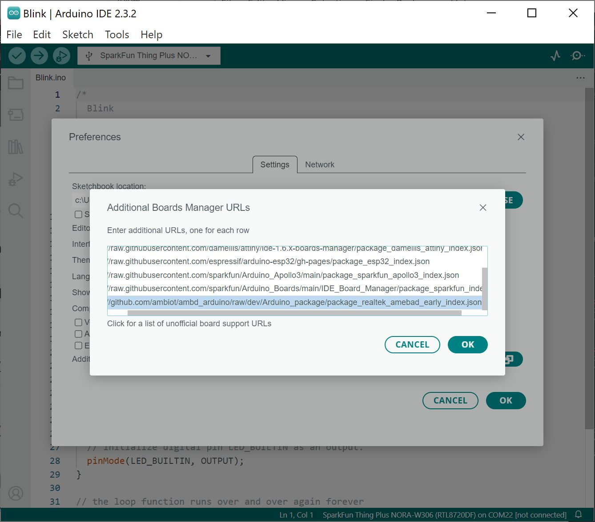
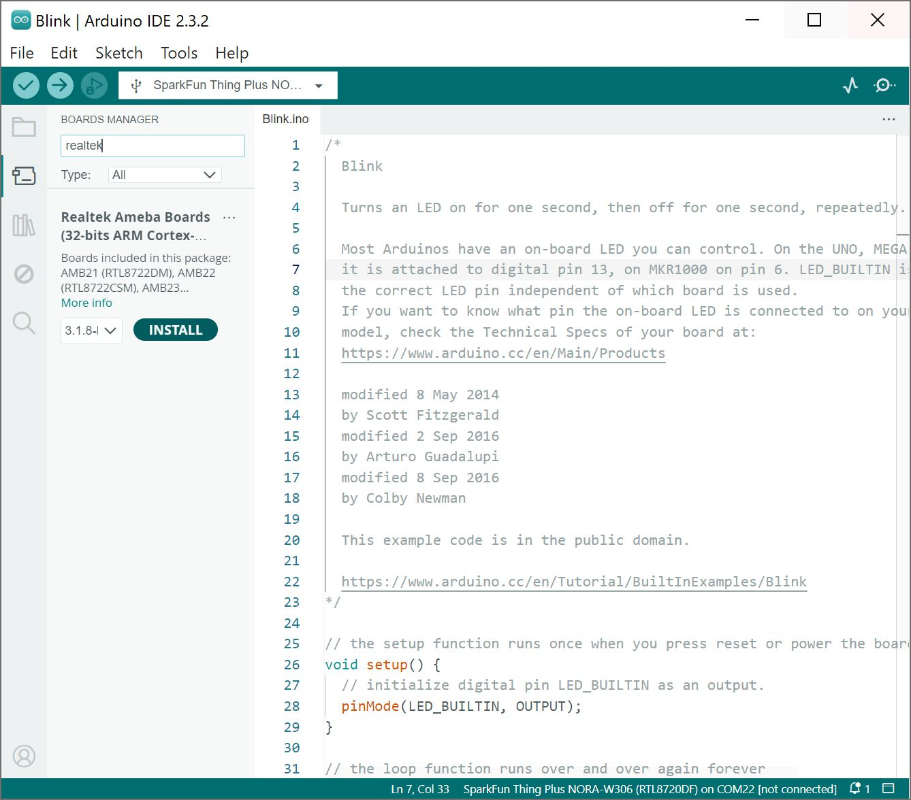
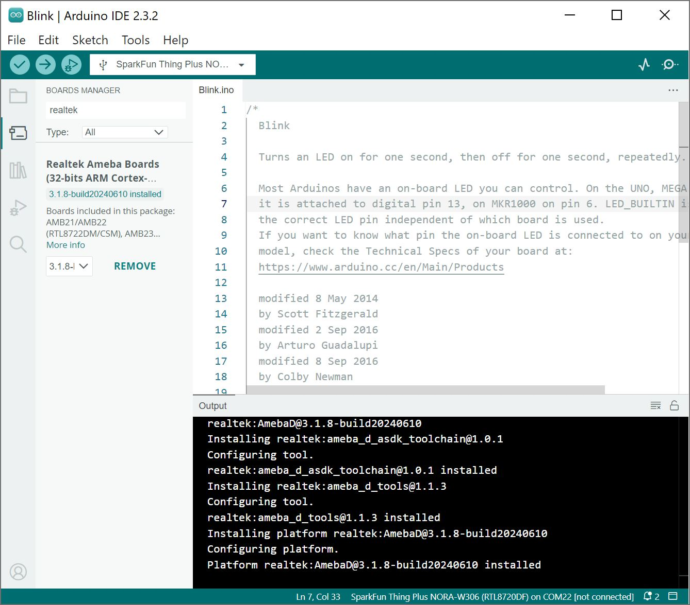
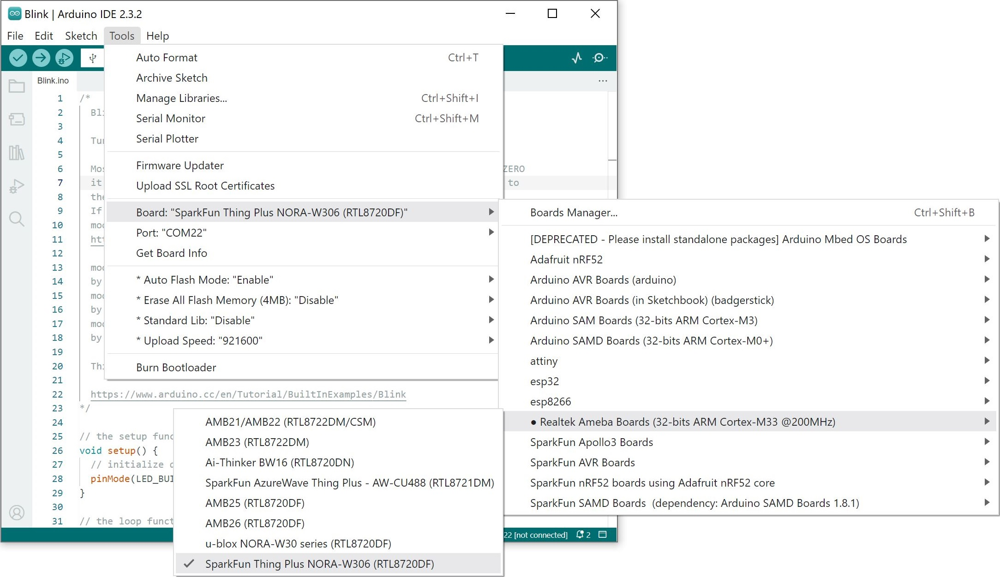
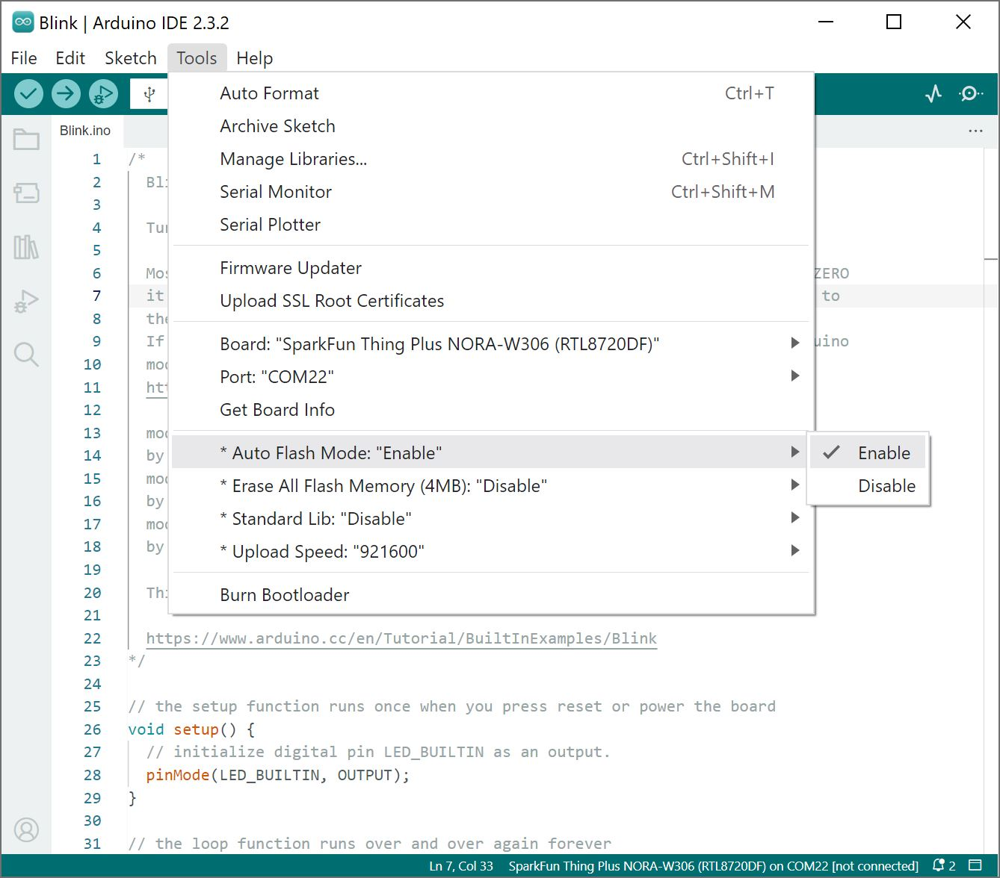

!!! arduino
    This example assumes you are using the latest version of the Arduino IDE on your desktop. If this is your first time using Arduino IDE, library, or board add-on, please review the following tutorials.

    - [Installing the Arduino IDE](https://learn.sparkfun.com/tutorials/installing-arduino-ide)
    - [Installing an Arduino Library](https://learn.sparkfun.com/tutorials/installing-an-arduino-library)
    - [Installing Board Definitions in the Arduino IDE](https://learn.sparkfun.com/tutorials/installing-board-definitions-in-the-arduino-ide)


### Install the Realtek Board Add-on

First, open your Arduino preferences (**File** > **Preferences**). Then find the **Additional Boards Manager URLs** text box, and paste the below link in. If you have other links for other 3rd party boards, you will need to add a comma (`,`) between each link in the field. You can also open an additional window by clicking the window button next to the _Additional Boards Manager URLs:_ field and add the link to a separate line.

``` bash
https://github.com/ambiot/ambd_arduino/raw/dev/Arduino_package/package_realtek_amebad_early_index.json
```

<div style="text-align: center;">
  <table>
    <tr style="vertical-align:middle;">
     <td style="text-align: center; vertical-align: middle; border: solid 1px #cccccc;"><a href="../assets/img/Realtek_AmebaD_SparkFun_u-blox_NORA-W306_Arduino_Board_Support_Files-EARLY_RELEASE.JPG"></a></td>
    </tr>
    <tr style="vertical-align:middle;">
     <td style="text-align: center; vertical-align: middle; border: solid 1px #cccccc;"><i><a href="https://github.com/ambiot/ambd_arduino">Realtek Arduino Board Support Files</a> for the NORA-W306</i></td>
   </tr>
  </table>
</div>

Then hit "OK", and travel back to the Board Manager menu. Type "**realtek**" in the search bar and hit <kbd>enter</kbd>. Click on the "Install" button for the **Realtek Ameba Boards (32-bit ARM Cortex-M33 @200MHz)** by **Realtek**. Downloading and installing the tools may take a couple minutes. Feel free to walk around, grab some water, or do a little dance while the tools install.

<div style="text-align: center;">
  <table>
    <tr style="vertical-align:middle;">
     <td style="text-align: center; vertical-align: middle; border: solid 1px #cccccc;"><a href="../assets/img/NORA-W306_Arduino_Board_Manager-EARLY_RELEASE.JPG"></a></td>
    </tr>
    <tr style="vertical-align:middle;">
     <td style="text-align: center; vertical-align: middle; border: solid 1px #cccccc;"><i>Search for realtek in Arduino Boards Manager</i></td>
   </tr>
  </table>
</div>


Once installed, the version number and Arduino-blue "INSTALLED" text should appear next to the boards list entry.

<div style="text-align: center;">
  <table>
    <tr style="vertical-align:middle;">
     <td style="text-align: center; vertical-align: middle; border: solid 1px #cccccc;"><a href="../assets/img/NORA-W306_installed_Arduino_Board_Manager-EARLY_RELEASE.JPG"></a></td>
    </tr>
    <tr style="vertical-align:middle;">
     <td style="text-align: center; vertical-align: middle; border: solid 1px #cccccc;"><i>Installed Realtek Arduino Core</i></td>
   </tr>
  </table>
</div>


### Selecting the SparkFun Thing Plus NORA-306

To upload code to the board, you will need to select the correct board. From the menu, select the following: **Tools** > **Board** > **Realtek Ameba Boards (32-bits ARM Cortex-M33 @200MHz)** > **SparkFun Thing Plus NORA-306 (RTL8720DF)** .

<div style="text-align: center;">
  <table>
    <tr style="vertical-align:middle;">
     <td style="text-align: center; vertical-align: middle; border: solid 1px #cccccc;"><a href="../assets/img/NORA-W306_Arduino_Board_Selection.JPG"></a></td>
    </tr>
    <tr style="vertical-align:middle;">
     <td style="text-align: center; vertical-align: middle; border: solid 1px #cccccc;"><i>Screenshot Board Selection</i></td>
   </tr>
  </table>
</div>


There are a few options for the board. One of them is the option to automatically upload code to the board without the need to press the BOOT and RESET buttons as Arduino uploads your code. By default, the Auto Upload Mode is disabled. From the menu, select the following: **Tools** > **Auto Upload Mode:** > **Enable** .

<div style="text-align: center;">
  <table>
    <tr style="vertical-align:middle;">
     <td style="text-align: center; vertical-align: middle; border: solid 1px #cccccc;"><a href="../assets/img/NORA-W306_Arduino_Auto_Upload_Mode.JPG"></a></td>
    </tr>
    <tr style="vertical-align:middle;">
     <td style="text-align: center; vertical-align: middle; border: solid 1px #cccccc;"><i>Screenshot of Auto Upload Mode</i></td>
   </tr>
  </table>
</div>


### COM Port Selection

You will also need to select the COM port that the board enumerated to. From the menu, select your respective COM port on your computer (in this case, it was **COM13** on a Windows computer): **Tools** > **Port** > **COM___** .

<div style="text-align: center;">
  <table>
    <tr style="vertical-align:middle;">
     <td style="text-align: center; vertical-align: middle; border: solid 1px #cccccc;"><a href="../assets/img/NORA-W306_Arduino_COM_Port_Selection.JPG"></a></td>
    </tr>
    <tr style="vertical-align:middle;">
     <td style="text-align: center; vertical-align: middle; border: solid 1px #cccccc;"><i>Screenshot COM Port Selection</i></td>
   </tr>
  </table>
</div>
