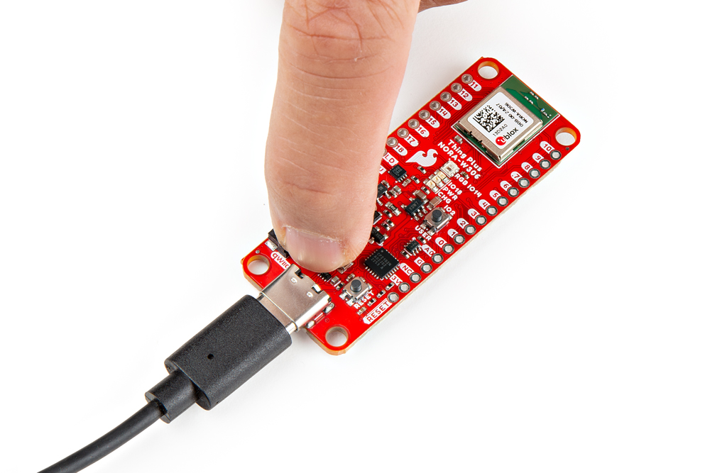
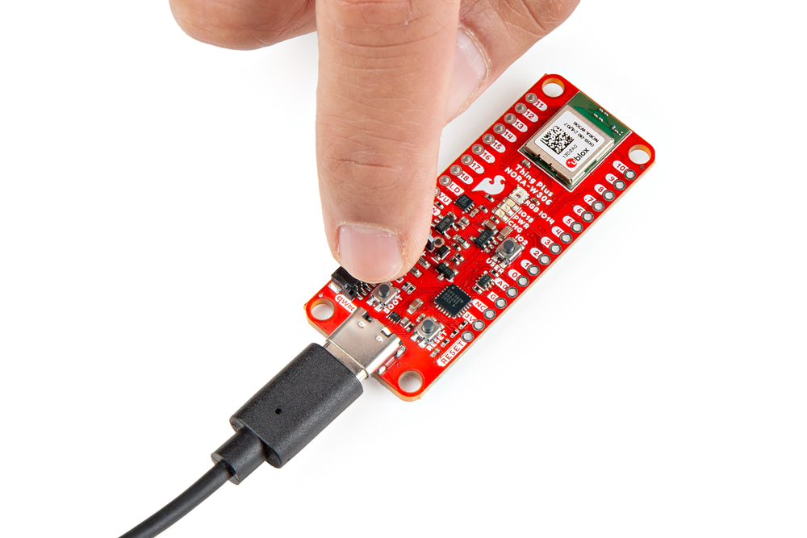
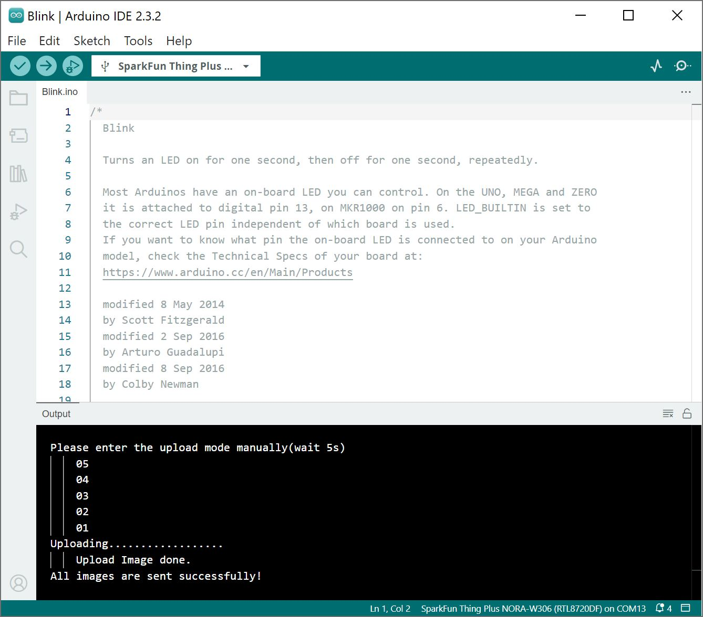

### General Troubleshooting Help

!!! note
    <span class="glyphicon glyphicon-question-sign" aria-hidden="true"></span>
        <strong> Not working as expected and need help? </strong> <br /><br />

    If you need technical assistance and more information on a product that is not working as you expected, we recommend heading on over to the <a href="https://www.sparkfun.com/technical_assistance">SparkFun Technical Assistance</a> page for some initial troubleshooting. <br /><br />

    <div style="text-align: center"><a href="https://www.sparkfun.com/technical_assistance" target="sfe_technical_assistance" class="md-button">SparkFun Technical Assistance Page</a></div>

    If you don't find what you need there, the <a href="https://community.sparkfun.com/">SparkFun Forums</a> are a great place to find and ask for help. If this is your first visit, you'll need to create a forum account to search product forums and post questions.<br /><br />

    <div style="text-align: center"><a href="https://community.sparkfun.com/" class="md-button md-button--primary">Log Into SparkFun Forums</a></div>


### Manual Upload Mode

Having problems uploading code with the auto upload mode? You may see this in the output window indicating there was an error uploading.

``` bash
Please enter the upload mode manually(wait 5s)
    05
    04
    03
    02
    01
Uploading.....error: Enter Uart Download Mode

    Upload Image done.
```


If you have problems uploading code when Auto Upload Mode is enabled, try uploading code manually. From the menu, select the following: **Tools** > **Auto Upload Mode:** > **Enable**. Hit the upload button in the Arduino IDE. In the debug window, you should see something similar. As the Arduino IDE starts outputting the numbers.

``` bash
Please enter the upload mode manually(wait 5s)
    05
    04
    03
    02
    01
```


Press down on the BOOT button. While holding down the BOOT button, press the RESET Button momentarily. Keep holding the BOOT button for a moment before lifting your finger off the button.

<div style="text-align: center;">
<table>
  <tr align="center">
   <td style="text-align: center; vertical-align: middle; border: solid 1px #cccccc;"><a href="../assets/img/WRL-21637_Thing_Plus_NORA-W306_Manual_Upload_1.jpg"></a></td>
   <td style="text-align: center; vertical-align: middle; border: solid 1px #cccccc;"><a href="../assets/img/WRL-21637_Thing_Plus_NORA-W306_Manual_Upload_2.jpg"></a></td>
   <td style="text-align: center; vertical-align: middle; border: solid 1px #cccccc;"><a href="../assets/img/WRL-21637_Thing_Plus_NORA-W306_Manual_Upload_3.jpg"></a></td>
   <td style="text-align: center; vertical-align: middle; border: solid 1px #cccccc;"><a href="../assets/img/WRL-21637_Thing_Plus_NORA-W306_USB_Cable.jpg"></a></td>
  </tr>
  <tr align="center">
   <td style="text-align: center; vertical-align: middle; border: solid 1px #cccccc;"><i>BOOT Button</i></td>
   <td style="text-align: center; vertical-align: middle; border: solid 1px #cccccc;"><i>BOOT and RESET</i></td>
   <td style="text-align: center; vertical-align: middle; border: solid 1px #cccccc;"><i>Keep Holding Down BOOT</i></td>
   <td style="text-align: center; vertical-align: middle; border: solid 1px #cccccc;"><i>Release BOOT</i></td>
  </tr>
</table>
</div>


If all goes well, you should have a successful upload with the following message.

``` bash
Please enter the upload mode manually(wait 5s)
    05
    04
    03
    02
    01
Uploading..................
    Upload Image done.
All images are sent successfully!
```

<div style="text-align: center;">
  <table>
    <tr style="vertical-align:middle;">
     <td style="text-align: center; vertical-align: middle; border: solid 1px #cccccc;"><a href="../assets/img/NORA-W306_Arduino_Manual_Upload_Success.JPG"></a></td>
    </tr>
    <tr style="vertical-align:middle;">
     <td style="text-align: center; vertical-align: middle; border: solid 1px #cccccc;"><i>NORA-W306 Arduino Manual Upload Success</i></td>
   </tr>
  </table>
</div>


To execute the code, hit the reset button or power cycle the board!
